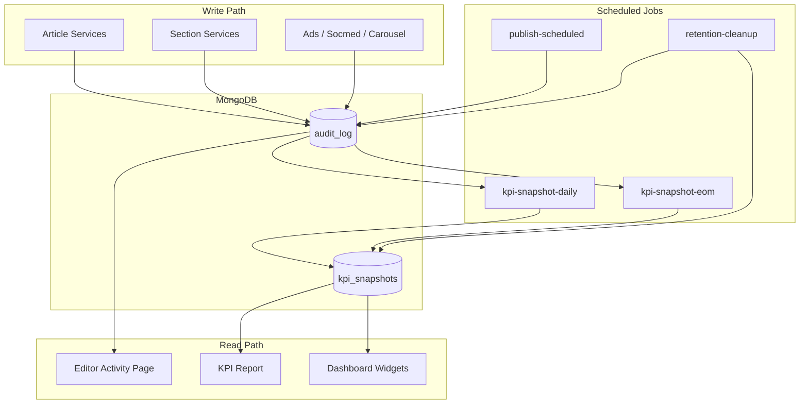
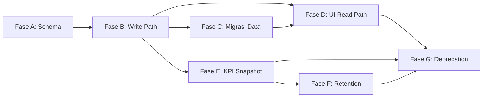

# Plan: Unified Logging System (`audit_log`)

**Tanggal:** 8 Juli 2026  
**Status:** Draft — menunggu review sebelum eksekusi

---

## 1. Ringkasan Keputusan

| Topik                   | Keputusan                                                                                    |
| ----------------------- | -------------------------------------------------------------------------------------------- |
| Collection tunggal      | `audit_log` — all-in-one                                                                     |
| Halaman Editor Activity | Filter by `entity` + opsi "Show All"; hanya entity editorial                                 |
| Granularitas kurasi     | 1 event per save (bukan per item)                                                            |
| Migrasi data lama       | `editor_activities` → `audit_log`, **tanpa kehilangan data**                                 |
| Retensi log             | 60 hari, dihapus via scheduler                                                               |
| KPI                     | Snapshot **harian** (progress) + snapshot **akhir bulan** (final)                            |
| Pembersihan snapshot    | Via scheduler (daily snapshot dihapus setelah periode tertentu; monthly disimpan lebih lama) |
| `editor_activities`     | Deprecate setelah migrasi + verifikasi                                                       |

---

## 2. Kondisi Saat Ini

### 2.1 `audit_log` (fondasi — diperluas)

Sudah dipakai di: artikel, carousel, socmed/youtube, ads, kategori, config, media, user.

Schema existing ([`src/types/auditLog.ts`](../../src/types/auditLog.ts)):

```
actor, action, entity, entityId, details, oldValue, newValue, createdAt, ipAddress?
```

### 2.2 `editor_activities` (duplikat — akan di-deprecate)

- Wired: `createArticle`, `approveArticleStatus`
- **Tidak wired:** `updateArticle` (ada komentar POINT 5, tidak ada pemanggilan)
- Dipakai KPI: [`kpiUserService.ts`](../../src/services/reports/kpiUserService.ts), dashboard editor/writer
- UI: [`editor-activity/page.tsx`](../../src/app/admin-xyz/analytics/editor-activity/page.tsx)

### 2.3 Gap pencatatan

| Aksi                                      | Status                                    |
| ----------------------------------------- | ----------------------------------------- |
| Grid unggulan (`section_featured`)        | ❌ Belum ada log                          |
| Artikel populer (`section_popular`)       | ❌                                        |
| Pilihan editor (`section_editor_choices`) | ❌                                        |
| Headline (`section_headline`)             | ❌                                        |
| Scheduler auto-publish                    | ⚠️ Perlu verifikasi / lengkapi            |
| `updateArticle` status change             | ⚠️ Audit log ada, editor_activities tidak |

---

## 3. Target Arsitektur



---

## 4. Schema Baru

### 4.1 Perluasan `audit_log`

Tambah field opsional `meta` (tidak wajib di semua event):

```typescript
interface AuditLogMeta {
  // Workflow artikel
  statusFrom?: ArticleStatus;
  statusTo?: ArticleStatus;
  reason?: string;
  articleTitle?: string; // denormalized untuk UI feed
  authorId?: string;

  // Kurasi section
  sectionType?: "featured" | "popular" | "editor_choices" | "headline";
  platform?: "tiktok" | "instagram" | "youtube" | "combined";

  // Migrasi dari editor_activities
  migratedFrom?: "editor_activities";
  originalId?: string; // _id asal untuk deduplikasi
}
```

### 4.2 Entity taxonomy (editorial — untuk filter UI)

| entity                   | Label UI         | Sumber service                               |
| ------------------------ | ---------------- | -------------------------------------------- |
| `articles`               | Artikel          | coreWriteArticleService, writeArticleService |
| `section_featured`       | Grid Unggulan    | sectionArticleService                        |
| `section_popular`        | Artikel Populer  | sectionArticleService                        |
| `section_editor_choices` | Pilihan Editor   | sectionArticleService                        |
| `section_headline`       | Headline         | sectionArticleService                        |
| `carousel_section`       | Carousel         | carouselSectionService                       |
| `socmed_video_section`   | Socmed / YouTube | videoSocmedService                           |
| `ads_homepage`           | Iklan Homepage   | AdsHomepageService                           |
| `ads_article`            | Iklan Artikel    | AdsSingleArticleService                      |
| `sponsor`                | Sponsor          | sponsorService                               |

Entity teknis (`USER`, `MEDIA`, `CONFIGURATION`, `CATEGORY`) **tetap masuk** `audit_log` tetapi **tidak muncul** di filter Editor Activity.

### 4.3 Collection `kpi_snapshots` (baru)

```typescript
interface KpiSnapshot {
  _id: ObjectId;
  period: string; // "YYYY-MM"
  snapshotType: "daily" | "monthly";
  snapshotDate: string; // "YYYY-MM-DD" (daily) atau "YYYY-MM" (monthly)
  scope: "writer" | "editor" | "head_of";
  userId: string; // atau teamId untuk head_of
  metrics: KPIWriterTeamResponse | KPIEditorResponse | KPIHeadOfResponse;
  computedAt: Date;
  sourceLogCount: number; // jumlah audit_log yang diagregasi
  deletedAt?: Date | null;
}
```

**Kebijakan retensi snapshot:**

| snapshotType | Retensi  | Alasan                                             |
| ------------ | -------- | -------------------------------------------------- |
| `daily`      | 90 hari  | Progress tracking bulan berjalan                   |
| `monthly`    | 24 bulan | Laporan historis KPI (tidak bergantung log mentah) |

---

## 5. Fase Development

### Fase A — Foundation (Schema & Types)

**Tujuan:** Siapkan kontrak data sebelum ubah write path.

**File:**

- [`src/types/auditLog.ts`](../../src/types/auditLog.ts) — tambah `AuditLogMeta`, `AuditLogEntity`, `EDITORIAL_ENTITIES`
- `src/types/analytics/kpiSnapshot.ts` (baru)
- [`src/services/auditLogService.ts`](../../src/services/auditLogService.ts) — dukung `meta`, filter `entity` di `getAuditLogs`

**Deliverable:**

- Types compile
- Helper `isEditorialEntity(entity: string): boolean`
- Helper `buildArticleAuditMeta(...)` untuk konsistensi field artikel

**Estimasi:** 1–2 hari

---

### Fase B — Lengkapi Write Path

**Tujuan:** Semua aksi editorial tercatat di `audit_log`; stop menulis ke `editor_activities`.

**Perubahan:**

| File                                                                                               | Perubahan                                                                                               |
| -------------------------------------------------------------------------------------------------- | ------------------------------------------------------------------------------------------------------- |
| [`sectionArticleService.ts`](../../src/services/article/articleSection/sectionArticleService.ts)   | `createAuditLog` di `upsertSectionArticlesWithType` — 1 event per save, entity sesuai type              |
| [`coreWriteArticleService.ts`](../../src/services/article/coreWriteArticleService.ts)              | Hapus `createEditorActivity`; perkaya `createAuditLog` dengan `meta.statusFrom/To`, `meta.articleTitle` |
| [`writeArticleService.ts`](../../src/services/article/writeArticleService.ts)                      | Hapus `createEditorActivity`; pastikan scheduler publish + approval punya `meta` lengkap                |
| [`carouselSectionService.ts`](../../src/services/article/articleSection/carouselSectionService.ts) | Tambah `meta.sectionType` / seragamkan entity naming                                                    |
| [`videoSocmedService.ts`](../../src/services/article/articleSection/socmed/videoSocmedService.ts)  | Tambah `meta.platform`                                                                                  |

**Pola event kurasi (contoh grid unggulan):**

```json
{
  "action": "UPDATE",
  "entity": "section_featured",
  "entityId": "section_featured",
  "details": "Mengganti grid unggulan: 4 artikel",
  "oldValue": { "articleCount": 3, "articleIds": ["..."] },
  "newValue": { "articleCount": 4, "articleIds": ["...", "..."] },
  "meta": { "sectionType": "featured" }
}
```

**Deliverable:**

- Tidak ada pemanggilan `createEditorActivity` di codebase
- Semua section upsert punya audit log

**Estimasi:** 2–3 hari

---

### Fase C — Migrasi Data `editor_activities` → `audit_log`

**Tujuan:** Zero data loss; idempotent; bisa dijalankan ulang.

**Script:** `scripts/migrate-editor-activities-to-audit-log.ts`

**Aturan mapping:**

| editor_activities | audit_log                               |
| ----------------- | --------------------------------------- |
| `actor`           | `actor`                                 |
| `action`          | `action`                                |
| `article._id`     | `entityId`                              |
| —                 | `entity: "articles"`                    |
| `statusFrom/To`   | `meta.statusFrom/To`                    |
| `article.title`   | `meta.articleTitle`                     |
| `reason`          | `details` + `meta.reason`               |
| `timestamp`       | `createdAt` (pertahankan waktu asli)    |
| `_id`             | `meta.originalId` + `meta.migratedFrom` |

**Verifikasi:**

```bash
# Count harus match
db.editor_activities.countDocuments({ deletedAt: { $in: [null, ""] } })
db.audit_log.countDocuments({ "meta.migratedFrom": "editor_activities" })
```

**Dedup:** Skip insert jika sudah ada dokumen dengan `meta.originalId` sama.

**Deliverable:**

- Script migrasi + script verifikasi
- Laporan count sebelum/sesudah
- `editor_activities` tidak dihapus (read-only archive)

**Estimasi:** 1–2 hari

---

### Fase D — Refactor Read Path (Editor Activity UI)

**Tujuan:** Halaman Editor Activity baca dari `audit_log`.

**File:**

- Refactor [`editorActivityService.ts`](../../src/services/analytics/editorActivityService.ts) → query `audit_log` dengan filter `entity: { $in: EDITORIAL_ENTITIES }`
- [`src/app/api/analytics/editor-activity/route.ts`](../../src/app/api/analytics/editor-activity/route.ts) — tambah query param `entity` (`ALL` = semua editorial)
- [`editor-activity/page.tsx`](../../src/app/admin-xyz/analytics/editor-activity/page.tsx) — dropdown filter entity + "Semua"
- [`editorActivity.ts`](../../src/types/analytics/editorActivity.ts) — sesuaikan `SerializedEditorActivity` agar kompatibel (map `entity` + `meta` ke kolom UI)

**Kolom UI (tetap):**

| Kolom            | Sumber audit_log                                     |
| ---------------- | ---------------------------------------------------- |
| Waktu            | `createdAt`                                          |
| User             | `actor`                                              |
| Aksi             | `action`                                             |
| Artikel / Target | `meta.articleTitle` atau `details` untuk non-artikel |
| Reason           | `meta.reason` atau `details`                         |

**Deliverable:**

- UI filter entity berfungsi
- Data lama (migrasi) + data baru tampil bersama

**Estimasi:** 2–3 hari

---

### Fase E — KPI Snapshot System

**Tujuan:** KPI tidak bergantung log mentah setelah 60 hari; ada progress harian + final bulanan.

**Service baru:** `src/services/reports/kpiSnapshotService.ts`

**Job 1 — Daily snapshot** (`POST /api/scheduler/kpi-snapshot-daily`)

- Jadwal: setiap hari 00:30 WIB
- Agregasi dari `audit_log` + `articles` + `article_views` untuk periode bulan berjalan
- Tulis ke `kpi_snapshots` dengan `snapshotType: "daily"`, `snapshotDate: YYYY-MM-DD`
- Upsert per `(period, snapshotType, snapshotDate, scope, userId)` — idempotent

**Job 2 — Monthly final snapshot** (`POST /api/scheduler/kpi-snapshot-monthly`)

- Jadwal: tanggal 1 setiap bulan 01:00 WIB (snapshot bulan sebelumnya)
- Agregasi final bulan tertutup
- `snapshotType: "monthly"`, `snapshotDate: YYYY-MM`
- **Wajib** dijalankan sebelum log bulan tersebut dihapus (log 60 hari >> 1 bulan, aman)

**Refactor consumers:**

| File                                                                          | Perubahan                                                                                    |
| ----------------------------------------------------------------------------- | -------------------------------------------------------------------------------------------- |
| [`kpiUserService.ts`](../../src/services/reports/kpiUserService.ts)           | Bulan lalu → baca `kpi_snapshots` monthly; bulan berjalan → daily terbaru atau live fallback |
| [`editorService.ts`](../../src/services/analytics/dashboard/editorService.ts) | Ganti query `editor_activities` → `audit_log` atau snapshot                                  |
| [`writerService.ts`](../../src/services/analytics/dashboard/writerService.ts) | Idem                                                                                         |

**Deliverable:**

- 2 endpoint scheduler + env `SCHEDULER_SECRET`
- Entry di `docker-compose.yml` scheduler container
- KPI report bulan lalu akurat tanpa log mentah

**Estimasi:** 3–4 hari

---

### Fase F — Retention & Cleanup Scheduler

**Tujuan:** Otomatis hapus log > 60 hari dan snapshot daily > 90 hari.

**Endpoint:** `POST /api/scheduler/retention-cleanup`

```typescript
// Pseudocode
const logCutoff = subDays(now, 60);
await db.audit_log.deleteMany({ createdAt: { $lt: logCutoff } });

const dailySnapshotCutoff = subDays(now, 90);
await db.kpi_snapshots.deleteMany({
  snapshotType: "daily",
  computedAt: { $lt: dailySnapshotCutoff },
});

// monthly snapshots: tidak dihapus dalam 24 bulan
const monthlyCutoff = subMonths(now, 24);
await db.kpi_snapshots.deleteMany({
  snapshotType: "monthly",
  computedAt: { $lt: monthlyCutoff },
});
```

**Jadwal:** 1x sehari 02:00 WIB (setelah daily KPI snapshot)

**Safety:**

- Log hasil cleanup (berapa dokumen dihapus) ke logger
- Jangan hapus dokumen dengan `meta.migratedFrom` jika `createdAt` masih dalam window — sama rule 60 hari
- Monthly snapshot **harus** sudah ada untuk bulan yang log-nya akan expired

**docker-compose.yml** — tambah ke scheduler loop atau pisah container:

```yaml
# Contoh: setiap 5 menit publish, setiap hari retention + snapshot
```

**Deliverable:**

- Retention job terjadwal di production
- Dokumentasi env + monitoring

**Estimasi:** 1–2 hari

---

### Fase G — Deprecation & Cleanup Code

**Tujuan:** Hapus tech debt setelah semua fase stabil di production.

- Hapus `createEditorActivity`, collection constant di `editorActivityService.ts` (atau rename service)
- Arsipkan `editor_activities` (opsional: rename ke `editor_activities_archive`)
- Update [`seed.ts`](../../src/lib/db/seed.ts) indexes
- Tambah MongoDB indexes:

```javascript
// audit_log
db.audit_log.createIndex({ createdAt: -1 });
db.audit_log.createIndex({ entity: 1, createdAt: -1 });
db.audit_log.createIndex({ "actor._id": 1, createdAt: -1 });
db.audit_log.createIndex({ "meta.originalId": 1 }, { sparse: true });

// kpi_snapshots
db.kpi_snapshots.createIndex({ period: 1, snapshotType: 1, userId: 1 });
db.kpi_snapshots.createIndex({ computedAt: 1 });
```

**Estimasi:** 1 hari

---

## 6. Urutan Eksekusi & Dependensi



**Urutan deploy aman:**

1. Fase A + B (dual-write tidak perlu — langsung stop `editor_activities`, mulai log lengkap di `audit_log`)
2. Fase C migrasi (sebelum UI switch, atau bersamaan)
3. Fase D UI switch
4. Fase E snapshot (sebelum retention aktif)
5. Fase F retention (setelah minimal 1 monthly snapshot terbuat)
6. Fase G cleanup

---

## 7. Risiko & Mitigasi

| Risiko                                  | Mitigasi                                                                |
| --------------------------------------- | ----------------------------------------------------------------------- |
| Data hilang saat migrasi                | Script idempotent + verifikasi count + jangan hapus `editor_activities` |
| KPI bulan lalu kosong setelah retention | Monthly snapshot wajib jalan sebelum cleanup; uji di staging            |
| Volume `audit_log` besar                | Index + retention 60 hari + `oldValue/newValue` ringkas                 |
| Event UPDATE artikel terlalu banyak     | Tetap log semua; filter UI by entity/action                             |
| Timezone snapshot                       | Semua job pakai `Asia/Jakarta`; dokumentasikan di scheduler             |

---

## 8. Checklist Testing

- [ ] Create artikel → 1 baris `audit_log` entity `articles`
- [ ] Schedule backdate → `action: SCHEDULE`, `meta.scheduledAt` di `newValue`
- [ ] Scheduler publish → `action: PUBLISH`, actor sistem
- [ ] Set grid unggulan → 1 baris `section_featured`
- [ ] Set YouTube → 1 baris `socmed_video_section` + `meta.platform`
- [ ] Migrasi: count `editor_activities` = count migrated di `audit_log`
- [ ] UI filter entity + Show All
- [ ] Daily KPI snapshot terbuat
- [ ] Monthly KPI snapshot akhir bulan
- [ ] KPI report bulan lalu baca dari snapshot (tanpa log mentah)
- [ ] Retention: log > 60 hari terhapus; monthly snapshot tetap ada

---

## 9. Estimasi Total

| Fase             | Estimasi              |
| ---------------- | --------------------- |
| A — Foundation   | 1–2 hari              |
| B — Write Path   | 2–3 hari              |
| C — Migrasi      | 1–2 hari              |
| D — UI Read      | 2–3 hari              |
| E — KPI Snapshot | 3–4 hari              |
| F — Retention    | 1–2 hari              |
| G — Deprecation  | 1 hari                |
| **Total**        | **~11–17 hari kerja** |

---

## 10. Pertanyaan Terbuka (opsional, bisa diputuskan saat implementasi)

1. **Retensi monthly snapshot 24 bulan** — apakah cukup, atau simpan permanen?
2. **Scheduler infrastructure** — tambah ke container `scheduler` existing (curl loop) atau pakai Railway cron terpisah per job?
3. **Notifikasi admin** jika job retention/snapshot gagal — perlu atau cukup logger?
