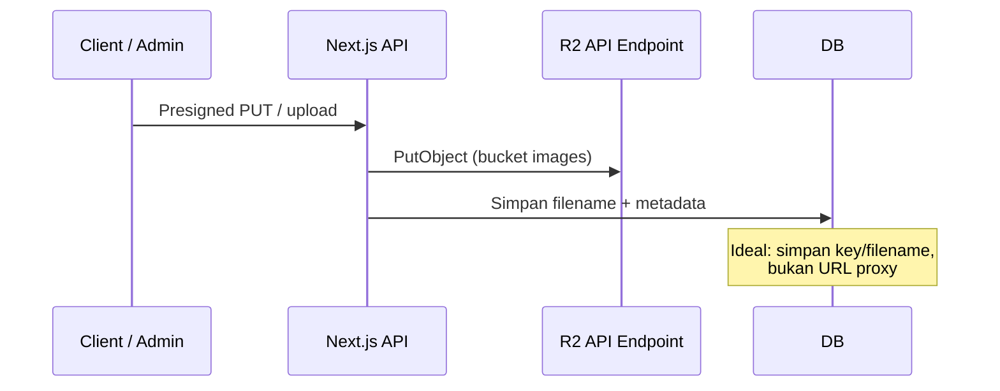
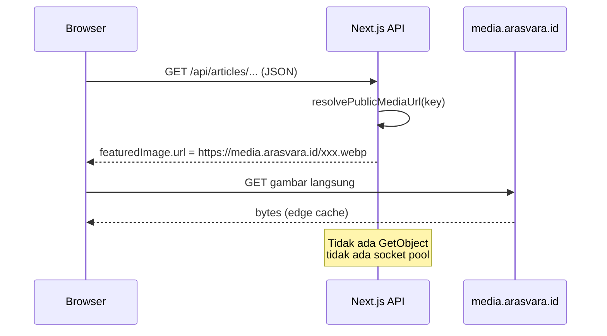
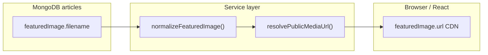
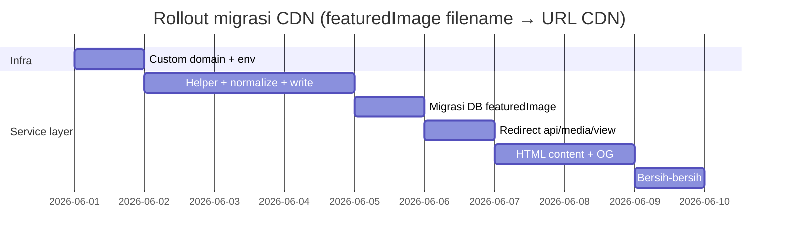

# Rencana Migrasi: Media Artikel ke Cloudflare R2 Custom Domain (Public Bucket)

**Tanggal:** 2026-05-29  
**Konteks:** Mengganti pola proxy streaming `/api/media/view` menjadi URL publik Cloudflare R2 (custom domain), dengan backend yang mengirim URL CDN ke client — **bukan presigned URL**.

**Prasyarat bacaan:** [`s3-problem.md`](./s3-problem.md) — menjelaskan mengapa proxy streaming memicu socket exhaustion di Railway.

---

## 1. Ringkasan proposal

### Yang diusulkan

| Komponen | Sekarang | Target |
|----------|----------|--------|
| Bucket `arasvara-images` | Private read via proxy Next.js | **Public read** via custom domain (mis. `media.arasvara.id`) |
| URL ke browser | `https://arasvara.id/api/media/view?key=...` | `https://media.arasvara.id/<storage-key>` |
| `/api/media/view` | Stream file dari R2 (GetObject) | **Resolver URL** (atau redirect 302), bukan streaming |
| Presigned GET | Tidak dipakai | **Tidak dipakai** — URL stabil & cacheable |

### Pola referensi yang sudah berjalan di codebase

Bucket **configuration** sudah memakai pola ini:

```typescript
// configurationService.ts — URL dibentuk saat READ, bukan disimpan permanen di DB
const storageBaseUrl = process.env.NEXT_PUBLIC_STORAGE_CONFIGURATION || "";
return `${storageBaseUrl}/${value.storageKey}`;
```

Target migrasi media artikel: **replikasi pola yang sama** dengan `NEXT_PUBLIC_STORAGE_MEDIA=https://media.arasvara.id`.

---

## 2. Arsitektur target

### 2.1 Alur upload (hampir tidak berubah)



### 2.2 Alur baca (berubah total)



### 2.3 Peran baru `/api/media/view`

Ada **tiga opsi** — pilih satu sebagai kontrak utama:

| Opsi | Perilaku | Cocok untuk `` lama? | Rekomendasi |
|------|----------|-------------------------------|-------------|
| **A. Redirect 302** | `Location: https://media.arasvara.id/key` | ✅ Ya, browser otomatis follow | **Terbaik untuk kompatibilitas** |
| **B. JSON resolver** | `{ "url": "https://media..." }` | ❌ Tidak, `` tidak bisa pakai JSON | Hanya untuk API eksplisit |
| **C. Hapus endpoint** | Semua URL sudah CDN di API response | ❌ Artikel/HTML lama patah | Hanya setelah migrasi penuh |

**Rekomendasi:** kombinasi **C jangka panjang** + **A sebagai jembatan** untuk URL lama di HTML/DB.

> Catatan: Jika `/api/media/view` hanya mengembalikan JSON URL, frontend harus **fetch dulu baru set src** — menambah latency dan kompleksitas. Lebih baik **resolve di server saat baca data** (seperti configuration) atau **302 redirect**.

---

## 3. Dampak pada data yang sudah ada

### 3.1 Apakah perlu migrasi MongoDB?

**`articles.featuredImage` — ya**, migrasi `url` → `filename` (Fase 2).  
**`articles.content` HTML — opsional** di Fase 4 (bisa runtime rewrite atau batch).  
**`media` collection — tidak wajib**; `filename` sudah ada sebagai sumber kebenaran.

| Koleksi / field | Isi saat ini | Target di DB |
|-----------------|--------------|--------------|
| `media.url` | `/api/media/view?key=...` | **Opsional** — tetap ada atau dihapus; `media.filename` tetap sumber kebenaran |
| `media.filename` | `featured/abc.webp` | **Tidak diubah** — key R2 |
| `articles.featuredImage.url` | Proxy URL embedded | **Diganti** → `articles.featuredImage.filename` (lihat §3.4) |
| `articles.content` (HTML) | `` | **Perlu perhatian** — lihat §3.2 |
| `articles.contentMedia[].url` | Proxy URL | Fase lanjutan: `filename` + resolve di service layer |
| `ads_*`, sponsor, socmed | Proxy URL di beberapa dokumen | Sama — resolver terpusat |

**File di R2 tidak perlu di-upload ulang** — `storage key` tetap valid; hanya **kontrak penyimpanan & pembentukan URL** yang berubah.

### 3.2 Titik paling rumit: HTML konten artikel

Konten artikel (Tiptap) disimpan sebagai **string HTML** di MongoDB. Gambar di body biasanya:

```html

```

Jika API mengembalikan `content` **apa adanya**, browser masih memanggil proxy lama.

**Solusi (pilih salah satu atau gabung):**

1. **Rewrite saat read** di `getArticleService` — regex/replace `/api/media/view?key=` → CDN URL (runtime, tanpa ubah DB).
2. **Migrasi batch** — script sekali jalan update semua `articles.content` (permanen, performa read lebih baik).
3. **Redirect 302** di `/api/media/view` — HTML lama tetap jalan tanpa ubah DB; traffic gambar pindah ke CDN setelah redirect.

Untuk transisi aman: **(3) segera** + **(1) atau (2)** untuk OG/sitemap/API JSON.

### 3.3 Data yang tidak terpengaruh

- `filename` / `storageKey` di object storage
- Relasi `mediaId` di `featuredImage`
- Upload flow presigned (masih ke R2 API endpoint)
- Bucket configuration (sudah CDN terpisah)

### 3.4 Kontrak `articles.featuredImage` (keputusan)

**Pisahkan storage (MongoDB) dan response (API ke client).**

#### Di MongoDB — simpan `filename`, bukan `url`

```json
{
  "featuredImage": {
    "mediaId": "6a1faacd9c7f842936d7e5b4",
    "filename": "featured/1780460235807-01KT5V50BNYFV45JY1EV0HQ1N2.webp",
    "caption": "screenshot halaman search",
    "credit": "septian"
  }
}
```

- **Jangan** simpan URL CDN di DB — domain CDN bisa berubah; `filename` stabil.
- **Jangan** simpan URL proxy `/api/media/view` — itu data derived yang cepat basi.
- `mediaId` tetap untuk relasi & validasi; `filename` denormalisasi dari `media.filename` saat write.

#### Di response API — client terima `url` CDN

Service layer (`normalizeFeaturedImage` + `resolvePublicMediaUrl`) membangun URL saat read:

```json
{
  "featuredImage": {
    "mediaId": "6a1faacd9c7f842936d7e5b4",
    "url": "https://media.arasvara.id/featured/1780460235807-01KT5V50BNYFV45JY1EV0HQ1N2.webp",
    "caption": "screenshot halaman search",
    "credit": "septian"
  }
}
```

Frontend publik (`NewsCard`, `HeroCard`, `ArticleUi`, dll.) **tetap pakai `featuredImage.url`** — tidak perlu diubah selama semua endpoint read melewati normalizer.

#### Backward-compat saat transisi

`normalizeFeaturedImage` mendukung data lama sampai migrasi batch selesai:

1. `filename` ada → `resolvePublicMediaUrl(filename)` → CDN URL  
2. Hanya `url` proxy lama → ekstrak key dari `?key=` → CDN URL  
3. Lookup `featuredImageMedia` dari aggregation → pakai `mediaPop.filename`

#### Migrasi batch `articles.featuredImage` (Fase 2)

Untuk setiap artikel dengan `featuredImage.url`:

1. Lookup `media.filename` via `featuredImage.mediaId` (paling akurat), atau  
2. Parse key dari `/api/media/view?key=...`  
3. Set `featuredImage.filename`, **unset** `featuredImage.url`

---

## 4. Perbandingan: rencana kamu vs alternatif

### Rencana kamu (CDN public + backend kirim URL Cloudflare)

| Aspek | Penilaian |
|--------|-----------|
| Mengatasi socket exhaustion | ✅ Ya — baca tidak lewat Railway |
| Kompleksitas | Sedang |
| Cache CDN | ✅ URL stabil, cacheable |
| Keamanan file publik | ✅ OK untuk artikel published |
| `/api/media/view` sebagai resolver | ✅ Baik jika **302** atau diganti resolve di service layer |

### Variasi: `/api/media/view` return JSON URL saja

| Aspek | Penilaian |
|--------|-----------|
| `` | ❌ Masih perlu stream atau redirect |
| Client harus 2-step | ❌ Buruk untuk performa |
| **Tidak disarankan** sebagai pengganti `` | |

### Presigned URL (bukan rencana kamu)

| Aspek | Penilaian |
|--------|-----------|
| Expired URL | ❌ Masalah cache & HTML lama |
| CDN cache | ❌ Sulit |
| **Tidak disarankan** untuk media artikel publik | |

---

## 5. Cakupan perubahan kode (estimasi)

### 5.1 Infrastruktur & env

```env
# API upload/delete (server only)
S3_ENDPOINT=https://<account>.r2.cloudflarestorage.com
S3_BUCKET_NAME=arasvara-images

# URL publik baca (browser)
NEXT_PUBLIC_STORAGE_MEDIA=https://media.arasvara.id
```

- Custom domain R2 di Cloudflare dashboard → bucket `arasvara-images`
- Pastikan **public access** enabled untuk bucket tersebut
- `next.config.ts` — tambah `media.arasvara.id` ke `remotePatterns`
- Opsional: `avatar.arasvara.id` untuk bucket avatar (terpisah)

### 5.2 Helper terpusat (inti migrasi)

Buat `src/lib/media/public-media-url.ts` (nama contoh):

```typescript
// Pseudocode
export function resolvePublicMediaUrl(input: string): string {
  // 1. Sudah https:// → return as-is
  // 2. /api/media/view?key=... → extract key → CDN
  // 3. filename saja / path key → CDN
  // 4. Normalisasi https:// pada base URL env
}
```

Pakai di **semua** layer response, bukan hanya satu endpoint.

### 5.3 File / area yang perlu disentuh

| Prioritas | Area | File (contoh) | Usaha |
|-----------|------|---------------|-------|
| P0 | Helper URL | `lib/media/public-media-url.ts` (baru) | 1 hari |
| P0 | Normalisasi featured image | `lib/helper-article.ts` — `normalizeFeaturedImage` output `url` CDN dari `filename` | 0.5 hari |
| P0 | Article write | `coreWriteArticleService.ts` — `resolveFeaturedImageForCreate` simpan `filename`, bukan `url` | 0.5 hari |
| P0 | Aggregation lookup | `FEATURED_IMAGE_LOOKUP_STAGES` — `$project` tambah `filename` | 0.25 hari |
| P0 | `/api/media/view` | Redirect 302 atau deprecate stream | 0.5 hari |
| P1 | Migrasi batch DB | Script: `featuredImage.url` → `featuredImage.filename` | 0.5–1 hari |
| P1 | Article read | `getArticleService.ts` + rewrite `content` HTML | 1–2 hari |
| P1 | Search / list | `searchService.ts`, `categoryService.ts`, `indeksService.ts` | 1 hari |
| P1 | Section homepage | `carouselSectionService.ts`, `articleSectionUtils.ts` | 1 hari |
| P1 | OG / metadata | `lib/og-image.ts` — OG harus URL absolut CDN | 0.5 hari |
| P2 | Admin preview | `lib/utils.ts` `getMediaPreviewUrl` — preview admin ke CDN | 0.25 hari |
| P2 | Ads / sponsor / socmed | `adsSharedHelpers.ts`, `sponsorUploadService.ts`, `videoSocmed*` | 1 hari |
| P2 | Frontend publik | Tidak wajib ubah jika API sudah kirim `url` CDN; opsional hapus `unoptimized` | 0.25 hari |
| P3 | `contentMedia` / `galleryItems` | Pola sama: `url` → `filename` di DB | 1 hari |
| P3 | Migrasi batch HTML | Script MongoDB one-off untuk `articles.content` | 1 hari (opsional) |

**Total estimasi:** ~5–8 hari kerja dev + 1–2 hari uji staging/production.

**Kompleksitas keseluruhan: sedang–tinggi** — bukan karena R2-nya sulit, tetapi karena **URL proxy tersebar** di banyak layer + HTML artikel.

### 5.4 Yang tidak perlu diubah

- Object files di R2 (kecuali mau reorganisasi folder)
- Flow presigned upload
- JWT / auth API artikel
- Bucket configuration (sudah benar)

---

## 6. Strategi rollout (disarankan)

### Tujuan rollout

1. **DB `articles`:** `featuredImage.url` → `featuredImage.filename` (storage key R2, bukan URL).  
2. **Service layer:** `resolvePublicMediaUrl(filename)` membangun URL di backend saat read.  
3. **Client:** `featuredImage.url` di response JSON sudah `https://media.arasvara.id/...` — frontend publik tidak perlu diubah.



---

### Fase 0 — Persiapan infra (1 hari)

- [ ] Custom domain `media.arasvara.id` → bucket `arasvara-images` (public read)
- [ ] Tes manual: `https://media.arasvara.id/<filename-yang-ada>` bisa diakses
- [ ] Set env: `NEXT_PUBLIC_STORAGE_MEDIA=https://media.arasvara.id` (staging & production)
- [ ] `remotePatterns` di `next.config.ts` untuk `media.arasvara.id`

---

### Fase 1 — Service layer + kontrak write (2–3 hari)

Inti migrasi: **filename di DB, URL CDN di response**.

- [ ] Implement `resolvePublicMediaUrl()` di `src/lib/media/public-media-url.ts`
- [ ] Update `normalizeFeaturedImage()`:
  - Input: `filename` dari embed atau `featuredImageMedia` lookup
  - Output: `url` = CDN (bukan proxy)
  - Fallback: parse `featuredImage.url` lama selama transisi
- [ ] Update `resolveFeaturedImageForCreate()` — simpan `filename: mediaDoc.filename`, **bukan** `url`
- [ ] Update `FEATURED_IMAGE_LOOKUP_STAGES` — proyeksikan `filename` dari koleksi `media`
- [ ] Terapkan normalizer di semua read path: `getArticleService`, `searchService`, `categoryService`, `indeksService`, `carouselSectionService`, `sectionArticleService`
- [ ] Update `getMediaPreviewUrl()` untuk admin preview (CDN)
- [ ] **Kriteria lulus:** artikel **baru** tersimpan dengan `featuredImage.filename`; API list/detail mengembalikan `featuredImage.url` ke `media.arasvara.id`

---

### Fase 2 — Migrasi DB `articles.featuredImage` (1 hari)

- [ ] Script batch MongoDB:
  - Lookup `media.filename` via `featuredImage.mediaId`, atau parse key dari `featuredImage.url` lama
  - Set `featuredImage.filename`, unset `featuredImage.url`
- [ ] Verifikasi sampel: tidak ada artikel published tanpa `filename` (kecuali tanpa featured image)
- [ ] Deploy dengan normalizer backward-compat tetap aktif sampai script selesai
- [ ] **Kriteria lulus:** koleksi `articles` tidak lagi menyimpan `featuredImage.url` proxy

---

### Fase 3 — Kompatibilitas legacy & beban server (1 hari)

- [ ] Ubah `GET /api/media/view` dari stream → **302** ke `resolvePublicMediaUrl(key)`
- [ ] Artikel dengan HTML lama (``) tetap tampil via redirect
- [ ] Monitor Railway: `socket usage at capacity=50` harus turun drastis
- [ ] **Kriteria lulus:** Network tab gambar featured/list/detail ke `media.arasvara.id`, bukan stream dari Railway

---

### Fase 4 — Konten artikel body & OG (1–2 hari)

- [ ] Rewrite `article.content` saat read ATAU script migrasi batch HTML
- [ ] `lib/og-image.ts` — `og:image` pakai URL CDN absolut
- [ ] Tes share artikel di WhatsApp / Facebook Debugger
- [ ] **Kriteria lulus:** gambar di body artikel & OG preview tidak lewat proxy stream

---

### Fase 5 — Bersih-bersih (opsional)

- [ ] Hapus kode streaming `getMediaViewStream` untuk akses publik
- [ ] Hapus fallback parse `featuredImage.url` di normalizer (setelah migrasi DB 100%)
- [ ] Terapkan pola `filename` → `contentMedia[]`, `galleryItems[]`, `media.url` (konsistensi)
- [ ] Dokumentasi env & `deploy_memo.md` untuk tim

---

### Timeline



### Urutan deploy yang aman

| Urutan | Deploy | Alasan |
|--------|--------|--------|
| 1 | Fase 0 + Fase 1 | CDN hidup; write path sudah `filename`; read path sudah kirim URL CDN |
| 2 | Fase 2 (script) | Bersihkan DB tanpa breaking client (normalizer masih fallback) |
| 3 | Fase 3 | Kurangi socket segera untuk HTML/proxy lama |
| 4 | Fase 4–5 | Body artikel, OG, cleanup |

---

## 7. Dampak per stakeholder

| Stakeholder | Dampak |
|-------------|--------|
| **Pengunjung** | Gambar load lebih cepat; lebih jarang gagal |
| **Railway / server** | Beban CPU & socket turun besar untuk traffic gambar |
| **Admin editor** | Preview gambar pakai URL CDN; sedikit perubahan UI |
| **SEO / social** | OG image harus URL CDN absolut — perlu verifikasi Facebook Debugger |
| **Biaya** | R2 egress berkurang dari app server; egress CDN R2 per Cloudflare pricing |
| **Keamanan** | File artikel published = publik (sama seperti sekarang via proxy tanpa auth) |

---

## 8. Hal lain yang perlu kamu ketahui

### 8.1 Public bucket ≠ semua file harus publik

- **Artikel published** → public CDN ✅  
- **Draft / incoming ads** → tetap di prefix private atau bucket terpisah; jangan expose `ads/homepage/incoming/`  
- Review prefix di bucket: `featured/`, `content-images/`, `gallery-content/`, `ads/`

### 8.2 Tiga bucket, tiga domain (konsisten dengan arsitektur sekarang)

| Bucket | Custom domain (contoh) | Env |
|--------|------------------------|-----|
| `arasvara-configuration` | `configuration.arasvara.id` | `NEXT_PUBLIC_STORAGE_CONFIGURATION` ✅ |
| `arasvara-images` | `media.arasvara.id` | `NEXT_PUBLIC_STORAGE_MEDIA` (baru) |
| `arasvara-avatars` | `avatar.arasvara.id` | `NEXT_PUBLIC_STORAGE_AVATAR` (opsional) |

Satu `S3_ENDPOINT` untuk API upload tetap dipakai untuk semua bucket.

### 8.3 `NEXT_PUBLIC_*` harus pakai `https://`

Pelajaran dari configuration: env **wajib** `https://media.arasvara.id`, bukan hostname saja.

### 8.4 next/image setelah migrasi

Saat URL sudah `https://media.arasvara.id/...`:

- Bisa **hapus** `unoptimized: true` di `NewsCard`, `HeroCard`, dll.
- Next.js Image Optimization akan fetch dari CDN (opsional — CDN R2 sudah cukup cepat dengan `unoptimized` juga)

### 8.5 Cache

- CDN + browser cache URL stabil = hit rate tinggi
- Tidak perlu `Cache-Control` di Next.js untuk gambar yang sudah tidak diproxy
- Di R2/Cloudflare bisa set cache rules untuk `media.arasvara.id`

### 8.6 `/api/media/view` sebagai “URL getter” saja

Jika tetap ingin endpoint resolver:

```typescript
// GET /api/media/view?key=xxx
// Opsi 1 (disarankan untuk img tag lama):
return NextResponse.redirect(cdnUrl, 302);

// Opsi 2 (untuk tooling/admin):
return NextResponse.json({ url: cdnUrl });
```

**Jangan** stream + JSON sekaligus.

### 8.7 Risiko & mitigasi

| Risiko | Mitigasi |
|--------|----------|
| Artikel lama HTML masih proxy | Fase 2: redirect 302 |
| OG cache URL lama | Facebook Sharing Debugger refresh |
| Env salah (tanpa https) | Normalisasi di helper + validasi deploy |
| File tidak ada di bucket | 404 dari CDN; pertahankan fallback `ImageNotFound` di UI |
| Mixed content | Semua URL HTTPS |

### 8.8 Kriteria sukses

- [ ] Log Railway: tidak ada `socket usage at capacity=50` saat traffic normal
- [ ] Network tab: gambar featured artikel dari `media.arasvara.id`
- [ ] DB `articles`: `featuredImage` menyimpan `filename`, **tanpa** `url` proxy
- [ ] API response: `featuredImage.url` = URL CDN (`https://media.arasvara.id/...`)
- [ ] Artikel lama (sebelum migrasi batch) tetap tampil via normalizer fallback
- [ ] Upload artikel baru: write path simpan `filename`; client langsung terima URL CDN
- [ ] WhatsApp preview artikel menampilkan gambar OG

---

## 9. Jawaban langsung atas pertanyaan kamu

### “Semua fetching gambar lewat custom domain public bucket — dampaknya?”

**Positif dan ini arsitektur yang benar** untuk media publik skala berita. Railway tidak lagi jadi bottleneck distribusi gambar.

### “`/api/media/view` untuk mendapatkan URL Cloudflare, backend kirim URL ke client — perlu ubah data?”

- **`articles.featuredImage`:** **Ya** — ganti `url` → `filename` di MongoDB; URL CDN **hanya** di response API (service layer).
- **`media` collection:** `filename` sudah cukup; `media.url` proxy opsional dihapus nanti.
- **HTML `articles.content`:** perlu rewrite (runtime atau migrasi batch) kecuali cukup dengan redirect 302 untuk `` lama.
- **Normalisasi read-time** wajib di semua endpoint yang mengembalikan `featuredImage` ke client.

### “Kompleksitas?”

**Sedang–tinggi** (~5–8 hari dev): satu helper terpusat + ~15–20 file touch points + uji regresi homepage/artikel/admin/OG. Bukan migrasi file R2, melainkan **migrasi kontrak URL** di seluruh aplikasi.

### “Presigned vs public URL?”

Rencana kamu (**public URL stabil**) **tepat** untuk artikel. Presigned hanya untuk upload atau file private.

---

## 10. Keputusan arsitektur yang disarankan

```
┌─────────────────────────────────────────────────────────────┐
│  WRITE (upload / simpan artikel)                            │
│  Client → Next.js API → S3_ENDPOINT (R2 API)                │
│  DB articles.featuredImage ← { mediaId, filename, caption } │
│  (tanpa url di MongoDB)                                     │
└─────────────────────────────────────────────────────────────┘

┌─────────────────────────────────────────────────────────────┐
│  READ (tampilkan gambar)                                    │
│  Service: normalizeFeaturedImage + resolvePublicMediaUrl()  │
│  API JSON → featuredImage.url = https://media.arasvara.id/… │
│  Browser → media.arasvara.id/<filename>  (langsung, cached) │
│  Legacy /api/media/view?key= → 302 → media.arasvara.id      │
└─────────────────────────────────────────────────────────────┘
```

Ini selaras dengan keputusan rollout, dengan klarifikasi penting:

1. **MongoDB menyimpan `filename`** — bukan URL proxy, bukan URL CDN.  
2. **Client menerima `url` CDN** — dibangun di service layer saat read.  
3. **`/api/media/view`** — jangan stream; pakai **redirect** untuk HTML legacy.  
4. **Bukan presigned** — benar untuk use case ini.  
5. **Migrasi batch Fase 2** — `featuredImage.url` → `featuredImage.filename` di seluruh `articles`.

---

## 11. Langkah berikutnya (aksi)

1. Setup `media.arasvara.id` di Cloudflare R2.  
2. Implement `resolvePublicMediaUrl()` + update `normalizeFeaturedImage` (output `url` CDN dari `filename`).  
3. Update `resolveFeaturedImageForCreate` — write path simpan `filename`, bukan `url`.  
4. Deploy staging → uji: API response `featuredImage.url` = CDN; DB artikel baru punya `filename`.  
5. Jalankan script migrasi batch: `featuredImage.url` → `featuredImage.filename`.  
6. Ubah `/api/media/view` ke redirect 302 (quick win socket).  
7. Rewrite `article.content` atau script migrasi batch HTML + verifikasi OG.  
8. Update `.env.prod` & `deploy_memo.md`.
