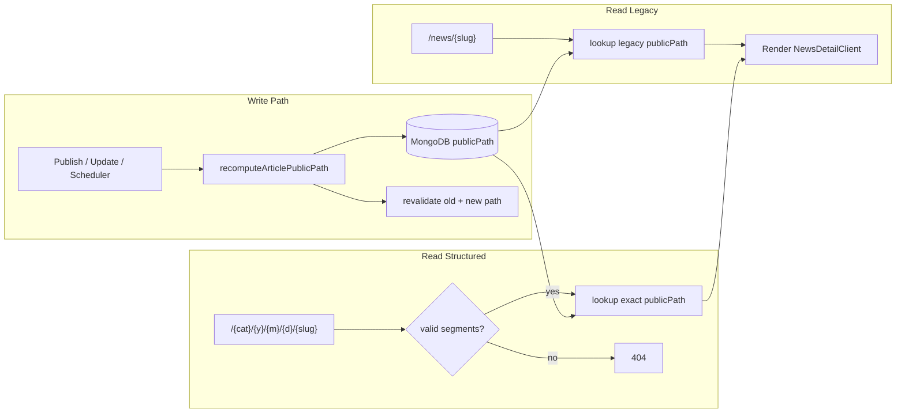

# Plan Implementasi: Refactor URL Artikel (Revisi 3 — Tanpa `/news` di Structured)

> **Diperbarui:** 2026-06-23  
> **Berdasarkan:** [refactor-link-article.md](./refactor-link-article.md) (Revisi 2) + keputusan produk baru  
> **Status codebase saat audit:** Fase 1–4 **sebagian besar selesai** dengan prefix `/news/` — perlu migrasi ke format root structured

---

## Ringkasan Perubahan (Revisi 3)

### Format URL baru

| Jenis | Format lama (sudah diimplementasi) | Format target (Revisi 3) |
|-------|-----------------------------------|--------------------------|
| **Structured** (artikel published baru) | `/news/{categorySlug}/{yyyy}/{mm}/{dd}/{articleSlug}` | `/{categorySlug}/{yyyy}/{mm}/{dd}/{articleSlug}` |
| **Legacy** (artikel pre-deploy) | `/news/{slug}` | `/news/{slug}` — **tidak berubah** |
| **CMS preview** (non-PUBLISHED) | `/news/{slug}` | `/news/{slug}` — **tidak berubah** |

Contoh:

```
# Sebelum (implementasi saat ini)
https://arasvara.id/news/business/2026/06/19/pemilu-2024

# Sesudah (target)
https://arasvara.id/business/2026/06/19/pemilu-2024

# Legacy tetap
https://arasvara.id/news/pemilu-2024-a1b2c3d4
```

### Keputusan produk tambahan

| Aspek | Keputusan |
|-------|-----------|
| Prefix `/news/` pada structured | **Dihapus** — kategori langsung di root |
| Prefix `/news/` pada legacy | **Dipertahankan** — backward compat artikel lama |
| Redirect URL lama structured (`/news/cat/...`) | **Tidak ada** — 404 (sama seperti edit artikel) |
| Halaman kategori | Tetap di `/category/{slug}` — **tidak** pindah ke `/{slug}` |
| Konflik routing root | Mitigasi via route eksplisit 5-segmen + daftar reserved segments |

---

## Requirement (Revisi 3)

### R1 — Format URL structured (diperbarui)

| ID | Requirement | Detail |
|----|-------------|--------|
| R1.1 | Template path | `/{categorySlug}/{yyyy}/{mm}/{dd}/{articleSlug}` |
| R1.2 | Tanpa prefix `/news/` | Structured **tidak** diawali `/news/` |
| R1.3 | Zero-padding tanggal | `yyyy`, `mm`, `dd` numerik; `mm` dan `dd` dua digit |
| R1.4 | Sumber kategori | `category.slug` terkini |
| R1.5 | Sumber slug | `articles.slug` terkini |
| R1.6 | Sumber tanggal | `publishedAt` terkini, dikonversi ke kalender WIB |

### R2 — Perilaku URL = state artikel saat ini

*(Tidak berubah dari Revisi 2)*

| ID | Requirement | Detail |
|----|-------------|--------|
| R2.1 | Full recompute on edit | Perubahan `slug`, `categoryId`, `publishedAt` → `publicPath` dihitung ulang |
| R2.2 | Tidak ada field snapshot | Tidak pakai `urlDateWib` / `publishedCategorySlug` frozen |
| R2.3 | URL lama mati setelah edit | Path structured lama → **404** |
| R2.4 | Draft / non-published | Tanpa `publishedAt` → tidak punya public path structured |

### R3 — Model hybrid (legacy + structured)

| ID | Requirement | Detail |
|----|-------------|--------|
| R3.1 | Artikel pre-deploy | Tetap `/news/{slug}`, `urlFormat: "legacy"` |
| R3.2 | Artikel post-deploy | `urlFormat: "structured"`, path **tanpa** `/news/` |
| R3.3 | Tidak ada migrasi otomatis legacy→structured | Legacy tidak di-convert tanpa aksi eksplisit |
| R3.4 | Tidak ada redirect | Legacy ↔ structured; structured lama ↔ structured baru; `/news/cat/...` ↔ `/cat/...` |

### R4 — Zero redirect (universal)

*(Tidak berubah)*

### R5 — Data layer

| ID | Requirement | Detail |
|----|-------------|--------|
| R5.1 | Field `publicPath` | Structured: `/cat/y/m/d/slug`; Legacy: `/news/slug` |
| R5.2 | Field `urlFormat` | `"legacy" \| "structured"` |
| R5.3 | Index MongoDB | Sparse unique pada `publicPath` |
| R5.4 | Recompute hooks | Publish, update, approve, scheduler |

### R6 — Helper terpusat (diperbarui)

| ID | Requirement | Detail |
|----|-------------|--------|
| R6.1 | File | `src/lib/article-public-path.ts` — **sudah ada**, perlu update |
| R6.2 | Konstanta | Pisahkan `LEGACY_PREFIX = "/news"` vs structured tanpa prefix |
| R6.3 | Builder structured | `buildStructuredArticlePath()` → `/{cat}/{y}/{m}/{d}/{slug}` |
| R6.4 | Builder legacy | `buildLegacyArticlePath()` → `/news/{slug}` (tetap) |
| R6.5 | Parser legacy | `parseLegacyNewsPath(segments)` — 1 segmen setelah `/news/` |
| R6.6 | Parser structured | `parseStructuredArticlePath(segments)` — 5 segmen di root |
| R6.7 | Deteksi format | `isStructuredPublicPath()` — 5 segmen, **bukan** diawali `/news/` |
| R6.8 | Reserved segments | `isReservedRootSegment()` — cegah kategori bentrok route statis |
| R6.9 | Unit test | Update semua ekspektasi path |

### R7 — Routing Next.js (diperbarui — split route)

| ID | Requirement | Detail |
|----|-------------|--------|
| R7.1 | Route structured | `src/app/(public)/[category]/[yyyy]/[mm]/[dd]/[slug]/page.tsx` |
| R7.2 | Route legacy | `src/app/(public)/news/[...segments]/page.tsx` — **hanya** 1 segmen |
| R7.3 | Shared UI | `NewsDetailClient` dipakai bersama (pindah ke lokasi shared jika perlu) |
| R7.4 | Validasi structured | `category` bukan reserved; `yyyy/mm/dd` numerik valid |
| R7.5 | Lookup | Exact match `publicPath` di DB |
| R7.6 | Hapus structured dari `/news/` | `news/[...segments]` tidak lagi menerima 5 segmen |

**Alasan route eksplisit 5-segmen (bukan catch-all root):**

- Route statis (`/search`, `/indeks`, `/about-us`, dll.) tetap prioritas Next.js
- Tidak menangkap path acak 1–4 segmen
- Pola jelas: hanya URL artikel structured yang match

### R8 — API & response

| ID | Requirement | Detail |
|----|-------------|--------|
| R8.1 | `publicPath` di response | Sudah ada — update nilai ke format baru |
| R8.2 | `GET /api/articles/by-path` | Terima structured **tanpa** `/news/`; legacy tetap `/news/slug` |
| R8.3 | Validasi by-path | Jangan require `startsWith("/news/")` untuk semua path |

### R9 — Cache / ISR

| ID | Requirement | Detail |
|----|-------------|--------|
| R9.1 | Cache tag by path | Sudah ada (`getArticleCacheTagFromPublicPath`) |
| R9.2 | Revalidate | `revalidatePath` untuk path baru **dan** path lama saat migrasi |
| R9.3 | `extractSlugFromPublicPath` | Support kedua format (legacy `/news/slug`, structured 5-segmen) |

### R10 — Refactor link

| ID | Requirement | Detail |
|----|-------------|--------|
| R10.1 | Kartu publik | `resolvePublicArticleHref()` — otomatis benar setelah helper diupdate |
| R10.2 | CMS preview | `resolveCmsArticleViewHref()` — non-published tetap `/news/slug` |
| R10.3 | Sitemap | `loc` dari `publicPath` baru; hapus hack strip `/news/` |
| R10.4 | Notifikasi | `link: article.publicPath` — recompute ke format baru |

### R11 — SEO & metadata

*(Prinsip sama — canonical = `article.publicPath`)*

### R12 — Editor UX

| ID | Requirement | Detail |
|----|-------------|--------|
| R12.1 | Preview URL | Tampilkan `/{cat}/{y}/{m}/{d}/{slug}` (bukan `/news/...`) |
| R12.2 | Warning edit published | Tetap berlaku |

### R13 — Migrasi data & rollout

| ID | Requirement | Detail |
|----|-------------|--------|
| R13.1 | Script migrasi DB | Recompute `publicPath` structured: strip `/news/` prefix |
| R13.2 | Dry-run default | Sama pola `upgrade-articles-to-structured-path.ts` |
| R13.3 | Revalidate batch | Invalidate cache path lama + baru pasca-migrasi |
| R13.4 | Monitoring | Spike 404 di `/news/{cat}/...` (URL structured lama) dan `/news/*` legacy |

### R14 — QA matrix (diperbarui)

| # | Kasus | Ekspektasi |
|---|-------|------------|
| Q1 | Legacy `/news/slug-lama` | 200 |
| Q2 | Structured `/business/2026/06/19/judul` | 200, canonical = `publicPath` |
| Q3 | Structured lama `/news/business/2026/06/19/judul` | **404** (tanpa redirect) |
| Q4 | Publish baru WIB 19/06/2026 | Path `.../2026/06/19/...` tanpa `/news/` |
| Q5 | UTC near midnight → WIB date | Tanggal sesuai WIB |
| Q6 | Edit kategori | New path 200, old path 404 |
| Q7 | Edit slug / `publishedAt` | Path baru 200, lama 404 |
| Q8 | No redirect anywhere | 301 never returned |
| Q9 | Sitemap | Hanya `publicPath` terkini (format baru) |
| Q10 | Reserved segment `/search/2026/06/19/x` | 404 (bukan artikel) |
| Q11 | `/category/business` | 200 — halaman kategori tidak terganggu |
| Q12 | CMS preview draft | `/news/{slug}` 200 (staf) |

---

## Gap Analysis: Kondisi Kode vs Target Revisi 3

### Sudah selesai (Revisi 2 — tidak perlu dibangun ulang)

| Area | File | Status |
|------|------|--------|
| Helper inti | `src/lib/article-public-path.ts` | ✅ Ada — **perlu update prefix** |
| Types | `src/types/article.ts`, `sitemap.ts` | ✅ `publicPath`, `urlFormat` |
| Mapper | `src/lib/helper-article.ts` | ✅ |
| Recompute service | `src/services/article/articlePublicPathService.ts` | ✅ |
| Write hooks | `coreWriteArticleService.ts`, `writeArticleService.ts` | ✅ |
| Lookup by path | `getPublishedArticleByPublicPath()` | ✅ |
| Server fetch | `fetchArticleServer.ts` | ✅ |
| API by-path | `src/app/api/articles/by-path/route.ts` | ✅ — **validasi `/news/` perlu diubah** |
| Cache tag | `article-cache-config.ts` | ✅ |
| Revalidate | `revalidate-article-page.ts` | ✅ — **asumsi `/news/` perlu diubah** |
| Route catch-all | `news/[...segments]/page.tsx` | ✅ — **perlu split: legacy only** |
| Kartu & link | `NewsCard`, `HeroCard`, dll. via `resolvePublicArticleHref` | ✅ |
| Admin links | `resolveCmsArticleViewHref` | ✅ |
| Sitemap service | `sitemapService.ts` | ✅ |
| Scripts | `audit-article-paths.ts`, `backfill-article-public-path.ts`, `upgrade-articles-to-structured-path.ts` | ✅ — **perlu update path template** |
| Unit test | `article-public-path.test.ts` | ✅ — **perlu update ekspektasi** |
| Feature flag | `ARTICLE_STRUCTURED_URL_ENABLED` | ✅ |

### Belum sesuai target Revisi 3

| Requirement | Masalah saat ini |
|-------------|------------------|
| R1.1–R1.2 | `buildStructuredArticlePath` masih prepend `/news/` |
| R6.5–R6.6 | `parseNewsArticlePath` mengasumsikan semua path diawali `/news/` |
| R7.1 | Belum ada route `[category]/[yyyy]/[mm]/[dd]/[slug]` |
| R7.6 | `news/[...segments]` masih handle 5 segmen structured |
| R8.2 | API by-path reject path tanpa `/news/` |
| R9.3 | `extractSlugFromPublicPath` hanya parse path `/news/...` |
| R10.3 | `sitemap-xml.ts` strip `/news/` sebelum parse |
| R13.1 | DB `publicPath` structured masih berformat `/news/cat/...` |
| R6.8 | Belum ada validasi reserved root segments |

---

## Reserved Root Segments

Segmen pertama path structured **tidak boleh** sama dengan route statis aplikasi:

```typescript
// Usulan: src/lib/article-public-path.ts
const RESERVED_ROOT_SEGMENTS = new Set([
  "news",        // legacy article prefix
  "category",    // halaman kategori
  "search",
  "indeks",
  "author",
  "about-us",
  "disclaimer",
  "pedoman-media-siber",
  "login",
  "admin-xyz",
  "api",
  "sitemap.xml",
  "robots.txt",
  "media",
  "og",
  "placeholder.jpg",
]);
```

**Tindakan preventif:** Saat create/update kategori di admin, validasi `slug` tidak ada di set ini.

---

## File & Layer Terdampak (Revisi 3)

### P0 — Inti path & routing (wajib pertama)

| Layer | File | Perubahan |
|-------|------|-----------|
| **Helper** | `src/lib/article-public-path.ts` | Hapus `/news/` dari structured; split parser; reserved segments |
| **Unit test** | `src/lib/article-public-path.test.ts` | Update semua path ekspektasi |
| **Route baru** | `src/app/(public)/[category]/[yyyy]/[mm]/[dd]/[slug]/page.tsx` | Halaman detail structured |
| **Route legacy** | `src/app/(public)/news/[...segments]/page.tsx` | Hanya `segments.length === 1` |
| **Shared client** | `NewsDetailClient.tsx` | Pindah ke `src/components/news/` atau di-import dari kedua route |
| **API** | `src/app/api/articles/by-path/route.ts` | Validasi path: legacy `/news/...` atau structured 5-segmen root |
| **Revalidate** | `src/lib/cache/revalidate-article-page.ts` | `extractSlugFromPublicPath` support kedua format |
| **Sitemap XML** | `src/lib/sitemap-xml.ts` | Hapus `.replace(/^\/news\/?/, "")`; pakai `isStructuredPublicPath` langsung |
| **Script migrasi** | `scripts/migrate-structured-path-remove-news-prefix.ts` | **Baru** — recompute DB + dry-run |
| **Script upgrade** | `scripts/upgrade-articles-to-structured-path.ts` | Update komentar & output path |

### P1 — Otomatis ikut setelah P0 (minimal/no-op)

| Layer | File | Catatan |
|-------|------|---------|
| Kartu berita | `NewsCard`, `HeroCard`, `SecondaryNewsCard`, dll. | Sudah pakai `resolvePublicArticleHref` — ikut helper |
| Write service | `coreWriteArticleService.ts`, `writeArticleService.ts` | Recompute otomatis benar |
| Notifikasi | idem | `link: publicPath` |
| Sitemap service | `sitemapService.ts` | Query `publicPath` — nilai berubah di DB |
| Admin | `articles/page.tsx`, analytics, approval | `resolveCmsArticleViewHref` |
| Editor | `ArticleEditorForm.tsx`, `ArticleEditorFormUi.tsx` | Preview path dari helper |

### P2 — Perlu review manual (komentar/hardcode)

| Layer | File | Perubahan |
|-------|------|-----------|
| Utils | `src/lib/utils.ts` | `buildArticleShareUrl(slug)` tetap `/news/` (preview CMS) — OK |
| View access | `src/lib/articleViewAccess.ts` | Update komentar path |
| Fetch server | `fetchArticleServer.ts` | Review komentar |
| Types | `src/types/article.ts` | Update JSDoc `publicPath` jika ada |

### Tidak terdampak

| File | Alasan |
|------|--------|
| `src/app/(public)/category/[category]/page.tsx` | Prefix `/category/` berbeda |
| `src/app/admin-xyz/articles/[idOrSlug]/page.tsx` | Admin by id/slug |
| `next.config.ts` | Tidak ada redirect |

---

## Fase Implementasi (Revisi 3)

### Fase A — Update helper & test (estimasi 0.5–1 hari)

**Tujuan:** Single source of truth path baru tanpa mengubah routing dulu.

**Tasks:**

1. Di `article-public-path.ts`:
   - `buildStructuredArticlePath` → return `/${categorySlug}/${year}/${pad2(month)}/${pad2(day)}/${articleSlug}`
   - `buildLegacyArticlePath` → tetap `/news/{slug}`
   - Tambah `RESERVED_ROOT_SEGMENTS` + `isReservedRootSegment()`
   - Split `parseNewsArticlePath` menjadi:
     - `parseLegacyNewsSegments(segments: string[])` — 1 segmen
     - `parseStructuredArticleSegments(segments: string[])` — 5 segmen → `publicPath`
   - Update `isStructuredPublicPath` — cek 5 segmen + tanggal valid (termasuk kategori `news` → `/news/{y}/{m}/{d}/{slug}`)
   - Update `parseNewsArticlePath` sebagai wrapper backward-compat (deprecated) atau hapus
2. Update `article-public-path.test.ts` — ekspektasi path structured + kasus kategori `news`
3. Jalankan test: `npm test -- article-public-path`

**Deliverable:** Helper + test hijau.

**Status:** ✅ Selesai (2026-06-23)

**Catatan implementasi:**
- `news` **tidak** masuk `RESERVED_ROOT_SEGMENTS` (keputusan produk: kategori slug `news` tetap dipakai)
- `isStructuredPublicPath` membedakan legacy `/news/{slug}` (2 segmen) vs structured `/news/{y}/{m}/{d}/{slug}` (5 segmen)
- `isValidArticlePublicPath` + `getPublishedArticleByPublicPath` sudah pakai helper validasi terpusat

---

### Fase B — Split routing (estimasi 1–2 hari)

**Tujuan:** Structured dilayani di root; legacy tetap di `/news/`.

**Tasks:**

1. Pindahkan `NewsDetailClient.tsx` ke `src/components/news/NewsDetailClient.tsx` (opsional tapi disarankan).
2. Buat `src/app/(public)/[category]/[yyyy]/[mm]/[dd]/[slug]/page.tsx`:
   - Validasi reserved segment + tanggal numerik
   - Build `publicPath` dari params
   - `fetchPublishedArticleByPath(publicPath)`
   - Metadata & canonical sama seperti route lama
3. Sederhanakan `news/[...segments]/page.tsx`:
   - Legacy: `segments.length === 1` → `/news/{slug}`
   - **Tambahan (deviasi plan):** `segments.length === 4` → structured kategori `news` → `/news/{y}/{m}/{d}/{slug}`
4. Update `src/app/api/articles/by-path/route.ts`:
   - Terima `publicPath` structured (`/cat/...`) atau legacy (`/news/slug`)
5. Update `revalidate-article-page.ts` — `extractSlugFromPublicPath` untuk kedua format
6. Ekstrak shared logic ke `src/lib/server/article-detail-page.ts`

**Deliverable:** URL baru live; legacy `/news/{slug}` tetap jalan.

**Status:** ✅ Selesai (2026-06-23)

**Catatan implementasi:**
- Route `news/[...segments]` **bukan** legacy-only — juga melayani structured kategori `news` (fix URL seperti `/news/2026/06/15/{slug}`)
- URL structured lama format `/news/{cat}/{y}/{m}/{d}/{slug}` (non-news) → **404** (expected, tanpa redirect)

---

### Fase C — Migrasi data MongoDB (estimasi 0.5–1 hari)

**Tujuan:** Semua artikel `urlFormat: "structured"` punya `publicPath` format baru (recompute via helper).

**Tasks:**

1. Buat `scripts/migrate-structured-path-remove-news-prefix.ts`:
   - Query structured yang masih pakai prefix migrasi lama (`/news/{cat}/...`)
   - Recompute via `buildStructuredArticlePath` (bukan string replace naif)
   - Dry-run default; `--execute` untuk write
   - Laporkan konflik index unique; skip kategori reserved (bukan `news`)
2. Setelah execute: batch warm cache via `scripts/warm-article-paths-cache.ts` + manifest revalidate
3. Update `scripts/audit-article-paths.ts` — flag stale prefix & path mismatch

**Deliverable:** DB konsisten; sitemap & notifikasi emit path baru.

**Status:** 🟡 Script selesai; execute DB per environment

**Catatan implementasi:**
- NPM: `migrate:structured-path-prefix` / `:prod`, `warm:article-paths` / `:prod`
- Dry-run lokal: **122 artikel** siap dimigrasi (termasuk kategori `news`)
- **Belum dikonfirmasi** apakah `--execute` sudah dijalankan di staging/prod
- Path kategori `news` tetap berprefix `/news/` (bukan bug): `/news/{y}/{m}/{d}/{slug}`

---

### Fase D — Sitemap, editor UX, QA (estimasi 1 hari)

**Tasks:**

1. `sitemap-xml.ts` — hapus strip `/news/`; validasi structured via `isStructuredPublicPath`
2. `ArticleEditorFormUi` + `ArticleEditorForm` — preview URL format baru (live recompute + warning `urlWillChange`)
3. Jalankan matriks QA Q1–Q12
4. Grep verifikasi:
   - Structured path di test/helper tidak mengandung `/news/{cat}/` (format lama double-prefix)
   - `buildLegacyArticlePath` dan preview CMS masih `/news/`
5. Unit test `src/lib/sitemap-xml.test.ts`

**Deliverable:** Sign-off QA Revisi 3.

**Status:** 🟡 Mayoritas selesai; QA manual penuh belum sign-off

**Catatan implementasi:**
- Sitemap, editor preview, unit test (46 test path+sitemap) ✅
- QA manual di dev: structured root ✅, legacy `/news/{slug}` ✅, kategori `news` structured via `/news/{y}/{m}/{d}/{slug}` ✅
- Matriks Q1–Q12 formal + sign-off dokumentasi belum ditandai selesai

---

### Fase E — Rollout & monitoring (estimasi 0.5 hari + observasi)

**Tasks:**

1. Deploy ke staging → production
2. Monitor 404:
   - `/news/{category}/*` (structured lama — expected spike sekali)
   - Link eksternal yang masih pakai format lama
3. Opsional: komunikasi internal ke redaksi tentang format URL baru

**Status:** ❌ Belum dikerjakan (operasional)

---

## Diagram Alur (Revisi 3)



---

## Risiko & Mitigasi

| Risiko | Dampak | Mitigasi |
|--------|--------|----------|
| Kategori slug = `search` / reserved lain | Route bentrok | `RESERVED_ROOT_SEGMENTS` (tanpa `news`) + validasi admin |
| Kategori slug = `news` | Bentrok dengan legacy `/news/{slug}` | Dibedakan jumlah segmen; route `news/[...segments]` handle keduanya |
| URL structured lama di SERP/sosmed | 404 setelah deploy | Diterima (no redirect); komunikasi redaksi |
| Index unique `publicPath` bentrok saat migrasi | Script gagal | Dry-run + laporan duplikat sebelum execute |
| ISR cache path lama | User lihat halaman lama sementara | `revalidatePath` batch pasca-migrasi |
| `news/[...segments]` 5 segmen bookmark | 404 | Expected; tidak ada redirect |

---

## Checklist Cepat Sebelum Merge (Revisi 3)

- [x] `buildStructuredArticlePath` return path format baru (`/{cat}/...`; kategori `news` → `/news/{y}/{m}/{d}/{slug}`)
- [x] `buildLegacyArticlePath` masih `/news/{slug}`
- [x] Route `[category]/[yyyy]/[mm]/[dd]/[slug]` + `/news/[...segments]` (legacy + kategori `news`)
- [x] Unit test `article-public-path` + `sitemap-xml` lulus
- [x] API by-path terima kedua format
- [x] Script migrasi DB dry-run reviewed
- [ ] DB structured `publicPath` sudah di-execute migrasi di target env
- [x] `/news/{cat}/{y}/{m}/{d}/{slug}` format lama (non-news) → 404
- [x] `/{cat}/{y}/{m}/{d}/{slug}` → 200
- [x] `/news/{legacy-slug}` → 200
- [x] `/news/{y}/{m}/{d}/{slug}` kategori news → 200
- [x] `/category/{cat}` → 200 (tidak terganggu)
- [x] Sitemap hanya path structured valid
- [x] Tidak ada 301 di mana pun
- [x] Editor preview URL format baru

---

## Estimasi Total (Revisi 3)

| Fase | Durasi |
|------|--------|
| A — Helper & test | 0.5–1 hari |
| B — Split routing | 1–2 hari |
| C — Migrasi DB | 0.5–1 hari |
| D — Sitemap, editor, QA | 1 hari |
| E — Rollout | 0.5 hari + monitoring |
| **Total** | **~3.5–5.5 hari kerja** |

> Catatan: Estimasi jauh lebih kecil dari Revisi 2 (~12–14 hari) karena fondasi (`publicPath`, recompute, kartu, API) **sudah diimplementasi**.

---

## Referensi

- Spesifikasi asli: [refactor-link-article.md](./refactor-link-article.md)
- Helper path: `src/lib/article-public-path.ts`
- Route legacy saat ini: `src/app/(public)/news/[...segments]/page.tsx`
- Route structured (target): `src/app/(public)/[category]/[yyyy]/[mm]/[dd]/[slug]/page.tsx`
- Recompute: `src/services/article/articlePublicPathService.ts`
- Lookup: `src/services/article/getArticleService.ts` → `getPublishedArticleByPublicPath()`
- Share URL CMS preview: `src/lib/utils.ts` → `buildArticleShareUrl()`
