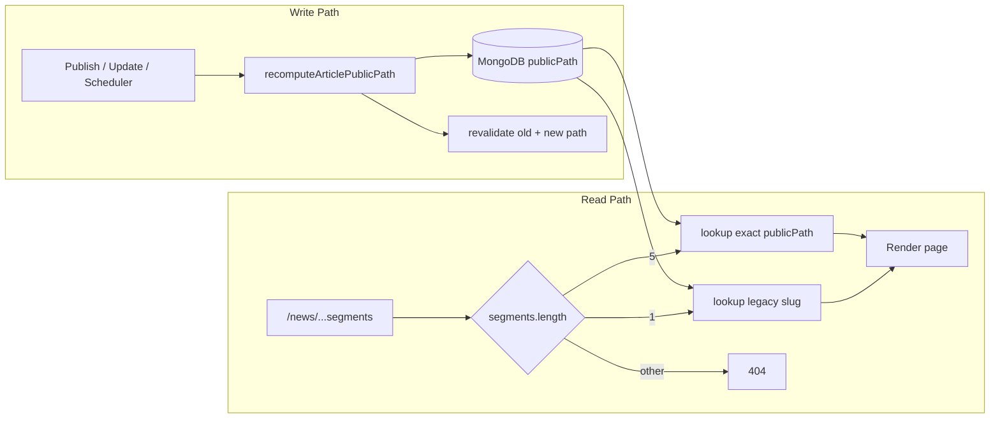

# Plan Implementasi: Refactor URL Artikel Structured

> **Dibuat:** 2026-06-22  
> **Berdasarkan:** [refactor-link-article.md](./refactor-link-article.md) (Revisi 2)  
> **Status codebase saat audit:** Belum dimulai — tidak ada `publicPath`, `urlFormat`, maupun `article-public-path.ts`

---

## Ringkasan

Refactor mengubah permalink artikel dari format pendek `/news/{slug}` menjadi format hierarkis:

```
/news/{categorySlug}/{yyyy}/{mm}/{dd}/{articleSlug}
```

dengan tanggal diambil dari `publishedAt` (UTC di DB) dikonversi ke **WIB (Asia/Jakarta)**, tanpa redirect untuk URL lama, dan model hybrid (legacy + structured) hidup bersamaan.

Audit kode (2026-06-22) menunjukkan **seluruh requirement masih perlu dikerjakan**. Satu-satunya file terkait yang sudah ada namun **belum** mengimplementasikan structured URL adalah `src/lib/articleViewAccess.ts` (otorisasi preview CMS) — tidak perlu diubah untuk URL, hanya komentar path di beberapa file perlu disesuaikan nanti.

---

## Requirement (dari spesifikasi Revisi 2)

### R1 — Format URL structured

| ID | Requirement | Detail |
|----|-------------|--------|
| R1.1 | Template path | `/news/{categorySlug}/{yyyy}/{mm}/{dd}/{articleSlug}` |
| R1.2 | Prefix tetap | Selalu diawali `/news/` (hindari konflik route root) |
| R1.3 | Zero-padding tanggal | `yyyy`, `mm`, `dd` numerik dengan `mm` dan `dd` dua digit |
| R1.4 | Sumber kategori | `category.slug` **terkini** (kategori utama artikel) |
| R1.5 | Sumber slug | `articles.slug` **terkini** |
| R1.6 | Sumber tanggal | `publishedAt` **terkini**, dikonversi ke kalender WIB |

### R2 — Perilaku URL = state artikel saat ini

| ID | Requirement | Detail |
|----|-------------|--------|
| R2.1 | Full recompute on edit | Setiap perubahan `slug`, `categoryId`, atau `publishedAt` → `publicPath` dihitung ulang penuh |
| R2.2 | Tidak ada field snapshot | Tidak pakai `urlDateWib` / `publishedCategorySlug` frozen |
| R2.3 | URL lama mati setelah edit | Path structured lama → **404**, bukan redirect |
| R2.4 | Draft / non-published | Artikel tanpa `publishedAt` tidak punya public path structured |

### R3 — Model hybrid (legacy + structured)

| ID | Requirement | Detail |
|----|-------------|--------|
| R3.1 | Artikel pre-deploy | Tetap `/news/{slug}`, `urlFormat: "legacy"` |
| R3.2 | Artikel post-deploy | `urlFormat: "structured"`, path dari builder WIB |
| R3.3 | Tidak ada migrasi otomatis | Legacy tidak di-convert ke structured tanpa aksi eksplisit |
| R3.4 | Tidak ada redirect antar generasi | Legacy ↔ structured, structured lama ↔ structured baru |

### R4 — Zero redirect (universal)

| ID | Requirement | Detail |
|----|-------------|--------|
| R4.1 | Tidak ada 301/302 | Tidak di middleware, `next.config`, maupun collection redirect |
| R4.2 | Lookup strict | Structured: exact match `publicPath`; typo/outdated → 404 |
| R4.3 | Broken link diterima | Trade-off bisnis: link share/bookmark/SERP lama mati setelah edit |

### R5 — Data layer

| ID | Requirement | Detail |
|----|-------------|--------|
| R5.1 | Field `publicPath` | `string \| null` — path kanonik denormalized |
| R5.2 | Field `urlFormat` | `"legacy" \| "structured"` |
| R5.3 | Index MongoDB | Index unik/sparse pada `publicPath` untuk lookup cepat |
| R5.4 | Recompute hooks | Publish, update, approve, scheduler (`publishScheduledArticles`) |

### R6 — Helper terpusat (server-only untuk tanggal WIB)

| ID | Requirement | Detail |
|----|-------------|--------|
| R6.1 | File baru | `src/lib/article-public-path.ts` |
| R6.2 | Fungsi WIB | `publishedAtToWibDateParts()`, `pad2()` |
| R6.3 | Builder | `buildStructuredArticlePath()`, `buildArticlePublicPath()` |
| R6.4 | Parser | `parseNewsArticlePath(segments)` → legacy \| structured |
| R6.5 | Util | `pathsEqual()` untuk deteksi perlu revalidate |
| R6.6 | Unit test | Konversi WIB termasuk midnight boundary |

### R7 — Routing Next.js hybrid

| ID | Requirement | Detail |
|----|-------------|--------|
| R7.1 | Catch-all route | `src/app/(public)/news/[...segments]/page.tsx` |
| R7.2 | `segments.length === 1` | Legacy lookup by slug |
| R7.3 | `segments.length === 5` | Structured lookup by exact `publicPath` |
| R7.4 | Lainnya | `notFound()` |
| R7.5 | Hapus route lama | `news/[slug]/page.tsx` diganti catch-all |

### R8 — API & response

| ID | Requirement | Detail |
|----|-------------|--------|
| R8.1 | `publicPath` di detail | Wajib di response `Article` |
| R8.2 | `publicPath` di list | Wajib di `ArticleListResponse` dan semua endpoint list |
| R8.3 | Lookup publik baru | `getPublishedArticleByPublicPath()` untuk halaman structured |
| R8.4 | Admin lookup | Tetap `getArticleByIdOrSlug` by id/slug (tidak by path) |
| R8.5 | Endpoint fetch halaman | `fetchPublishedArticleByPath()` menggantikan by-slug only untuk publik |

### R9 — Cache / ISR

| ID | Requirement | Detail |
|----|-------------|--------|
| R9.1 | Cache tag by path | `getArticleCacheTag(publicPath)` — bukan slug saja |
| R9.2 | Revalidate on edit | `revalidatePath(oldPublicPath)` + `revalidatePath(newPublicPath)` |
| R9.3 | In-memory previous path | `previousPublicPath` hanya untuk revalidate, tidak disimpan sebagai redirect |

### R10 — Refactor semua pembuat link

| ID | Requirement | Detail |
|----|-------------|--------|
| R10.1 | Ganti hardcoded `/news/${slug}` | Pakai `article.publicPath` atau `buildArticlePublicPath()` |
| R10.2 | `buildArticleShareUrl` | Terima `publicPath` atau artikel, bukan slug saja |
| R10.3 | Notifikasi | `link: article.publicPath` |
| R10.4 | Sitemap | `loc` dari `publicPath` terkini saja |
| R10.5 | Target bersih | Grep `` `/news/${` `` tidak ada lagi di codebase produksi |

### R11 — SEO & metadata

| ID | Requirement | Detail |
|----|-------------|--------|
| R11.1 | Canonical | `article.publicPath` (bukan slug dari URL bar) |
| R11.2 | Open Graph `url` | Sama dengan canonical |
| R11.3 | JSON-LD | `url` / `mainEntityOfPage` = `publicPath` |
| R11.4 | Sitemap `lastmod` | Dari `updatedAt` artikel |

### R12 — Editor UX (disarankan kuat)

| ID | Requirement | Detail |
|----|-------------|--------|
| R12.1 | Preview URL sebelum publish | Tampilkan path WIB di `ArticleEditorForm` |
| R12.2 | Warning edit published | "URL akan berubah, link lama tidak valid" |
| R12.3 | Dokumentasi redaksi | Tanggal URL = WIB; edit path-driving fields = URL baru |

### R13 — Feature flag & rollout

| ID | Requirement | Detail |
|----|-------------|--------|
| R13.1 | `ARTICLE_STRUCTURED_URL_ENABLED` | Kontrol generate structured untuk artikel baru |
| R13.2 | Script audit | `scripts/audit-article-paths.ts` — preview path published |
| R13.3 | Monitoring | Pantau spike 404 di `/news/*` pasca-edit |

### R14 — QA matrix (acceptance)

| # | Kasus | Ekspektasi |
|---|-------|------------|
| Q1 | Legacy `/news/slug-lama` | 200 |
| Q2 | Structured path valid | 200, canonical = `publicPath` |
| Q3 | Publish baru WIB 19/06/2026 | Path contains `2026/06/19` |
| Q4 | UTC near midnight → WIB date | Tanggal sesuai WIB, bukan UTC |
| Q5 | Edit kategori | New path 200, old path 404 |
| Q6 | Edit judul/slug | New path 200, old path 404 |
| Q7 | Edit `publishedAt` (WIB date changes) | Full path termasuk tanggal berubah |
| Q8 | No redirect anywhere | 301 never returned |
| Q9 | Sitemap | Only current `publicPath` |
| Q10 | Notifikasi baru | Uses current `publicPath` |
| Q11 | Share OG | canonical = current `publicPath` |

---

## Gap Analysis: Kondisi Kode vs Requirement

### Sudah ada (bisa dipakai ulang)

| Area | File | Catatan |
|------|------|---------|
| Luxon WIB | `src/lib/utils.ts` | `DateTime`, `toJakartaDatetimeLocal`, `formatTimeReadable` — pola sudah ada |
| Data artikel | `slug`, `publishedAt`, `category.slug` | Field sumber path sudah tersedia |
| Lookup by slug | `getArticleByIdOrSlug()` | Tetap untuk admin/API internal |
| ISR dasar | `fetchArticleServer.ts`, `article-cache-config.ts` | Perlu diubah dari slug → path |
| Revalidate hook | `revalidate-article-page.ts` | Perlu diubah signature slug → publicPath |
| Publish/update | `coreWriteArticleService.ts` | Sudah panggil `safeRevalidateArticlePublicPage(slug)` — perlu path |
| Scheduler | `publishScheduledArticles()` di `writeArticleService.ts` | Bulk publish tanpa recompute path |
| Prefix `/news/` aman | Routing publik | Tidak bentrok dengan `/search`, `/indeks`, dll. |

### Belum ada / belum sesuai

| Requirement | Status saat ini |
|-------------|-----------------|
| `publicPath`, `urlFormat` di types & MongoDB | ❌ Tidak ada |
| `article-public-path.ts` | ❌ Tidak ada |
| Catch-all route `[...segments]` | ❌ Masih `news/[slug]/page.tsx` |
| Lookup by `publicPath` | ❌ Hanya by slug/id |
| `fetchPublishedArticleByPath` | ❌ Hanya `fetchPublishedArticleBySlug` |
| `buildArticleShareUrl(slug)` | ❌ Hardcoded `/news/${slug}` |
| 20+ titik link hardcoded | ❌ Masih pakai slug |
| Sitemap loc | ❌ `/news/${slug}` di `sitemap-xml.ts` + `sitemapService.ts` |
| Notifikasi link | ❌ `/news/${slug}` di `coreWriteArticleService.ts`, `writeArticleService.ts` |
| JSON-LD `url` / `mainEntityOfPage` | ❌ Tidak ada di `NewsDetailClient.tsx`, `ArticleUi.tsx` |
| Metadata canonical dari `publicPath` | ❌ Dibangun dari slug URL bar |
| Feature flag | ❌ Tidak ada |
| Unit test WIB | ❌ Tidak ada |
| Script audit paths | ❌ Tidak ada |
| Editor URL preview & warning | ❌ Tidak ada di `ArticleEditorForm` |
| MongoDB index `publicPath` | ❌ Belum dibuat |

---

## File & Layer Terdampak

### P0 — Inti (wajib pertama)

| Layer | File | Perubahan |
|-------|------|-----------|
| **Helper baru** | `src/lib/article-public-path.ts` | Builder, parser, WIB conversion |
| **Types** | `src/types/article.ts` | Tambah `publicPath`, `urlFormat` di `BaseArticle` & `ArticleListResponse` |
| **Types sitemap** | `src/types/sitemap.ts` | Tambah `publicPath` (atau ganti `slug` sebagai loc) |
| **Mapper** | `src/lib/helper-article.ts` | Map `publicPath`, `urlFormat` dari doc Mongo |
| **Read service** | `src/services/article/getArticleService.ts` | `getPublishedArticleByPublicPath()`, resolver hybrid |
| **Write service** | `src/services/article/coreWriteArticleService.ts` | Recompute on create/update/publish; revalidate by path |
| **Write service** | `src/services/article/writeArticleService.ts` | Recompute di `publishScheduledArticles`; notifikasi path |
| **Route publik** | `src/app/(public)/news/[slug]/page.tsx` → `[...segments]/page.tsx` | Routing hybrid, metadata dari `publicPath` |
| **Route client** | `src/app/(public)/news/[slug]/NewsDetailClient.tsx` | Pindah ke folder catch-all; JSON-LD url |
| **Server fetch** | `src/lib/server/fetchArticleServer.ts` | `fetchPublishedArticleByPath`, cache tag by path |
| **Cache** | `src/lib/cache/article-cache-config.ts` | Tag berdasarkan `publicPath` |
| **Cache** | `src/lib/cache/revalidate-article-page.ts` | Revalidate full path, old + new |
| **Utils** | `src/lib/utils.ts` | `buildArticleShareUrl` → terima `publicPath` |
| **API** | `src/app/api/articles/[idOrSlug]/route.ts` | Response sudah include `publicPath` setelah mapper diupdate |
| **DB** | Migration/index script | Index `publicPath` sparse unique |

### P1 — Refactor link (komponen & list mapping)

| Layer | File | Perubahan |
|-------|------|-----------|
| Kartu berita | `src/components/news/NewsCard.tsx` | `href={article.publicPath}` |
| | `src/components/news/HeroCard.tsx` | idem |
| | `src/components/news/SecondaryNewsCard.tsx` | idem |
| | `src/components/news/TersierNewsCard.tsx` | idem |
| | `src/components/news/TopicNewsCard.tsx` | idem |
| | `src/components/news/FeaturedCard.tsx` | idem |
| | `src/components/news/ReadAlso.tsx` | Terima `publicPath` (bukan slug saja) |
| Sidebar | `src/components/sidebarPublic/SidebarSingleArticle.tsx` | `publicPath` |
| Carousel | `src/components/homepage/carousel/FotografiCarousel.tsx` | `publicPath` |
| List mapping | `src/services/article/articleSection/sectionArticleService.ts` | Include `publicPath` di list response |
| | `src/services/article/articleSection/carouselSectionService.ts` | idem |
| | `src/services/categoryService.ts` | `publicPath` di `ArticleListResponse` |
| | `src/services/article/getArticleService.ts` → `getRelatedArticles` | `publicPath` di related |
| | `src/services/article/relatedArticlesService.ts` | idem jika ada mapping |
| | `src/services/indeksService.ts` | Projection + response `publicPath` |
| | `src/services/article/coreGetArticleService.ts` | List endpoints |
| SEO komponen | `src/components/news/ArticleUi.tsx` | JSON-LD `url`, `mainEntityOfPage` |

**Catatan:** Halaman seperti `HomePageClient`, `SearchClient`, `CategoryClient`, `NewsIndeksClient`, `AuthorClient` tidak perlu diubah langsung jika kartu sudah pakai `publicPath` — mereka hanya konsumen `NewsCard` dll.

### P2 — Sitemap, notifikasi, admin

| Layer | File | Perubahan |
|-------|------|-----------|
| Sitemap service | `src/services/sitemapService.ts` | Query & projection `publicPath` |
| Sitemap XML | `src/lib/sitemap-xml.ts` | `loc` dari `publicPath` |
| Notifikasi | `src/services/article/coreWriteArticleService.ts` | `link: publicPath` |
| | `src/services/article/writeArticleService.ts` | idem (publish scheduled) |
| Admin list | `src/app/admin-xyz/articles/page.tsx` | Link "lihat di situs" → `publicPath` |
| Admin analytics | `src/app/admin-xyz/analytics/writing/page.tsx` | idem |
| Admin preview | `src/app/admin-xyz/articles/preview/page.tsx` | `buildArticleShareUrl(publicPath)` |
| Admin approval | `src/app/admin-xyz/articles/[idOrSlug]/approval/page.tsx` | idem |
| Scheduler API | `src/app/api/publish-scheduled/route.ts` | Tidak langsung, tapi service di bawahnya harus recompute |

### P3 — Editor UX & tooling

| Layer | File | Perubahan |
|-------|------|-----------|
| Editor form | `src/components/admin/articles/ArticleEditorForm.tsx` | Preview URL, warning edit published |
| Editor UI | `src/components/admin/articles/ArticleEditorFormUi.tsx` | Tampilan preview path WIB |
| TipTap ReadAlso | `src/lib/tiptap/ReadAlsoNode.tsx` (jika ada) | Simpan/render `publicPath` |
| Script audit | `scripts/audit-article-paths.ts` | Baru |
| Unit test | `src/lib/article-public-path.test.ts` (atau sejenis) | Baru |
| Env | `.env.example` | `ARTICLE_STRUCTURED_URL_ENABLED` |

### Layer yang tidak terdampak langsung (perlu dicek setelah refactor)

| File | Alasan |
|------|--------|
| `src/lib/articleViewAccess.ts` | Otorisasi by status/role — path tidak relevan |
| `src/app/admin-xyz/articles/[idOrSlug]/page.tsx` | Admin edit by id/slug — OK tetap |
| `src/types/notification.ts` | Field `link` string — cukup isi `publicPath` |
| `next.config.*` | Tidak perlu redirect dinamis (sesuai spec) |

---

## Fase Implementasi

### Fase 1 — Helper WIB & model data (estimasi 2 hari)

**Tujuan:** Fondasi pure function + types tanpa mengubah perilaku publik.

**Tasks:**

1. Buat `src/lib/article-public-path.ts`:
   - `publishedAtToWibDateParts()`
   - `pad2()`
   - `buildStructuredArticlePath({ categorySlug, publishedAt, articleSlug })`
   - `buildArticlePublicPath(article)`
   - `parseNewsArticlePath(segments)`
   - `pathsEqual(a, b)`
2. Tambah `publicPath: string | null` dan `urlFormat: "legacy" | "structured"` ke:
   - `BaseArticle`, `ArticleListResponse` di `src/types/article.ts`
   - `SitemapArticle` di `src/types/sitemap.ts`
3. Update `mapDocToArticle()` di `helper-article.ts` untuk membaca field baru.
4. Unit test konversi WIB (termasuk `2026-06-18T17:00:00.000Z` → `2026/06/19`).
5. Buat `scripts/audit-article-paths.ts` — baca artikel published, print path legacy vs structured (dry-run).
6. Dokumentasikan schema Mongo + rencana index `publicPath`.

**Deliverable:** Helper tested; types & mapper siap; belum mengubah URL live.

**Status:** ❌ Belum dikerjakan

---

### Fase 2 — Recompute path on write (estimasi 2–3 hari)

**Tujuan:** Setiap mutasi artikel yang relevan menulis `publicPath` benar ke DB.

**Tasks:**

1. Implement `recomputeArticlePublicPath(article, options?)` — dipanggil dari service layer.
2. Hook di `coreWriteArticleService.ts`:
   - `createArticle` / first publish → `urlFormat: "structured"` (jika flag on), compute path
   - `updateArticle` → recompute jika `slug`, `categoryId`, `publishedAt`, atau status → PUBLISHED berubah
   - Simpan `oldPublicPath` in-memory untuk revalidate (bukan persist)
3. Hook di `writeArticleService.ts`:
   - `publishScheduledArticles()` — setelah bulk publish, recompute `publicPath` per artikel
   - Notifikasi scheduled publish pakai `publicPath`
4. Feature flag `ARTICLE_STRUCTURED_URL_ENABLED`:
   - `false`: artikel baru tetap legacy (`urlFormat: "legacy"`)
   - `true`: artikel baru structured
5. Legacy artikel existing: default `urlFormat: "legacy"`, `publicPath = /news/{slug}` (bisa di-set via migration script opsional).
6. Buat MongoDB index: `{ publicPath: 1 }` sparse unique.
7. Update `safeRevalidateArticlePublicPage` → terima `publicPath` + `previousPublicPath`.

**Deliverable:** DB artikel baru/updated punya `publicPath` benar; revalidate by path.

**Status:** ❌ Belum dikerjakan

---

### Fase 3 — Routing hybrid (estimasi 3 hari)

**Tujuan:** Halaman publik melayani legacy (1 segmen) dan structured (5 segmen).

**Tasks:**

1. Buat `src/app/(public)/news/[...segments]/page.tsx` (+ pindahkan `NewsDetailClient.tsx`).
2. Implement `getPublishedArticleByPublicPath(db, publicPath)` di `getArticleService.ts`.
3. Resolver di page:
   - `segments.length === 1` → legacy lookup by slug (atau `publicPath` legacy)
   - `segments.length === 5` → rebuild path string, exact match `publicPath` di DB
   - else → `notFound()`
4. Refactor `fetchArticleServer.ts`:
   - `fetchPublishedArticleByPath(publicPath)` untuk ISR publik
   - `fetchArticleByPathForNewsPage(segments)` — gabung legacy + staff preview
   - Staff preview: tetap bisa by slug/id via API internal (bukan by structured path)
5. Update `getArticleCacheTag()` → hash/encode `publicPath`.
6. `generateMetadata` & canonical: pakai `article.publicPath`, bukan slug dari URL.
7. Hapus `news/[slug]/page.tsx` setelah catch-all stabil.

**Deliverable:** Structured URL live (flag on); legacy tetap 200.

**Status:** ❌ Belum dikerjakan — masih `news/[slug]/page.tsx` only

---

### Fase 4 — Refactor link & API response (estimasi 2–3 hari)

**Tujuan:** Semua konsumen memakai `publicPath`; API list/detail mengembalikan field tersebut.

**Tasks:**

1. Pastikan semua pipeline list (`coreGetArticleService`, `categoryService`, `indeksService`, section services, `getRelatedArticles`) memproyeksikan & memetakan `publicPath`.
2. Refactor komponen kartu (P1 list di atas) → `href={article.publicPath ?? fallback}`.
3. Update `buildArticleShareUrl()` → signature `(publicPath: string)` atau `(article: { publicPath })`.
4. Update `ReadAlso` — simpan/pass `publicPath` dari TipTap node jika perlu.
5. Notifikasi: ganti semua `link: /news/${slug}` → `link: publicPath`.
6. Sitemap: `sitemapService` query `publicPath`; `sitemap-xml` emit loc dari field tersebut.
7. Verifikasi: `rg '/news/\$\{'` di `src/` harus kosong (kecuali di `article-public-path.ts` builder).

**Deliverable:** Link konsisten; sitemap & notifikasi benar.

**Status:** ❌ Belum dikerjakan — 20+ titik masih hardcoded

---

### Fase 5 — SEO, editor UX & QA (estimasi 2 hari)

**Tujuan:** Metadata lengkap, edukasi redaksi, sign-off QA.

**Tasks:**

1. JSON-LD di `NewsDetailClient.tsx` & `ArticleUi.tsx`:
   - `"url": canonicalShareUrl`
   - `"mainEntityOfPage": canonicalShareUrl`
2. `ArticleEditorForm` / `ArticleEditorFormUi`:
   - Preview URL structured (server action atau client estimate dengan API preview)
   - Warning dialog saat edit artikel PUBLISHED yang mengubah slug/kategori/publishedAt
3. Jalankan matriks QA Q1–Q11.
4. Resubmit sitemap ke Search Console (opsional operasional).

**Deliverable:** Sign-off QA; tidak ada redirect layer.

**Status:** ❌ Belum dikerjakan

---

### Fase 6 — Rollout & monitoring (estimasi 1 hari + observasi)

**Tujuan:** Production enable dengan risiko terkendali.

**Tasks:**

1. Enable `ARTICLE_STRUCTURED_URL_ENABLED=true` di staging → production.
2. Monitor 404 rate pada `/news/*` (khususnya setelah edit artikel).
3. Opsional: batch script set `publicPath` untuk artikel published existing (tetap `urlFormat: legacy` kecuali migrasi manual).
4. Opsional: batch recompute jika kategori slug di-rename admin.

**Deliverable:** Production live; runbook broken-link untuk redaksi.

**Status:** ❌ Belum dikerjakan

---

## Diagram Alur (ringkas)



---

## Risiko & Keputusan Terbuka

| Topik | Keputusan di spec | Tindakan dev |
|-------|-------------------|--------------|
| `publishedAt` mutable setelah publish | Ikut nilai DB terkini | Audit apakah form admin mengizinkan edit `publishedAt` post-publish; jika ya, URL date akan berubah |
| Rename kategori slug | Semua artikel kategori perlu recompute | Pertimbangkan hook di category update atau script batch |
| TipTap ReadAlso node | Saat ini simpan slug | Perlu evaluasi: render-time resolve `publicPath` atau simpan path saat insert |
| ISR orphan cache | Path lama cache sampai TTL | Expected; revalidate old path on edit mempercepat 404 |
| Analytics GA4 | Path berubah setelah edit | Luar scope dev — koordinasi tim analytics (`article_id` custom dim) |

---

## Checklist Cepat Sebelum Merge ke Production

- [ ] `article-public-path.ts` + unit test lulus
- [ ] Index `publicPath` di MongoDB
- [ ] Catch-all route + legacy masih 200
- [ ] Structured route 200 dengan canonical benar
- [ ] Edit kategori/slug/tanggal → old 404, new 200
- [ ] Tidak ada 301 di mana pun untuk path artikel
- [ ] Sitemap hanya `publicPath` terkini
- [ ] Notifikasi pakai `publicPath`
- [ ] Grep `` `/news/${slug}` `` bersih di `src/`
- [ ] Editor preview URL + warning tampil
- [ ] Feature flag tested on/off

---

## Estimasi Total

| Fase | Durasi |
|------|--------|
| 1 — Helper & model | 2 hari |
| 2 — Write recompute | 2–3 hari |
| 3 — Routing | 3 hari |
| 4 — Link refactor | 2–3 hari |
| 5 — SEO & QA | 2 hari |
| 6 — Rollout | 1 hari + monitoring |
| **Total** | **~12–14 hari kerja** |

---

## Referensi

- Spesifikasi lengkap: [refactor-link-article.md](./refactor-link-article.md)
- Route saat ini: `src/app/(public)/news/[slug]/page.tsx`
- Share URL: `src/lib/utils.ts` → `buildArticleShareUrl()`
- Lookup: `src/services/article/getArticleService.ts`
- Publish: `src/services/article/coreWriteArticleService.ts`, `writeArticleService.ts`
