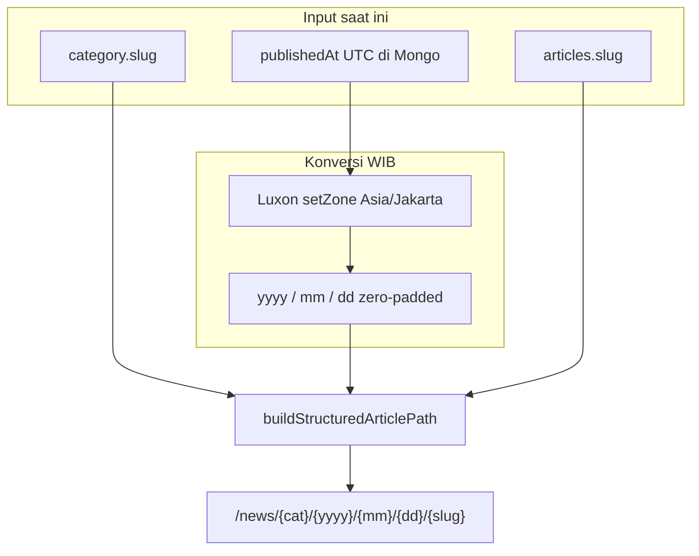
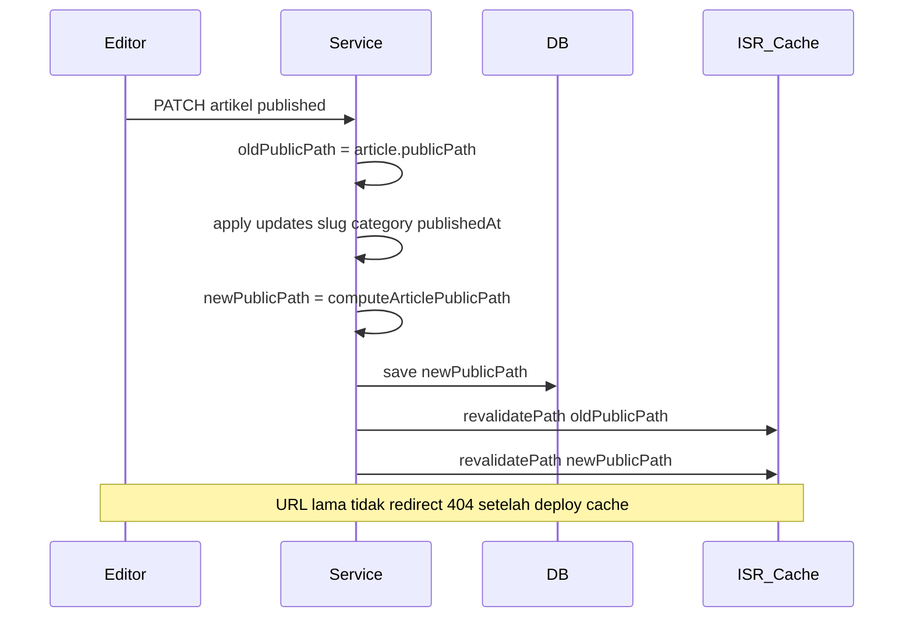
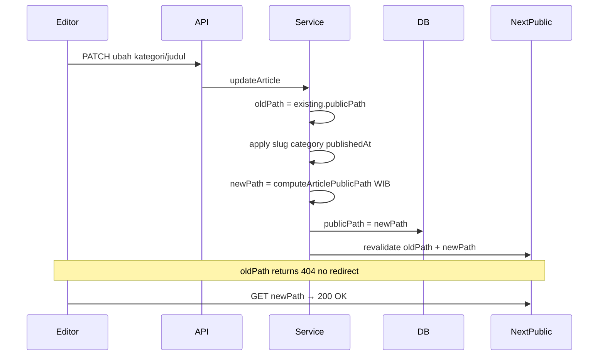

# Analisis Refactor URL Artikel: `/news/[slug]` → `/news/[kategori]/[tahun]/[bulan]/[tanggal]/[slug]`

> **Revisi 2** — 2026-06-19  
> Perubahan utama: URL **selalu merefleksikan data terkini** (kategori, tanggal WIB, slug); **tidak ada redirect** untuk URL lama (legacy maupun structured); timezone **WIB (Asia/Jakarta)** untuk segmen tanggal.

---

## Ringkasan Eksekutif

Perubahan yang diusulkan mengubah permalink artikel dari format pendek:

```
https://arasvara.id/news/pemilu-2024-a1b2c3d4
```

menjadi format hierarkis (dengan **prefix `/news/` tetap dipertahankan**):

```
https://arasvara.id/news/nasional/2026/06/19/pemilu-2024
```

**Keputusan produk (revisi final):**

| Aspek | Keputusan |
|-------|-----------|
| Sumber tanggal | `publishedAt` **saat ini** (nilai di DB), dikonversi ke **WIB (Asia/Jakarta)** |
| Format tanggal | Numerik zero-padded: `YYYY/MM/DD` → contoh `2026/06/19` |
| Sumber kategori | `category.slug` **saat ini** (kategori utama artikel) |
| Sumber slug | `articles.slug` **saat ini** |
| Perilaku saat **edit** | URL **sepenuhnya digenerate ulang** dari data baru — semua segmen (kategori, tanggal, slug) bisa berubah |
| Redirect URL lama | **Tidak ada** — tidak untuk legacy → structured, tidak untuk structured lama → structured baru |
| Timezone | **WIB / Asia/Jakarta** untuk menentukan year/month/day di path |
| Konflik routing root | Hindari dengan **prefix `/news/`** |
| Artikel legacy | Format pendek `/news/{slug}` tetap untuk artikel **sebelum deploy**; artikel baru pakai format structured |

**Tingkat kompleksitas keseluruhan: TINGGI** — routing hybrid, refactor 25+ file, dua format URL hidup bersamaan, dan risiko broken link diterima sebagai trade-off bisnis.

---

## Prinsip Inti URL (Revisi)

### URL = fungsi murni dari state artikel saat ini



**Tidak ada field snapshot immutable** (`urlDateWib` freeze, `publishedCategorySlug` freeze) — cukup **`publicPath` denormalized** yang di-**recompute** setiap kali data relevan berubah.

| Segmen | Sumber | Saat edit |
|--------|--------|-----------|
| `categorySlug` | `category.slug` terkini | **Berubah** jika kategori diganti |
| `yyyy/mm/dd` | `publishedAt` → WIB | **Berubah** jika `publishedAt` berubah (mis. republish, koreksi jadwal) |
| `articleSlug` | `articles.slug` terkini | **Berubah** jika judul/slug diganti |

### Contoh perubahan URL setelah edit (tanpa redirect)

| Aksi edit | URL sebelum | URL sesudah |
|-----------|-------------|-------------|
| Ganti kategori `nasional` → `ekonomi` | `/news/nasional/2026/06/19/judul` | `/news/ekonomi/2026/06/19/judul` |
| Ganti judul → slug baru | `/news/nasional/2026/06/19/judul-lama` | `/news/nasional/2026/06/19/judul-baru` |
| Ubah `publishedAt` (WIB beda hari) | `/news/nasional/2026/06/19/judul` | `/news/nasional/2026/06/20/judul` |
| Kombinasi kategori + judul + tanggal | path lama | path baru **100% berbeda** |

**URL lama → 404.** Tidak ada 301, tidak ada tabel redirect. Link di sosmed, notifikasi, atau SERP yang masih menunjuk path lama **tidak lagi valid** setelah edit.

---

## Kondisi Sistem Saat Ini

### Routing & halaman detail

| Komponen | Lokasi | Perilaku |
|----------|--------|----------|
| Route publik | `src/app/(public)/news/[slug]/page.tsx` | Satu segmen dinamis `[slug]` |
| Fetch server | `src/lib/server/fetchArticleServer.ts` | `GET /api/articles/{slug}` + ISR tag `article-{slug}` |
| Lookup DB | `src/services/article/getArticleService.ts` → `getArticleByIdOrSlug()` | Match `_id` atau `articles.slug` |
| Cache invalidation | `src/lib/cache/revalidate-article-page.ts` | `revalidatePath(/news/{slug})` |

### Pembangkit URL (hardcoded `/news/${slug}`)

Tidak ada helper terpusat selain `buildArticleShareUrl(slug)` di `src/lib/utils.ts`.

**File yang membangun link `/news/...` secara langsung (25+ titik):**

- **Komponen kartu/list:** `NewsCard`, `HeroCard`, `SecondaryNewsCard`, `TersierNewsCard`, `TopicNewsCard`, `FeaturedCard`, `ReadAlso`, `FotografiCarousel`, `SidebarSingleArticle`
- **Metadata & share:** `news/[slug]/page.tsx`, `buildArticleShareUrl()` di `utils.ts`
- **Sitemap:** `src/lib/sitemap-xml.ts`, `src/services/sitemapService.ts`
- **Notifikasi:** `coreWriteArticleService.ts`, `writeArticleService.ts`
- **Admin:** `articles/page.tsx`, `analytics/writing/page.tsx`, preview & approval pages
- **JSON-LD:** `ArticleUi.tsx`, `NewsDetailClient.tsx` — belum ada `mainEntityOfPage`

### Data artikel relevan

- `slug`, `publishedAt`, `categoryId` / `category.slug` — sudah ada
- **Belum ada:** `publicPath`, `urlFormat`

### Halaman publik (tidak bentrok)

Prefix `/news/` aman — tidak bentrok dengan `/search`, `/indeks`, `/category/`, dll.

---

## Spesifikasi URL Baru (Final — Revisi 2)

### Template

```
/news/{categorySlug}/{yyyy}/{mm}/{dd}/{articleSlug}
```

### Contoh

| Field | Nilai |
|-------|-------|
| Kategori | `nasional` |
| `publishedAt` (UTC di DB) | `2026-06-18T17:00:00.000Z` |
| Setara WIB | 19 Juni 2026, 00:00 WIB |
| Slug artikel | `pemilu-2024` |
| **URL penuh** | `/news/nasional/2026/06/19/pemilu-2024` |

### Konversi WIB (wajib di server)

```ts
import { DateTime } from "luxon";

function publishedAtToWibDateParts(publishedAt: Date): {
  year: number;
  month: number; // 1-12
  day: number;
} {
  const wib = DateTime.fromJSDate(publishedAt, { zone: "utc" })
    .setZone("Asia/Jakarta");
  return { year: wib.year, month: wib.month, day: wib.day };
}

function pad2(n: number): string {
  return String(n).padStart(2, "0");
}

// Path: `/news/${cat}/${year}/${pad2(month)}/${pad2(day)}/${slug}`
```

**Aturan:** tanggal di URL = **tanggal kalender WIB** dari `publishedAt`, bukan UTC. Redaksi harus paham artikel publish jam 23:00 UTC bisa jadi **hari berikutnya** di URL.

### Dunia hybrid (dua format URL)

| Generasi | Format | Lookup |
|----------|--------|--------|
| **Legacy** (pre-deploy) | `/news/{slug}` | By `slug`, `urlFormat: "legacy"` atau `publicPath` null |
| **Structured** (post-deploy) | `/news/{cat}/{y}/{m}/{d}/{slug}` | By `publicPath` exact match |

Tidak ada redirect antara generasi maupun antar versi path structured.

---

## Analisis Pro & Kontra

### Sisi teknis

#### Kelebihan (Pros)

1. **Model mental sederhana** — `publicPath = buildPath(article)`; tidak perlu snapshot vs mutable rules.
2. **Konsistensi data–URL** — URL selalu mirror kategori, tanggal publish (WIB), dan slug terkini.
3. **Implementasi update lebih mudah** — setiap edit cukup recompute `publicPath`; tidak ada field frozen yang diverge.
4. **Prefix `/news/`** — aman dari konflik route root.
5. **Lookup efisien** — index/query by `publicPath` untuk structured; legacy by `slug`.
6. **Luxon sudah tersedia** — `src/lib/utils.ts` sudah pakai Luxon untuk format WIB.

#### Kekurangan (Cons)

1. **Broken link garanti setelah edit** — tanpa redirect, setiap edit = URL lama mati (structured & notifikasi lama).
2. **Dua format URL selamanya** — legacy + structured; testing matrix lebih besar.
3. **Cache ISR** — harus `revalidatePath(oldPublicPath)` + `revalidatePath(newPublicPath)` saat edit; orphan cache path lama until TTL.
4. **SEO churn** — Google indeks URL lama; edit = URL baru dianggap halaman baru tanpa transfer authority (no 301).
5. **Notifikasi/push/email** — deep link terkirim sebelum edit **404** setelah edit.
6. **Sitemap** — perlu update `lastmod` + loc baru; URL lama hilang dari sitemap (benar) tapi backlink eksternal tetap 404.
7. **Timezone edge cases** — publish mendekati midnight WIB perlu dokumentasi ke redaksi.
8. **Refactor massal link** — 25+ file harus pakai `publicPath`, bukan `slug` saja.

### Sisi bisnis

#### Kelebihan (Pros)

1. **URL selalu akurat** — kategori/tanggal di URL match konten saat ini; tidak ada URL "nasional" padahal sudah pindah ke "ekonomi".
2. **Credibility & pola media besar** — path hierarkis familiar pembaca Indonesia.
3. **Tanpa biaya redirect infrastructure** — keputusan sengaja untuk simplicity operasional.
4. **Artikel legacy tidak wajib dimigrasi** — rollout bertahap.

#### Kekurangan (Cons)

1. **Link share rusak setelah edit** — tim redaksi harus **re-share** URL baru setelah edit material (kategori/judul/tanggal).
2. **SEO authority tidak pindah** — tanpa 301, edit judul/kategori = halaman "baru" di mata Google untuk artikel structured.
3. **Pengalaman pembaca** — bookmark URL lama 404 setelah edit; keluhan user mungkin naik.
4. **Inkonsistensi format** — legacy pendek vs structured panjang di SERP.
5. **Analytics discontinuity** — path GA/GTM berubah total setelah edit; laporan per URL terfragmentasi.
6. **Google News** — URL stabil historically preferred; frequent URL change without redirect is suboptimal for news SEO.

**Trade-off yang diterima:** simplicity implementasi + URL always-fresh **vs** link permanence & SEO stability. Keputusan bisnis: **fresh URL, no redirect**.

---

## Kompleksitas Teknis

### Ringkasan: **TINGGI** (~10–14 hari dev + QA)

| Area | Kompleksitas | Catatan revisi 2 |
|------|--------------|------------------|
| Routing Next.js | Tinggi | Hybrid 1 vs 5 segmen |
| Model data | **Sedang** | ↓ lebih sederhana: hanya `publicPath` + `urlFormat`, tanpa snapshot |
| Service publish/update | Sedang | Recompute full path on every relevant mutation |
| Refactor link | Tinggi | 25+ file |
| API response | Sedang | `publicPath` wajib di list/detail |
| Cache / ISR | Sedang | Revalidate old + new path on edit, no redirect |
| Sitemap & OG | Sedang | Loc = current `publicPath` only |
| Testing | Tinggi | Edit → old 404, new 200 |

---

## Desain Teknis Rekomendasi

### 1. Field database (articles)

```ts
publicPath: string | null;
// structured: "/news/nasional/2026/06/19/pemilu-2024"
// legacy:     "/news/pemilu-2024-a1b2c3d4"  OR null + derive from slug

urlFormat: "legacy" | "structured";
```

**Tidak perlu** (dihapus dari desain revisi 1):

- ~~`urlDateWib`~~ — derive from `publishedAt` + WIB on each build
- ~~`publishedCategorySlug`~~ — pakai `category.slug` terkini

**Kapan `publicPath` di-update:**

| Event | Aksi |
|-------|------|
| First publish (structured era) | `publicPath = buildStructuredPath(...)`, `urlFormat = "structured"` |
| Edit kategori | Recompute full `publicPath` |
| Edit judul/slug | Recompute full `publicPath` |
| Edit `publishedAt` | Recompute full `publicPath` (tanggal WIB bisa berubah) |
| Scheduler publish | Same as first publish |
| Legacy article | `urlFormat = "legacy"`, `publicPath = /news/{slug}` optional |

**Helper recompute:**

```ts
function computeArticlePublicPath(article: {
  slug: string;
  publishedAt: Date | null;
  category: { slug: string };
  urlFormat: "legacy" | "structured";
}): string | null {
  if (article.urlFormat === "legacy" || !article.publishedAt) {
    return `/news/${encodeURIComponent(article.slug)}`;
  }
  const { year, month, day } = publishedAtToWibDateParts(article.publishedAt);
  return `/news/${encodeURIComponent(article.category.slug)}/${year}/${pad2(month)}/${pad2(day)}/${encodeURIComponent(article.slug)}`;
}
```

### 2. Helper terpusat

File baru: `src/lib/article-public-path.ts`

- `publishedAtToWibDateParts()`
- `buildStructuredArticlePath({ categorySlug, publishedAt, articleSlug })`
- `buildArticlePublicPath(article)` — legacy vs structured
- `parseNewsArticlePath(segments)` → legacy | structured
- `pathsEqual(a, b)` — untuk deteksi perlu revalidate

Ganti semua `/news/${slug}` → `buildArticlePublicPath(article)` atau `article.publicPath`.

### 3. Routing Next.js

**Rekomendasi:** catch-all

```
src/app/(public)/news/[...segments]/page.tsx
```

| `segments.length` | Interpretasi |
|-------------------|--------------|
| 1 | Legacy lookup by slug |
| 5 | Structured: query `{ publicPath: "/news/..." }` exact |
| other | `notFound()` |

**Resolver structured:** primary lookup by **exact `publicPath`** string — bukan re-parse + multi-field query (lebih aman & cepat).

### 4. Perilaku saat edit (kritis)



**Tidak ada:**

- Collection `path_redirects`
- Middleware 301
- `next.config redirects` dinamis

### 5. API

- Response artikel: **`publicPath` wajib** (list + detail)
- Lookup publik: by `publicPath` untuk structured route
- Admin tetap bisa `getArticleByIdOrSlug` by id/slug

### 6. Cache

```ts
getArticleCacheTag(publicPath: string) // e.g. article-path-{hash or encoded path}
revalidateArticlePage(publicPath: string, previousPublicPath?: string)
```

Saat edit: revalidate **both** paths; path lama tidak dilayani → eventual 404.

### 7. Sitemap

Hanya emit **`publicPath` terkini** per artikel. URL structured lama **tidak** disertakan setelah edit.

---

## Peta File yang Perlu Disentuh

| Prioritas | File / area |
|-----------|-------------|
| P0 | `src/app/(public)/news/` → catch-all route |
| P0 | `src/lib/article-public-path.ts` (baru) |
| P0 | `getArticleService.ts` — resolver by `publicPath` |
| P0 | `coreWriteArticleService.ts`, `writeArticleService.ts` — recompute on publish/edit |
| P0 | `src/lib/utils.ts` — `buildArticleShareUrl` |
| P1 | 15+ komponen kartu berita |
| P1 | `fetchArticleServer.ts`, `revalidate-article-page.ts`, `article-cache-config.ts` |
| P1 | `src/types/article.ts`, `ArticleListResponse` |
| P2 | `sitemapService.ts`, `sitemap-xml.ts` (+ category slug in projection) |
| P2 | JSON-LD, notifikasi |
| P3 | Admin preview, analytics, editor URL preview sebelum save |

---

## Edge Cases & Mitigasi

| Skenario | Dampak | Mitigasi |
|----------|--------|----------|
| Publish 23:30 UTC → 06:30 WIB hari berikutnya | Tanggal URL = hari WIB | Preview URL di editor; dokumentasi redaksi |
| Edit kategori/judul setelah viral share | Link sosmed 404 | **Kebijakan redaksi:** hindari edit path-driving fields post-publish; or accept re-share |
| `publishedAt` null (draft) | Tidak ada public path structured | Draft tidak punya URL publik structured |
| Scheduled → published | `publishedAt` diset scheduler → path dari WIB that moment | OK |
| Takedown → republish | `publishedAt` mungkin baru → **URL bisa berubah total** | Document; expected with full-recompute rule |
| Kategori slug di-rename admin | Semua artikel kategori recompute path on next edit OR batch job | Optional script recompute all in category |
| Legacy `/news/slug` | Tetap works untuk artikel lama | `urlFormat: legacy` |
| Structured URL typo / outdated | 404 | Strict `publicPath` match |
| Dua artikel same slug (prevented) | N/A | Validasi slug unik global sudah ada |
| Midnight WIB boundary | Date flip | Unit test Luxon conversion |

---

## Implikasi "No Redirect" (Eksplisit)

Keputusan ini berlaku **universal**:

| Transisi | Redirect? | Hasil |
|----------|-----------|-------|
| Legacy `/news/slug` → structured | ❌ | Keduanya hidup hanya jika artikel legacy vs baru; tidak auto-migrate |
| Structured lama → structured baru (edit) | ❌ | Lama 404, baru 200 |
| External backlink ke URL lama setelah edit | ❌ | 404 |

**Yang harus dilakukan tim non-teknis:**

1. Edukasi redaksi: **edit kategori/judul = URL baru**, link lama mati.
2. Setelah edit penting: update post sosmed manual jika perlu.
3. SEO: expect ranking fluctuation on heavily edited URLs.

---

## Rencana Implementasi Berfase

### Fase 1 — Helper WIB & model data (2 hari)

- [ ] `article-public-path.ts` + unit test konversi WIB (termasuk midnight boundary)
- [ ] Types: `publicPath`, `urlFormat`
- [ ] `computeArticlePublicPath()` — pure function dari state terkini
- [ ] Script audit `scripts/audit-article-paths.ts` — preview path untuk artikel published
- [ ] Dokumentasi redaksi: tanggal URL = WIB; edit = URL baru

**Deliverable:** Helper tested; DB schema documented.

---

### Fase 2 — Recompute path on write (2–3 hari)

- [ ] Hook `recomputeArticlePublicPath(article)` di publish/update/approve/scheduler
- [ ] Simpan `previousPublicPath` hanya in-memory untuk revalidate (tidak persist redirect table)
- [ ] `createArticle` / first publish → `urlFormat: structured`, `publicPath` computed
- [ ] `updateArticle` — any change to `slug`, `categoryId`, `publishedAt` → full recompute
- [ ] Feature flag `ARTICLE_STRUCTURED_URL_ENABLED`

**Deliverable:** DB artikel baru/updated punya `publicPath` benar.

---

### Fase 3 — Routing hybrid (3 hari)

- [ ] `news/[...segments]/page.tsx`
- [ ] `getPublishedArticleByPublicPath()`
- [ ] `fetchPublishedArticleByPath()` menggantikan by-slug only
- [ ] Metadata canonical = `article.publicPath`
- [ ] ISR revalidate old + new path on edit

**Deliverable:** Structured URL live; legacy tetap.

---

### Fase 4 — Refactor link & API (2–3 hari)

- [ ] `publicPath` di semua list API responses
- [ ] Refactor 15+ komponen → `article.publicPath`
- [ ] Notifikasi: `link: article.publicPath`
- [ ] Sitemap: loc from `publicPath` (+ category data for new articles)

**Deliverable:** Grep `/news/\${` clean.

---

### Fase 5 — SEO, editor UX & QA (2 hari)

- [ ] JSON-LD `url` = `publicPath`
- [ ] **Preview URL di ArticleEditorForm** sebelum save (WIB date visible)
- [ ] Warning saat edit artikel published: "URL akan berubah, link lama tidak valid"
- [ ] QA matrix revisi
- [ ] Search Console sitemap resubmit

**Deliverable:** Sign-off; **tidak** implement redirect layer.

---

### Fase 6 — Rollout & monitoring

- [ ] Enable feature flag production
- [ ] Monitor 404 spike on `/news/*` post-edit
- [ ] Optional batch: set `publicPath` for existing published (tetap legacy format unless manual migrate)

---

## Matriks QA (Revisi 2)

| # | Kasus | Ekspektasi |
|---|-------|------------|
| 1 | Legacy `/news/slug-lama` | 200 |
| 2 | Structured path valid | 200, canonical = `publicPath` |
| 3 | Publish baru WIB 19/06/2026 | Path contains `2026/06/19` |
| 4 | UTC near midnight → WIB date | Tanggal sesuai WIB not UTC |
| 5 | Edit kategori | **New path 200, old path 404** |
| 6 | Edit judul/slug | **New path 200, old path 404** |
| 7 | Edit `publishedAt` (WIB date changes) | **Full path including date changes** |
| 8 | No redirect anywhere | 301 never returned for old paths |
| 9 | Sitemap | Only current `publicPath` |
| 10 | Notifikasi baru | Uses current `publicPath` |
| 11 | Share OG | canonical = current `publicPath` |

---

## Estimasi Timeline

| Fase | Durasi |
|------|--------|
| 1 — Helper WIB & model | 2 hari |
| 2 — Write recompute | 2–3 hari |
| 3 — Routing | 3 hari |
| 4 — Link refactor | 2–3 hari |
| 5 — SEO & QA | 2 hari |
| **Total** | **~11–13 hari kerja** |

_Sedikit lebih ringan dari revisi 1 karena tidak ada snapshot immutable / redirect table._

---

## Hal Lain yang Perlu Diketahui

### 1. Luxon WIB — satu sumber kebenaran

Semua path building **hanya di server** (`Asia/Jakarta`). Jangan format tanggal URL di client.

### 2. Editor warning (disarankan kuat)

Karena no redirect, UI admin sebaiknya menampilkan:

- Preview URL sebelum publish
- Konfirmasi jika edit artikel published yang mengubah URL

### 3. `publishedAt` mutability

Pastikan di codebase apakah `publishedAt` bisa di-update setelah publish. Jika ya, URL date berubah. Jika harus immutable bisnis-wise, **block edit `publishedAt`** after publish — keputusan terpisah; secara teknis revisi 2 mengikuti nilai DB terkini.

### 4. Batch recompute

Jika kategori slug di-rename, pertimbangkan script one-off recompute semua artikel published di kategori itu (URL mass change, mass 404 on old paths).

### 5. Analytics

Siapkan tim analytics: page path berubah setelah edit → gunakan `article_id` di GA4 custom dim jika perlu continuity.

### 6. Perbedaan revisi 1 vs 2

| Topik | Revisi 1 | Revisi 2 |
|-------|----------|----------|
| Tanggal URL setelah edit | Immutable (freeze) | **Ikut `publishedAt` terkini (WIB)** |
| Kategori setelah edit | Mutable | **Mutable (sama)** |
| Redirect structured lama | Direkomendasikan 301 | **Tidak ada** |
| Field DB | `urlDateWib`, `publishedCategorySlug` | **Hanya `publicPath` + `urlFormat`** |
| Mental model | Snapshot + partial update | **Full recompute** |

---

## Diagram Alur Edit Artikel Published



---

## Kesimpulan

Refactor ke `/news/{kategori}/{yyyy}/{mm}/{dd}/{slug}` dengan **WIB Jakarta**, **full URL recompute on edit**, dan **zero redirect** adalah:

- **Technically feasible** dengan model `publicPath` denormalized + catch-all routing
- **Simpler data model** daripada revisi 1 (no frozen date)
- **Higher operational risk** — broken links after every structural edit accepted by product

Prioritas implementasi: **helper WIB + recompute hook** dulu, lalu routing, lalu refactor link. **Editor warning & URL preview** critical untuk adoption redaksi.

---

## Referensi Kode

- Route: `src/app/(public)/news/[slug]/page.tsx`
- Share URL: `src/lib/utils.ts` → `buildArticleShareUrl()`
- Lookup: `src/services/article/getArticleService.ts`
- Revalidate: `src/lib/cache/revalidate-article-page.ts`
- Publish: `src/services/article/coreWriteArticleService.ts`, `writeArticleService.ts`
- Luxon: `src/lib/utils.ts`

**Tanggal analisis awal:** 2026-06-19  
**Revisi 2:** 2026-06-19 — full URL on edit, no redirect, WIB Jakarta
