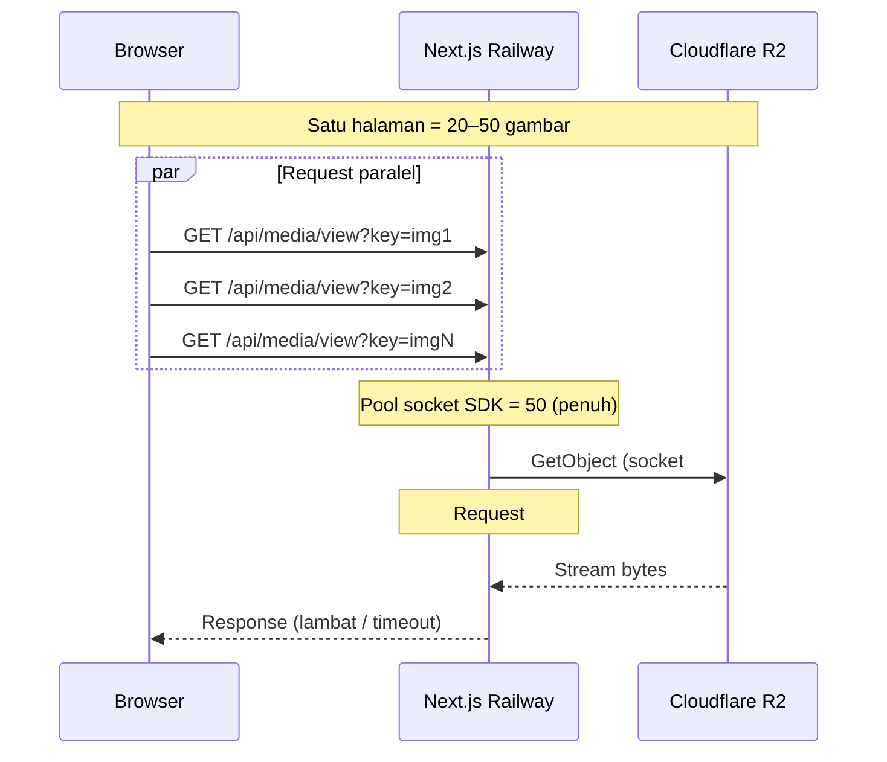
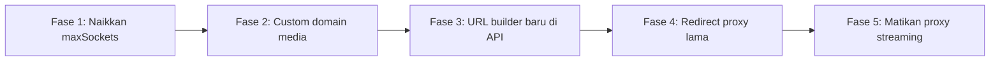

# Analisis Masalah Gambar Artikel Lambat / Tidak Muncul (S3 / R2 + Railway)

**Tanggal:** 2026-05-29  
**Konteks:** Foto artikel sudah ter-upload, tetapi di web tidak muncul atau loading sangat lama. Log Railway menampilkan peringatan `@smithy/node-http-handler` tentang socket penuh.

---

## 1. Ringkasan eksekutif

| Aspek | Kesimpulan |
|--------|------------|
| **Gejala** | Gambar artikel tidak tampil / loading lama saat dibuka langsung |
| **Log kritis** | `socket usage at capacity=50` dan **1.400+ request mengantre** |
| **Akar masalah** | Setiap gambar artikel dilayani lewat **proxy Next.js → R2/S3** (`GET /api/media/view`), bukan langsung dari CDN. Semua request memakai **pool HTTP AWS SDK default (50 socket)** di satu instance server |
| **Bukan penyebab utama** | Log MongoDB `WiredTiger checkpoint` — aktivitas DB normal, tidak terkait gambar |
| **Solusi jangka panjang** | Pindahkan **baca publik** gambar ke **custom domain R2 + CDN**; server hanya untuk upload/admin, bukan streaming ribuan gambar |

---

## 2. Apa arti log Railway?

```
@smithy/node-http-handler:WARN - socket usage at capacity=50
and 1451 additional requests are enqueued.
```

Ini berasal dari **AWS SDK for JavaScript v3** (paket yang dipakai `@aws-sdk/client-s3`).

### Penjelasan sederhana

- Node.js memakai **koneksi HTTP(S) terbatas** ke R2/S3 (default **50 socket** per host).
- Setiap `GetObject` (ambil file dari bucket) **memegang satu socket** selama file di-stream ke client.
- Ketika **lebih dari 50** permintaan baca file terjadi **bersamaan**, request ke-51 dst. **mengantre**.
- Log menunjukkan **~1.450 request menunggu** → antrian sangat panjang → timeout → gambar gagal / loading sangat lama.

### Mengapa ini fatal untuk situs berita?

Satu halaman bisa memuat **puluhan gambar** (homepage, artikel + isi body, carousel, thumbnail). Satu lonjakan traffic (banyak pengunjung, bot, atau refresh) bisa dengan cepat memenuhi 50 socket dan memblokir semua akses media baru.

---

## 3. Arsitektur saat ini (dari codebase)

### 3.1 Upload gambar artikel

```
Browser/Admin
    → POST presigned URL / upload
    → S3 PutObject (bucket: arasvara-images)
    → MongoDB `media` collection
         url: "/api/media/view?key=<filename>"
         filename: "<ulid>.webp"
```

Referensi:

- `src/services/mediaService.ts` — `saveMediaDB()` menyimpan URL proxy, bukan URL R2 langsung.
- `src/lib/helper-article.ts` — `normalizeFeaturedImage()` memakai `media.url` dari DB.

### 3.2 Tampilan gambar di web (masalah utama)

```
Browser  atau next/image
    → GET https://arasvara.id/api/media/view?key=...
    → Next.js route: src/app/api/media/view/route.ts
    → getMediaViewStream(key)
    → s3Client.send(GetObjectCommand)  ← memegang socket
    → Stream body dikembalikan ke browser
```

Referensi:

- `src/lib/s3.ts` — `S3Client` **tanpa** konfigurasi `maxSockets`.
- `src/app/api/media/view/route.ts` — proxy penuh + `Cache-Control: public, max-age=31536000` (bagus untuk browser, tapi **hit pertama tetap ke origin**).

### 3.3 Siapa yang memanggil `/api/media/view`?

| Area | Perilaku |
|------|----------|
| Featured image artikel | URL di DB → `NewsCard`, `HeroCard`, `ArticleUi`, dll. |
| Isi artikel (Tiptap HTML) | `` di `content` |
| Search / category / author | `normalizeFeaturedImage()` → URL proxy |
| Admin media picker | Langsung ke `/api/media/view` |
| Avatar | Terpisah: `/api/media/avatar/view` (pola proxy sama) |

Komponen publik memakai `unoptimized: true` untuk URL non-HTTP → **setiap gambar = 1 request langsung ke API Next**, tidak lewat optimasi CDN Next/Image.

### 3.4 Bucket & endpoint

| Bucket | Akses baca publik saat ini |
|--------|----------------------------|
| `arasvara-images` (artikel) | **Hanya lewat proxy** `/api/media/view` |
| `arasvara-avatars` | Proxy `/api/media/avatar/view` |
| `arasvara-configuration` | **Custom domain** `configuration.arasvara.id` (sudah benar) |

Artikel **belum** memakai custom domain; configuration **sudah** — itulah mengapa hero video/config bisa lebih stabil daripada foto artikel.

### 3.5 Diagram alur (sekarang)



---

## 4. Mengapa foto bisa “sudah upload” tapi tidak muncul?

Upload **berhasil** (file ada di R2, record ada di MongoDB). Yang gagal adalah **tahap baca**:

1. Browser minta gambar ke `/api/media/view`.
2. Server antre karena socket penuh.
3. Request timeout atau sangat lambat → `` error / loading abadi.
4. Buka link foto langsung juga lambat karena **masih lewat proxy yang sama**.

Ini **bukan** bug upload tunggal; ini **kapasitas arsitektur baca** yang tidak skala dengan jumlah gambar × traffic.

---

## 5. Perbandingan: logika sekarang vs yang seharusnya

### 5.1 Sekarang (anti-pattern untuk media publik skala besar)

| Aspek | Implementasi saat ini |
|--------|---------------------|
| URL di DB | `/api/media/view?key=...` |
| Baca file | Server Next.js stream dari R2 setiap request |
| Socket | 50 default, shared untuk semua operasi S3 |
| CDN | Cache browser ada (`max-age=1 tahun`), tapi origin tetap Railway |
| Skalabilitas | **O(traffic × jumlah_gambar)** beban ke satu instance |

**Cocok untuk:** development, situs kecil, sedikit gambar.  
**Tidak cocok untuk:** portal berita dengan banyak artikel, homepage kaya gambar, traffic publik.

### 5.2 Seharusnya (best practice untuk media publik)

| Aspek | Target |
|--------|--------|
| URL di DB / API response | `https://media.arasvara.id/<key>` atau path terstruktur |
| Baca file | **Browser ↔ R2/CDN langsung** (custom domain + public access) |
| Server Next.js | Hanya **upload** (PutObject / presigned PUT), delete, admin |
| Proxy `/api/media/view` | Dihapus atau **redirect 302** ke URL publik (transisi) |
| CDN | Cloudflare cache di edge untuk domain media |
| Skalabilitas | **Tidak terikat** socket pool Railway |

### 5.3 Pola transisi (minim risiko)



---

## 6. Rekomendasi bertahap

### Fase 1 — Mitigasi darurat (jam–hari)

**Tujuan:** Kurangi antrian ekstrem tanpa ubah arsitektur besar.

1. **Naikkan `maxSockets` pada `S3Client`** di `src/lib/s3.ts`:

   ```typescript
   import { NodeHttpHandler } from "@smithy/node-http-handler";

   export const s3Client = new S3Client({
     // ...config existing...
     requestHandler: new NodeHttpHandler({
       maxSockets: 200, // atau 500, uji di Railway
       socketAcquisitionWarningTimeout: 30_000,
     }),
   });
   ```

   > Ini **pereda**, bukan solusi permanen. Traffic besar tetap akan membebani Railway.

2. **Monitor** log Railway untuk warning yang sama setelah deploy.

3. **Scale horizontal** (jika Railway plan mengizinkan) — beberapa replica = beberapa pool 50 socket (tetap mahal dibanding CDN).

### Fase 2 — Custom domain untuk bucket images (hari–minggu) ⭐ Prioritas

Mirip `configuration.arasvara.id`:

1. Pasang custom domain R2, mis. `media.arasvara.id` → bucket `arasvara-images`.
2. Env production:
   ```env
   NEXT_PUBLIC_STORAGE_MEDIA=https://media.arasvara.id
   ```
3. `S3_ENDPOINT` tetap API R2 (`*.r2.cloudflarestorage.com`) untuk upload — **jangan** dicampur dengan domain publik.

### Fase 3 — Ubah URL yang dikembalikan ke frontend (minggu)

1. Tambah helper `resolvePublicMediaUrl(key)` — mirip `configurationService.buildFileUrl()`.
2. Terapkan di:
   - `normalizeFeaturedImage()` / `searchService`
   - `saveMediaDB()` — simpan key; URL publik dibentuk saat read (seperti configuration).
3. Update `next.config.ts` — `remotePatterns` untuk `media.arasvara.id`.
4. Artikel lama di DB masih punya `/api/media/view?key=...` → helper harus **deteksi dan rewrite** ke domain baru.

### Fase 4 — Redirect proxy (kompatibilitas)

Ubah `GET /api/media/view` dari **stream** menjadi:

```http
HTTP/1.1 302 Found
Location: https://media.arasvara.id/<key>
Cache-Control: public, max-age=31536000, immutable
```

- Artikel lama tetap jalan.
- **Tidak memegang socket** untuk streaming penuh (hanya redirect ringan).
- Browser/cache mengambil file dari CDN.

### Fase 5 — Opsional lanjutan

| Item | Manfaat |
|------|---------|
| Cloudflare cache rules untuk `media.arasvara.id` | Hit rate tinggi, latency rendah globally |
| `loading="lazy"` pada img di konten artikel | Kurangi burst request saat page load |
| Pisahkan `S3Client` upload vs read | Isolasi pool jika masih ada operasi server-side read |
| Hapus duplikat `src/lib/db/s3.ts` | Satu konfigurasi client, hindari kebingungan env |

---

## 7. Estimasi beban (contoh kasar)

| Skenario | Request media ke Railway |
|----------|---------------------------|
| 1 user buka homepage (~30 gambar) | ~30 `GetObject` paralel |
| 50 user bersamaan | ~1.500 request (sesuai log **1451 enqueued**) |
| 1 artikel panjang (15 gambar di body) | +15 proxy per page view |

Dengan **custom domain**, angka di kolom Railway untuk baca gambar → **mendekati 0**.

---

## 8. Hal lain yang perlu kamu ketahui

### 8.1 Upload vs baca adalah dua masalah berbeda

- **Upload** (presigned PUT / PutObject) — jarang, socket cepat lepas.
- **Baca** (GetObject + stream) — sering, socket lama terpakai → inilah yang memicu log.

### 8.2 Cache-Control sudah benar, tapi tidak cukup

`src/app/api/media/view/route.ts` sudah set `max-age=31536000, immutable`.  
Itu membantu **kunjungan ulang** di browser yang sama, tidak membantu:

- Banyak user pertama kali
- Banyak gambar berbeda di satu halaman
- Bot/crawler yang menembak ribuan URL

### 8.3 Presigned URL untuk **baca** artikel — tidak disarankan sebagai default

Seperti dibahas sebelumnya untuk bucket configuration:

- URL expired
- Sulit di-cache CDN
- Setiap API call harus signing

Untuk gambar **publik** artikel, **custom domain + public bucket** lebih tepat daripada presigned GET.

### 8.4 MongoDB di log

```
WiredTiger message ... Creating a checkpoint ...
```

Ini maintenance rutin database. **Abaikan** untuk investigasi gambar.

### 8.5 Keamanan

- Bucket images untuk artikel **published** memang publik — OK di CDN.
- Jangan expose bucket configuration/admin lewat listing publik.
- Upload tetap pakai kredensial server / presigned PUT dengan expiry pendek.

### 8.6 Kriteria sukses setelah perbaikan

- [ ] Buka artikel dengan banyak gambar — semua tampil < 2 detik (di koneksi normal)
- [ ] Log Railway **tidak lagi** menampilkan `socket usage at capacity=50` dalam traffic normal
- [ ] Network tab browser: gambar artikel dari `media.arasvara.id`, bukan `arasvara.id/api/media/view`
- [ ] Link foto langsung cepat (CDN edge)

---

## 9. File kode kunci (referensi cepat)

| File | Peran |
|------|--------|
| `src/lib/s3.ts` | S3Client — **perlu** `maxSockets` + nanti tidak dipakai untuk baca publik |
| `src/app/api/media/view/route.ts` | Proxy streaming — **bottleneck** |
| `src/services/mediaService.ts` | `getMediaViewStream()`, `saveMediaDB()` |
| `src/lib/helper-article.ts` | `normalizeFeaturedImage()`, `resolveFeaturedImageUrl()` |
| `src/services/configurationService.ts` | **Contoh benar** — URL publik dari `NEXT_PUBLIC_STORAGE_CONFIGURATION` |
| `next.config.ts` | `remotePatterns`, `localPatterns` untuk `/api/media/view` |
| `src/proxy.ts` | `/api/media` public — tidak perlu auth |

---

## 10. Kesimpulan

Masalah ini **bukan bug upload** melainkan **arsitektur distribusi gambar**: seluruh lalu lintas baca artikel dipaksakan melalui satu instance Next.js di Railway dengan pool HTTP terbatas ke R2.

**Solusi yang benar secara desain:** pisahkan **write** (server → R2) dan **read** (browser → CDN/custom domain), sama seperti yang sudah dilakukan untuk bucket configuration.

**Urutan kerja yang disarankan:**

1. Mitigasi `maxSockets` (sementara).
2. Custom domain `media.arasvara.id` + env.
3. Rewrite URL di API + helper.
4. Redirect `/api/media/view` → CDN.
5. Monitor dan matikan proxy streaming ketika stabil.

Dengan pola ini, jumlah foto di artikel **tidak lagi membebani** server aplikasi — skala mengikuti CDN R2/Cloudflare, bukan socket pool Node.js di Railway.
