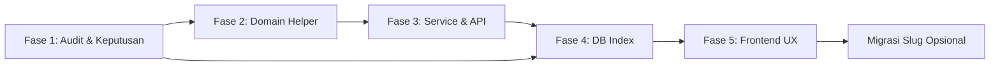

# Rencana Implementasi: Validasi Judul Unik & Slug Tanpa Suffix Random

## Ringkasan Masalah

Saat ini portal berita memungkinkan dua artikel dengan **judul identik**, karena belum ada guard unik di layer manapun. Slug dibuat di `generateArticleSlug()` dengan pola:

```
slugify(title) + "-" + randomUUID(8)
```

Contoh: judul `"Pemilu 2024"` → slug `pemilu-2024-a1b2c3d4`.

**Tujuan:**

1. Judul artikel **tidak boleh duplikat** (sama persis).
2. Slug **hanya** hasil `slugify(title)` — tanpa suffix random.

---

## Kondisi Kode Saat Ini

| Area | File | Perilaku |
|------|------|----------|
| Generator slug | `src/lib/helper-article.ts` | `generateArticleSlug()` menambah `-xxxxxxxx` dari UUID |
| Create | `src/services/article/coreWriteArticleService.ts` → `createArticle()` | Set `slug: generateArticleSlug(title)` saat insert |
| Update | `src/services/article/coreWriteArticleService.ts` → `updateArticle()` | Update `title` + `metaTitle`, **slug tidak ikut berubah** |
| Autosave backend | `src/services/article/writeArticleService.ts` → `autosaveArticle()` | Insert draft baru pakai `generateArticleSlug()` |
| Autosave frontend | `src/lib/autosave.ts` | Draft baru hanya ke **localStorage** (tidak hit API) |
| API create | `src/app/api/articles/route.ts` POST | Trim title, delegasi ke `createArticle()` |
| API update | `src/app/api/articles/[idOrSlug]/route.ts` PATCH | Delegasi ke `updateArticle()` |
| API autosave | `src/app/api/articles/autosave/route.ts` POST | Delegasi ke `autosaveArticle()` |
| UI editor | `src/components/admin/articles/ArticleEditorForm.tsx` | Error dari API ditampilkan via `toast.error(message)` |
| Database | MongoDB (`DB_NAME=arasvara_news`, lihat `.env` / `docker-compose.yml`) | **Belum ada** unique index pada `articles.title` atau `articles.slug` |
| Soft delete | `deletedAt` + `status: DELETED` | Query publik/admin sudah filter `deletedAt: { $in: [null, ""] }` |

**Catatan infrastruktur:** MongoDB lokal via Docker (`27001:27017`, container `arasvara_mongo`). Tidak ada hook startup yang membuat index artikel — pola serupa ada di `refreshTokenService.ts` dan `adClickService.ts` (`ensureIndexes()`).

---

## Rekomendasi Pembagian Fase: **5 Fase**

Alasan 5 fase (bukan 3–4):

- **Keputusan produk** perlu diselesaikan dulu agar implementasi tidak bolak-balik.
- **Migrasi data lama** berisiko SEO/URL — sebaiknya fase terpisah, opsional.
- **Frontend UX** (feedback duplikat) layak fase sendiri setelah kontrak API stabil.

---

## Fase 1 — Persiapan, Audit Data & Keputusan Produk

**Tujuan:** Pastikan scope jelas dan data existing aman sebelum ubah kode.

### 1.1 Audit data existing

Jalankan query ke MongoDB (`arasvara_news.articles`):

- Hitung pasangan judul duplikat (exact match setelah `trim`).
- Hitung slug dengan pola suffix `-xxxxxxxx` (regex: `/-[a-f0-9]{8}$/`).
- Identifikasi pasangan judul berbeda yang `slugify`-nya sama (edge case slug bentrok meski judul unik).

Simpan hasil audit (jumlah duplikat, contoh dokumen) sebagai acuan migrasi.

### 1.2 Keputusan produk yang **wajib** disepakati

| # | Pertanyaan | Opsi | Rekomendasi default |
|---|------------|------|---------------------|
| 1 | "Sama persis" = case-sensitive? | A) Exact byte (`"Berita"` ≠ `"berita"`) · B) Case-insensitive | **B** — UX lebih aman |
| 2 | Artikel `DELETED` / punya `deletedAt` dihitung bentrok? | A) Ya · B) Tidak | **B** — judul artikel terhapus bisa dipakai ulang |
| 3 | Draft (`DRAFT`) boleh duplikat title sementara? | A) Tidak, sejak create · B) Hanya validasi saat submit/publish | **A** — konsisten dengan rule "tidak boleh duplikat" |
| 4 | Saat **update title**, slug ikut berubah? | A) Tetap (URL stabil) · B) Regenerate dari title baru | **B** — selaras dengan slug = slugify(title); butuh redirect jika sudah published |
| 5 | Migrasi slug artikel lama (hapus suffix random)? | A) Tidak (grandfathering) · B) Ya + redirect 301 | **A** dulu — risiko SEO rendah; fase migrasi terpisah jika diminta |
| 6 | Pesan error ke user (Bahasa)? | Contoh: `"Judul artikel sudah digunakan"` | Setuju satu kalimat standar |

### 1.3 Desain teknis singkat

- Tambah field opsional `titleNormalized: string` (lowercase + trim) jika memilih case-insensitive — memudahkan index & query.
- Helper baru: `assertUniqueArticleTitle(db, title, excludeId?)` — reusable di create/update/autosave.
- Ubah `generateArticleSlug()` → hanya `slugify(title, { lower: true, strict: true })`.
- Tambah `assertUniqueArticleSlug()` jika audit menemukan bentrok slug dari judul berbeda.

### Deliverable Fase 1

- [ ] Hasil audit JSON/console log
- [ ] Keputusan produk terdokumentasi (centang tabel di atas)
- [ ] Tidak ada perubahan kode production (kecuali script audit opsional di `scripts/`)

**Estimasi:** 0.5–1 hari (tergantung akses DB prod/staging)

---

## Fase 2 — Domain Layer (Helper & Validasi)

**Tujuan:** Satu sumber kebenaran untuk slug dan cek duplikat.

### 2.1 Ubah generator slug

**File:** `src/lib/helper-article.ts`

```ts
// Sebelum
return `${base}-${uid}`;

// Sesudah
return base || "untitled"; // fallback jika title kosong setelah slugify
```

Hapus import/penggunaan `crypto.randomUUID()` jika tidak dipakai lagi.

### 2.2 Tambah util validasi judul

**File:** `src/lib/helper-article.ts` (atau `src/lib/article-validation.ts` jika ingin pisah)

Fungsi yang dibutuhkan:

| Fungsi | Tanggung jawab |
|--------|----------------|
| `normalizeArticleTitle(title: string)` | `trim()` + (opsional) lowercase untuk `titleNormalized` |
| `buildActiveArticleFilter()` | `{ deletedAt: { $in: [null, ""] } }` — konsisten dengan query existing |
| `findArticleByTitleConflict(db, title, excludeId?)` | Query satu dokumen bentrok |
| `assertUniqueArticleTitle(db, title, excludeId?)` | Throw `Error` dengan `{ status: 409, code: "DUPLICATE_TITLE" }` |

Query contoh (case-insensitive + exclude self):

```js
{
  titleNormalized: normalizeArticleTitle(title),
  deletedAt: { $in: [null, ""] },
  ...(excludeId && { _id: { $ne: new ObjectId(excludeId) } })
}
```

### 2.3 (Opsional) Validasi slug bentrok

Jika audit Fase 1 menemukan risiko:

- `assertUniqueArticleSlug(db, slug, excludeId?)` sebelum insert/update.

### 2.4 Unit test

Tambah test untuk:

- `generateArticleSlug()` tanpa suffix
- Normalisasi title
- Edge case: title spasi, karakter khusus, title kosong

### Deliverable Fase 2

- [ ] Helper slug & validasi terpusat
- [ ] Test dasar lulus

**Estimasi:** 0.5 hari

---

## Fase 3 — Service Layer & API

**Tujuan:** Terapkan validasi di semua jalur tulis artikel; mapping error konsisten.

### 3.1 `createArticle()`

**File:** `src/services/article/coreWriteArticleService.ts`

1. Normalisasi `title` dengan `trim()` sebelum validasi.
2. Panggil `assertUniqueArticleTitle(db, title)` **sebelum** `insertOne`.
3. Set `slug: generateArticleSlug(title)` (format baru).
4. (Opsional) set `titleNormalized` saat insert.
5. Tangkap error MongoDB `E11000` → map ke 409 dengan pesan ramah.

### 3.2 `updateArticle()`

**File:** `src/services/article/coreWriteArticleService.ts`

1. Jika `payload.title` ada dan berbeda dari `existing.title` (setelah normalisasi):
   - `assertUniqueArticleTitle(db, payload.title, articleId)`.
2. **Keputusan slug (default rekomendasi B):**
   - Update `slug: generateArticleSlug(payload.title)` bersamaan dengan title.
   - Jika artikel sudah `PUBLISHED`, pertimbangkan invalidasi cache (`article-cache-config`) dan dokumentasi kebutuhan redirect.
3. Set `titleNormalized` jika dipakai.

### 3.3 `autosaveArticle()`

**File:** `src/services/article/writeArticleService.ts`

- **Create path** (tanpa `articleId`): validasi title unik + slug baru.
- **Update path** (dengan `articleId`): jika title berubah, validasi unik (exclude id).
- Title placeholder `"Untitled"` — tentukan apakah boleh duplikat banyak draft "Untitled" atau wajib unik (rekomendasi: **boleh duplikat hanya untuk title kosong/Untitled** via exception khusus).

### 3.4 API routes — error contract

**File:**

- `src/app/api/articles/route.ts`
- `src/app/api/articles/[idOrSlug]/route.ts`
- `src/app/api/articles/autosave/route.ts`

Pastikan response konsisten:

```json
{
  "error": "Judul artikel sudah digunakan",
  "code": "DUPLICATE_TITLE"
}
```

Status HTTP: **409 Conflict** (bukan 400) untuk duplikat judul.

Helper kecil `mapArticleWriteError(error)` di `src/lib/` untuk hindari duplikasi try/catch.

### 3.5 Approval flow

**File:** `src/services/article/writeArticleService.ts` → `approveArticleStatus()`

Tidak mengubah title/slug — **tidak perlu** validasi duplikat di sini kecuali approval flow nanti bisa edit title.

### Deliverable Fase 3

- [ ] Semua jalur create/update/autosave backend menolak duplikat
- [ ] Slug baru tanpa suffix random
- [ ] API mengembalikan 409 + `code` untuk duplikat

**Estimasi:** 1 hari

---

## Fase 4 — Database: Index Unik & Race Condition

**Tujuan:** Jamin integritas di level DB; cegah duplikat saat request paralel.

### 4.1 Bersihkan data duplikat (pre-requisite index)

Sebelum `createIndex`, selesaikan duplikat existing dari audit Fase 1:

- Rename judul duplikat (suffix editorial), atau
- Soft-delete duplikat, atau
- Merge manual — sesuai kebijakan redaksi.

Tanpa langkah ini, `createIndex` akan gagal.

### 4.2 Unique index (partial)

**Lokasi implementasi:** modul baru `src/lib/db/article-indexes.ts` dengan `ensureArticleIndexes(db)`, dipanggil dari `connectToDatabase()` atau startup script sekali jalan.

Index yang disarankan:

```js
// Case-insensitive via titleNormalized
db.articles.createIndex(
  { titleNormalized: 1 },
  {
    unique: true,
    partialFilterExpression: {
      deletedAt: { $in: [null, ""] },
      titleNormalized: { $type: "string", $ne: "" }
    },
    name: "uniq_active_article_title_normalized"
  }
);

// Slug unik untuk artikel aktif
db.articles.createIndex(
  { slug: 1 },
  {
    unique: true,
    partialFilterExpression: {
      deletedAt: { $in: [null, ""] },
      slug: { $type: "string", $ne: "" }
    },
    name: "uniq_active_article_slug"
  }
);
```

**Catatan:** Index slug unik wajib meski title unik — karena dua judul berbeda bisa menghasilkan slug identik setelah `slugify`.

### 4.3 Backfill `titleNormalized`

Script one-off `scripts/backfill-article-title-normalized.ts`:

- Iterasi semua artikel aktif
- Set `titleNormalized = normalizeArticleTitle(title)`
- Deteksi & laporkan bentrok sebelum index

### 4.4 Handling `E11000` di service

Di `createArticle` / `updateArticle`, catch:

```ts
if (err?.code === 11000) {
  throw Object.assign(new Error("Judul artikel sudah digunakan"), {
    status: 409,
    code: "DUPLICATE_TITLE", // atau DUPLICATE_SLUG
  });
}
```

### 4.5 Lingkungan

- **Lokal:** MongoDB Docker (`docker-compose.yml` → port `27001`)
- **Staging/Prod:** Jalankan script index + backfill via pipeline deploy atau manual dengan backup

### Deliverable Fase 4

- [ ] Duplikat existing terselesaikan
- [ ] `titleNormalized` ter-backfill
- [ ] Unique index aktif di semua environment
- [ ] Service menangani `E11000`

**Estimasi:** 1–2 hari (termasuk koordinasi data prod)

---

## Fase 5 — Frontend, UX & (Opsional) Migrasi Slug Lama

**Tujuan:** Pengguna admin mendapat feedback jelas; opsional rapikan URL lama.

### 5.1 Penanganan error di editor

**File:** `src/components/admin/articles/ArticleEditorForm.tsx`

- Saat submit gagal dengan `code === "DUPLICATE_TITLE"`, tampilkan toast spesifik (bisa pakai pesan dari API).
- (Opsional) highlight field judul.

### 5.2 Validasi client-side (opsional, nice-to-have)

Endpoint baru `GET /api/articles/check-title?title=...&excludeId=...`:

- Debounce 400ms di input judul
- Tampilkan indikator "Judul tersedia" / "Judul sudah dipakai"
- **Tetap** andalkan validasi server — ini hanya UX

**File tambahan:**

- `src/app/api/articles/check-title/route.ts`
- Hook `useArticleTitleAvailability` di `src/hooks/`

### 5.3 Migrasi slug lama (opsional — hanya jika Fase 1 memilih opsi B)

Script `scripts/migrate-article-slugs-remove-suffix.ts`:

1. Untuk setiap artikel dengan slug `-xxxxxxxx`
2. Hitung slug baru = `slugify(title)`
3. Jika bentrok dengan artikel lain → skip + laporkan
4. Update dokumen + buat entri redirect (collection `slug_redirects` atau middleware Next.js)
5. Invalidate cache artikel

**Risiko tinggi** untuk SEO — lakukan hanya dengan redirect 301 dan komunikasi ke tim.

### 5.4 Dokumentasi internal

Update `memory/alurArticle.md` — bagian create/update slug & validasi title.

### Deliverable Fase 5

- [ ] Toast/error UX jelas di form artikel
- [ ] (Opsional) live check judul
- [ ] (Opsional) migrasi slug + redirect

**Estimasi:** 0.5–1 hari (tanpa migrasi slug); +1–2 hari jika migrasi slug

---

## Peta File yang Akan Disentuh

| Fase | File |
|------|------|
| 2 | `src/lib/helper-article.ts`, (baru) `src/lib/article-validation.ts` |
| 3 | `src/services/article/coreWriteArticleService.ts`, `src/services/article/writeArticleService.ts`, `src/app/api/articles/route.ts`, `src/app/api/articles/[idOrSlug]/route.ts`, `src/app/api/articles/autosave/route.ts` |
| 4 | (baru) `src/lib/db/article-indexes.ts`, `src/lib/db/db.ts`, `scripts/backfill-article-title-normalized.ts` |
| 5 | `src/components/admin/articles/ArticleEditorForm.tsx`, (opsional) `src/app/api/articles/check-title/route.ts` |

**Tidak perlu diubah** untuk scope minimal: `approveArticleStatus`, halaman publik `news/[slug]` (selama slug lama tetap valid).

---

## Urutan Eksekusi & Dependensi



- Fase 3 bisa dimulai paralel dengan persiapan script Fase 4, tetapi **index DB tidak boleh diterapkan** sebelum duplikat dibersihkan.
- Fase 5 bisa sebagian dimulai setelah Fase 3 (toast error) tanpa menunggu index.

---

## Risiko & Mitigasi

| Risiko | Dampak | Mitigasi |
|--------|--------|----------|
| Duplikat title existing | Index gagal dibuat | Audit + cleanup Fase 1/4 |
| Race condition dua create bersamaan | Duplikat lolos cek aplikasi | Unique index + E11000 handling |
| Judul berbeda, slug sama setelah slugify | Insert gagal / bentrok slug | Unique index slug + pesan error jelas; pertimbangkan suffix numerik (`-2`) hanya untuk kasus slug bentrok, **bukan** random |
| Update title artikel published | URL lama 404 | Redirect 301 atau keputusan Fase 1 opsi A (slug tetap) |
| Banyak draft "Untitled" | False duplicate | Exception khusus untuk title kosong/Untitled |
| Artikel lama slug `-uuid` | Inkonsistensi visual | Grandfathering (default) atau migrasi terpisah |

---

## Definition of Done (seluruh initiative)

1. Tidak mungkin membuat artikel baru dengan judul yang sudah dipakai artikel aktif lain.
2. Slug artikel **baru** = `slugify(title)` tanpa suffix random.
3. Update judul menolak duplikat (dan perilaku slug sesuai keputusan Fase 1).
4. Database punya unique index; request paralel tetap aman.
5. Admin melihat pesan error yang jelas saat judul duplikat.
6. (Opsional) Migrasi slug lama + redirect jika disepakati.

---

## Estimasi Total

| Fase | Estimasi |
|------|----------|
| 1 — Persiapan & audit | 0.5–1 hari |
| 2 — Domain layer | 0.5 hari |
| 3 — Service & API | 1 hari |
| 4 — Database & index | 1–2 hari |
| 5 — Frontend UX | 0.5–1 hari |
| **Total (tanpa migrasi slug)** | **~3.5–5.5 hari** |
| Migrasi slug opsional | +1–2 hari |

---

## Pertanyaan untuk Diskusi (jawaban diperlukan sebelum Fase 3)

1. **Case-sensitive atau case-insensitive** untuk "judul sama persis"?
2. **Judul artikel yang sudah DELETED** — boleh dipakai lagi?
3. **Saat edit judul artikel published**, slug ikut berubah (URL baru) atau tetap?
4. **Migrasi slug lama** — perlu sekarang atau cukup artikel baru saja?
5. **Draft berjudul "Untitled"** — boleh banyak, atau harus unik juga?
6. Jika dua judul berbeda menghasilkan **slug identik** (edge case slugify), apakah boleh tambah suffix numerik (`judul-2`) atau tolak keduanya?

Setelah keenam poin dijawab, implementasi Fase 2–5 bisa dijalankan berurutan tanpa rework besar.
