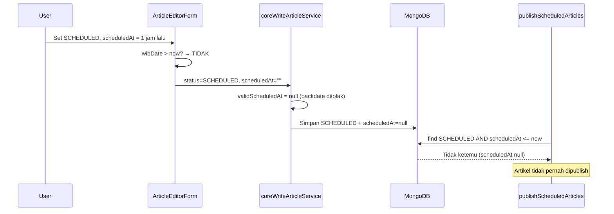

# Analisis: Schedule Publish Backdate Tidak Terpublish

**Tanggal:** 8 Juli 2026  
**Konteks:** Artikel dijadwalkan (`SCHEDULED`) dengan waktu `scheduledAt` di masa lalu (backdate) tidak otomatis terpublish saat scheduler berikutnya berjalan.

---

## 1. Ekspektasi User

User ingin perilaku berikut ketika menjadwalkan artikel dengan waktu yang **sudah lewat** (backdate):

| Aspek | Ekspektasi |
|-------|------------|
| **Kapan publish** | Artikel tetap menunggu **siklus scheduler berikutnya** (bukan langsung publish saat disimpan). |
| **Status akhir** | Saat scheduler jalan, artikel berubah dari `SCHEDULED` → `PUBLISHED`. |
| **`publishedAt`** | Diisi dari nilai `scheduledAt` (bukan waktu scheduler berjalan). |
| **Urutan di homepage/indeks** | Tidak masalah jika artikel tidak muncul sebagai "terbaru" — urutan mengikuti `publishedAt` backdate. |

### Contoh skenario

1. Sekarang pukul **11:00**.
2. User membuat/menyetujui artikel dengan status `SCHEDULED` dan `scheduledAt = 10:00` (1 jam yang lalu).
3. User **tidak** mengharapkan publish instan saat klik save.
4. User menunggu scheduler berikutnya (mis. jalan tiap 5 menit, pukul **11:05**).
5. Pada siklus itu, artikel **harus** terpublish dengan `publishedAt = 10:00`.

Intinya: **backdate = timestamp publikasi historis**, bukan penundaan ke masa depan — tetapi tetap menunggu **trigger scheduler** untuk eksekusi publish.

---

## 2. Sistem Existing Saat Ini

### 2.1 Arsitektur scheduler

```
[Docker scheduler / cron]
        │  POST setiap ~5 menit
        ▼
/api/publish-scheduled
        │
        ▼
publishScheduledArticles(db)
        │
        ▼
MongoDB bulkWrite: SCHEDULED → PUBLISHED
```

**File terkait:**
- [`src/app/api/publish-scheduled/route.ts`](../src/app/api/publish-scheduled/route.ts) — endpoint, dilindungi `SCHEDULER_SECRET`
- [`src/services/article/writeArticleService.ts`](../src/services/article/writeArticleService.ts) — fungsi `publishScheduledArticles()`
- [`docker-compose.yml`](../docker-compose.yml) — container `scheduler` memanggil endpoint setiap `sleep 300` (5 menit)

### 2.2 Query scheduler (inti publish)

```typescript
// writeArticleService.ts — publishScheduledArticles()
const now = new Date();
const scheduled = await db.collection("articles").find({
  status: "SCHEDULED",
  scheduledAt: { $lte: now },
}).toArray();
```

Artikel yang **lolos** query ini akan di-update:

```typescript
$set: {
  status: "PUBLISHED",
  publishedAt: article.scheduledAt,  // ← sudah sesuai ekspektasi user
  updatedAt: now,
}
```

**Catatan penting:** Logika scheduler **sudah benar** untuk ekspektasi user — jika `scheduledAt` tersimpan dan `<= now`, artikel akan dipublish dengan `publishedAt = scheduledAt`.

### 2.3 Validasi: sistem **menolak** backdate di banyak layer

Masalahnya bukan di scheduler, melainkan **data `scheduledAt` tidak pernah tersimpan** (atau diset `null`) ketika user memilih waktu di masa lalu.

#### Layer A — Form editor artikel (client)

[`src/components/admin/articles/ArticleEditorForm.tsx`](../src/components/admin/articles/ArticleEditorForm.tsx) baris ~1245:

```typescript
if (!isNaN(wibDate.getTime()) && wibDate > new Date()) {
  finalScheduledAt = wibDate.toISOString();
  finalStatus = ArticleStatus.SCHEDULED;
}
```

- Hanya tanggal **masa depan** yang diset ke `finalScheduledAt`.
- Jika user pilih backdate: `finalScheduledAt` tetap `""` (kosong).
- Status bisa tetap `SCHEDULED` jika user memilih dari dropdown status, tetapi **tanpa** `scheduledAt` yang valid.

#### Layer B — Form approval artikel (client)

[`src/components/news/ArticleApprovalForm.tsx`](../src/components/news/ArticleApprovalForm.tsx) — validasi Zod:

```typescript
if (date <= new Date()) {
  return false; // gagal validasi
}
```

Pesan error: *"Tanggal terjadwal harus di masa depan..."*

Via flow approval, **backdate tidak bisa disubmit sama sekali**.

#### Layer C — Server create/update artikel

[`src/services/article/coreWriteArticleService.ts`](../src/services/article/coreWriteArticleService.ts) baris ~628–632 dan ~1070–1073:

```typescript
if (scheduledAt) {
  const d = new Date(scheduledAt);
  if (!isNaN(d.getTime()) && d > new Date()) validScheduledAt = d;
}
// jika backdate → validScheduledAt = null
```

Artikel bisa tersimpan sebagai:
- `status: "SCHEDULED"`
- `scheduledAt: null`

#### Layer D — Server approval flow

[`src/services/article/writeArticleService.ts`](../src/services/article/writeArticleService.ts) — `assertApprovalScheduledDateValid()`:

```typescript
if (Number.isNaN(scheduled.getTime()) || scheduled <= new Date()) {
  throw new Error("Tanggal terjadwal harus di masa depan.");
}
```

Approval dengan backdate **ditolak** dengan HTTP 400.

---

## 3. Root Cause: Mengapa Tidak Terpublish?

### Alur bug (skenario user)



### Kenapa query scheduler tidak menemukan artikel?

Di MongoDB, dokumen dengan `scheduledAt: null` **tidak cocok** dengan filter `scheduledAt: { $lte: now }`.

Artikel "terjebak" dalam status `SCHEDULED` tanpa tanggal jadwal yang valid — scheduler tidak punya trigger untuk mempublikasikannya.

---

## 4. Ringkasan Perbandingan

| Aspek | Ekspektasi User | Sistem Saat Ini |
|-------|-----------------|-----------------|
| Backdate diizinkan? | Ya | Tidak (ditolak di 4 layer) |
| `scheduledAt` backdate tersimpan? | Ya | Tidak — diset `null` atau request ditolak |
| Publish saat scheduler berikutnya? | Ya | Tidak terjadi — artikel tidak masuk query |
| `publishedAt` dari `scheduledAt`? | Ya | Sudah benar **jika** artikel lolos query |
| Urutan artikel di list | Boleh tidak jadi terbaru | Sudah mengikuti `publishedAt` |

---

## 5. File yang Perlu Diubah (jika implementasi fix)

Untuk mendukung ekspektasi user, perubahan minimal diperkirakan menyentuh:

| File | Perubahan |
|------|-----------|
| `ArticleEditorForm.tsx` | Izinkan `finalScheduledAt` untuk tanggal `<= now`, tetap set status `SCHEDULED` |
| `ArticleApprovalForm.tsx` | Longgarkan validasi Zod: izinkan backdate, tetap wajib isi `scheduledAt` |
| `coreWriteArticleService.ts` | Hapus syarat `d > new Date()` — terima `scheduledAt` valid apa pun |
| `writeArticleService.ts` | Hapus/ubah `assertApprovalScheduledDateValid()` agar izinkan backdate |
| `publishScheduledArticles()` | **Tidak perlu diubah** — sudah benar |

Opsional — pertimbangkan juga menangani artikel legacy yang sudah `SCHEDULED` + `scheduledAt: null` (data korup).

---

## 6. Risiko & Catatan Implementasi

1. **Publish instan vs via scheduler:** Ekspektasi user = tetap via scheduler. Jangan publish langsung saat save meskipun `scheduledAt <= now`.
2. **`publicPath`:** Setelah publish, `recomputeArticlePublicPath()` sudah dipanggil dengan `publishedAt` dari `scheduledAt` — URL artikel akan memakai tanggal backdate (sesuai format structured path).
3. **Notifikasi:** Notifikasi "Artikel dijadwalkan terbit" saat ini bisa menampilkan waktu kosong jika `validScheduledAt` null — akan lebih konsisten setelah backdate didukung.
4. **Timezone:** Form editor mengonversi input `datetime-local` ke UTC dengan offset WIB (-7). Pastikan backdate tetap konsisten dengan konversi ini.
5. **Artikel terjebak:** Perlu script/query one-time untuk memperbaiki artikel existing `SCHEDULED` + `scheduledAt: null` jika ada di production.

---

## 7. Kesimpulan

**User mengerti dengan benar:** artikel backdate seharusnya terpublish pada siklus scheduler berikutnya, dengan `publishedAt` mengikuti `scheduledAt`.

**Sistem saat ini sengaja melarang backdate** di form client dan validasi server. Akibatnya artikel bisa tersimpan sebagai `SCHEDULED` tanpa `scheduledAt` yang valid, sehingga **scheduler tidak pernah menemukannya**.

Scheduler (`publishScheduledArticles`) sendiri **sudah sesuai** ekspektasi — masalah ada di **penyimpanan `scheduledAt`**, bukan di eksekusi publish.
