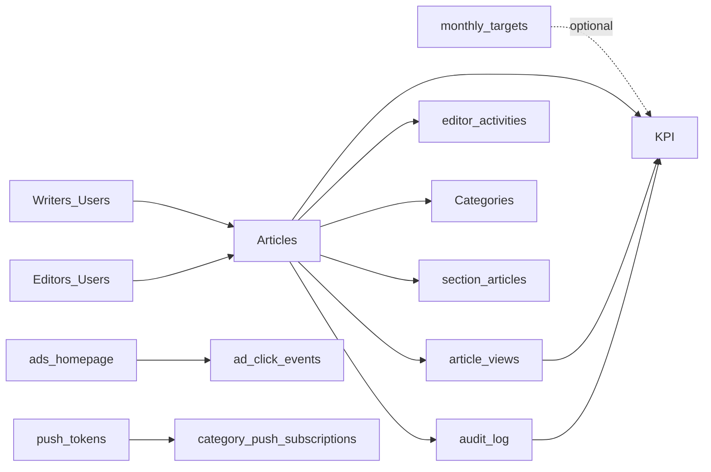
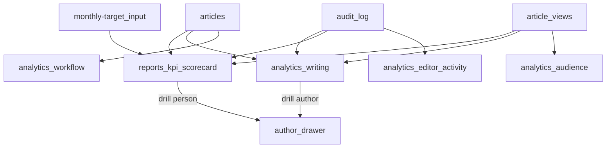
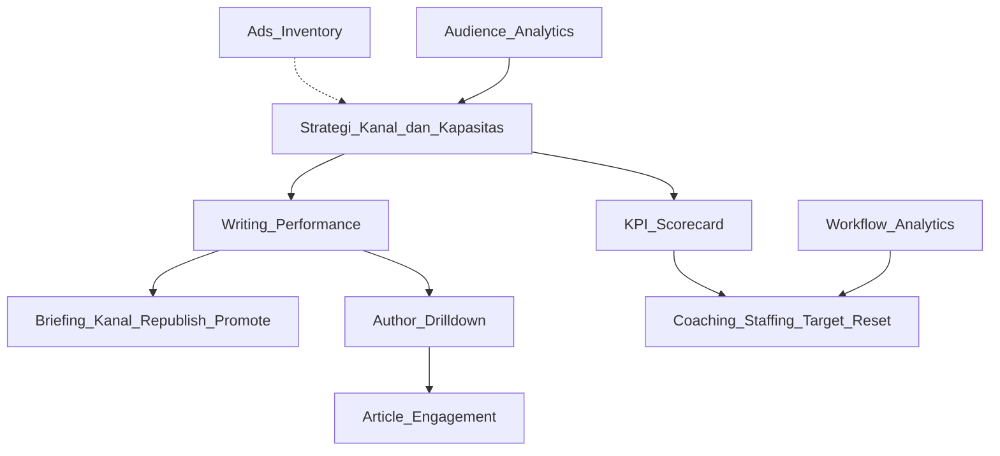

# Report Metrics — Decision Support System (DSS) Media Arasvara

**Tanggal audit:** 2026-08-10  
**Scope halaman:** `/admin-xyz/reports/kpi` dan `/admin-xyz/analytics/writing`  
**Constraint:** Tidak mengubah struktur data / skema MongoDB. Memanfaatkan data yang sudah ada.  
**Database yang diaudit:** `arasvara_news` di `mongodb://192.168.0.193:27001`

---

## 1. Ringkasan Eksekutif

Arasvara sudah memiliki fondasi data yang cukup kuat untuk membangun **Decision Support System redaksi + audience**, tetapi kedua halaman target masih berada di tingkat laporan operasional mentah, bukan dashboard pengambilan keputusan.

| Area                  | Kondisi saat ini                                    | Implikasi bisnis                                             |
| --------------------- | --------------------------------------------------- | ------------------------------------------------------------ |
| Produksi konten       | Kuat (`articles` status, timestamps, author/editor) | Output, funnel, backlog, dan SLA dapat diukur                |
| Traffic               | Kuat (`article_views` + `articles.viewCount`)       | Audience contribution per penulis/kanal dapat diukur         |
| Kualitas workflow     | Sedang (`editor_activities` + `audit_log`)          | Revision/SLA bisa dihitung, tapi sumber event terpecah       |
| Target                | Lemah di DB aktual (`monthly_targets` kosong)       | Achievement rate belum bisa dibandingkan dengan target nyata |
| Monetisasi            | Lemah untuk DSS keuangan                            | Hanya inventory/klik iklan; tidak ada revenue/impresi DB     |
| People performance UI | Partial                                             | KPI hanya 2 tab; Writing analytics hampir stub               |

**Kesimpulan utama:** Full refactor kedua halaman layak dilakukan **tanpa perubahan skema**, dengan syarat:

1. Menyatukan definisi metrik (sumber kebenaran view, periode, status filter).
2. Memindahkan agregasi KPI workflow dari `editor_activities` (stale) ke `audit_log` + field artikel yang sudah ada.
3. Memposisikan KPI sebagai **people scorecard**, Writing sebagai **writer performance cockpit**, dan menjaga Workflow/Audience sebagai companion pages (tidak digabung paksa).

---

## 2. Inventaris Data yang Ada di Website / MongoDB

### 2.1 Koleksi operasional yang terdeteksi di DB

| Koleksi                       | Estimasi dokumen | Domain bisnis           | Relevansi DSS         |
| ----------------------------- | ---------------- | ----------------------- | --------------------- |
| `articles`                    | 1.033            | Produksi konten         | Primer                |
| `article_views`               | 15.364           | Traffic event           | Primer                |
| `audit_log`                   | 2.645            | Jejak editorial         | Primer (KPI/workflow) |
| `editor_activities`           | 470              | Legacy editorial events | Primer tapi stale     |
| `users`                       | 14               | SDM redaksi             | Primer                |
| `categories`                  | 10               | Kanal konten            | Primer                |
| `media`                       | 954              | Aset konten             | Sekunder (ops)        |
| `notifications`               | 3.158            | Event in-app            | Sekunder              |
| `section_articles`            | 15               | Kurasi beranda          | Sekunder              |
| `video_section`               | 46               | Embed sosmed            | Sekunder              |
| `ads_homepage`                | 7                | Monetisasi inventory    | Sekunder              |
| `ad_click_events`             | 0                | Monetisasi event        | Belum usable          |
| `tag_recommendations`         | 6                | Tag cache               | Sekunder              |
| `category_push_subscriptions` | 6                | Push channel interest   | Sekunder              |
| `push_tokens`                 | 1                | Push delivery capacity  | Sekunder              |
| `configuration`               | 39               | Konfigurasi CMS         | Pendukung             |
| `refresh_tokens`              | 7                | Auth session            | Tidak untuk DSS       |

### 2.2 Koleksi yang ada di kode / seed, tetapi kosong / tidak muncul di DB lokal

Kode mendukung `monthly_targets`, `teams`, `sponsors`, `ads_article`, `carousel_section`, `selected_topics`, `page_views`, `push_sent`, `push_open`. Pada DB yang diaudit, beberapa belum terisi / belum tercipta. Refactor **tidak boleh bergantung** pada koleksi kosong untuk metrik inti; boleh menampilkannya sebagai empty-state bila tersedia kemudian.

### 2.3 Model data bisnis end-to-end (tanpa schema change)

---

## 3. Baseline Numerik (Snapshot DB)

### 3.1 Status artikel

| Status         | Jumlah    |
| -------------- | --------- |
| PUBLISHED      | 1.017     |
| TAKEN_DOWN     | 9         |
| REJECTED       | 4         |
| SCHEDULED      | 1         |
| DRAFT          | 1         |
| PENDING_REVIEW | 1         |
| **Total**      | **1.033** |

Rentang publish: **2026-06-03 → 2026-08-07**.

### 3.2 Produksi bulanan (PUBLISHED)

| Bulan             | Artikel terbit | Sum `viewCount` |
| ----------------- | -------------- | --------------- |
| 2026-06           | 285            | 2.494           |
| 2026-07           | 604            | 10.738          |
| 2026-08 (partial) | 128            | 2.122           |

### 3.3 Traffic event (`article_views`)

| Bulan             | Views      |
| ----------------- | ---------- |
| 2026-06           | 2.317      |
| 2026-07           | 10.453     |
| 2026-08 (partial) | 2.594      |
| **Total**         | **15.364** |

Proxy uniqueness:

- Distinct `sessionId`: ~969
- Distinct `ip`: ~1.112
- Identified `userId`: 1.576 event
- Artikel yang pernah dilihat: 1.017

### 3.4 Sumber traffic (referrer top)

| Referrer                               | Views                       |
| -------------------------------------- | --------------------------- |
| Google                                 | 5.143 (+ variant lokal/app) |
| Facebook (m/www/l/lm)                  | ~4.714                      |
| Direct/empty                           | 2.847                       |
| Internal admin (`/admin-xyz/articles`) | ~929                        |
| Threads / Instagram                    | ~545                        |

**Catatan DSS:** referrer internal admin harus difilter dari laporan audience publik agar tidak mengotori keputusan distribusi.

### 3.5 Distribusi kanal (join `categoryId` → `categories`)

| Kanal          | Artikel published | Sum viewCount |
| -------------- | ----------------- | ------------- |
| Style-Z        | 312               | 5.161         |
| News           | 214               | 3.093         |
| Entertainment  | 192               | 3.510         |
| Tekno          | 110               | 1.410         |
| Invest Cuan    | 102               | 670           |
| Aneka          | 49                | 521           |
| Otomotif       | 18                | 226           |
| Opini          | 9                 | 438           |
| Arah Lensa     | 9                 | 289           |
| News Marketing | 2                 | 36            |

Semua published punya `categoryId` + denorm `category.name` (baik).

### 3.6 Format konten

- STANDARD: 1.023
- GALLERY: 10

### 3.7 SDM (`users`)

| Role              | Count | Active |
| ----------------- | ----- | ------ |
| editor            | 4     | 4      |
| admin             | 4     | 4      |
| writer            | 3     | 2      |
| editor-in-chief   | 2     | 2      |
| account-executive | 1     | 1      |

**Tidak ada** role `reporter` / `contributor` / `head-of` / `managing-editor` di DB aktual. Ini memengaruhi tab KPI yang dirancang di dokumen lama.

### 3.8 Top author by published volume

| Author                     | Articles          | viewCount |
| -------------------------- | ----------------- | --------- |
| Gabriel Omar Batistuta     | 531               | 7.072     |
| (author tanpa denorm name) | 311               | 5.435     |
| Tim Redaksi                | 163               | 2.612     |
| Lainnya                    | <10 masing-masing | kecil     |

Konsentrasi produksi sangat tinggi pada sedikit akun → DSS harus menampilkan **concentration risk** dan **views-per-article**, bukan hanya volume.

### 3.9 Coverage field untuk SLA/KPI

| Field                          | Coverage                                        | Catatan                                                             |
| ------------------------------ | ----------------------------------------------- | ------------------------------------------------------------------- |
| `authorId`                     | 100%                                            | Baik                                                                |
| `editorId`                     | 1.010 / 1.033                                   | Baik                                                                |
| `submittedAt`                  | 923 / 1.033; 911 published with both timestamps | SLA usable                                                          |
| Avg SLA (submitted→published)  | ~73.9 menit                                     | Hardcoded 30m di workflow page berbeda dari target KPI default 120m |
| `monthly_targets`              | 0 dokumen                                       | Achievement rate saat ini sering 0 atau misleading                  |
| `editor_activities` last event | 2026-07-10                                      | Stale vs artikel/audit sampai 2026-08-07                            |
| `audit_log` last event         | 2026-08-07                                      | Lebih lengkap untuk period terkini                                  |
| Ads clicks                     | inventory 7 active, click events 0              | Monetisasi belum measurable                                         |

---

## 4. Audit Halaman Existing

### 4.1 `/admin-xyz/reports/kpi`

**File utama**

- UI: `src/app/admin-xyz/reports/kpi/page.tsx`
- Hook: `src/hooks/useKPIReport.ts`
- API: `src/app/api/reports/kpi/route.ts`
- Service: `src/services/reports/kpiUserService.ts`
- Types: `src/types/reports/kpiUser.ts`

**Yang sudah ada**

- Tab Tim Penulis + Editor
- Filter bulan/tahun + search
- Writer metrics: published, target achievement, pageviews (`article_views`), revision rate
- Editor metrics: processed, strictness, avg processing time, SLA compliance

**Kelemahan untuk DSS**

1. Hanya tabel; tidak ada summary cards, tren, ranking, alert, atau drill-down.
2. Target GLOBAL `ARTICLES_PUBLISHED` dipakai sebagai target **per individu** → achievement rate salah secara bisnis.
3. KPI writer/editor masih bergantung `editor_activities` yang berhenti 10 Jul 2026.
4. Tidak ada MoM / previous period comparison.
5. Tidak ada segmentasi kanal/format/tag.
6. Tab Head Of / AE ada di types/docs tapi tidak diimplementasi; DB juga belum punya role head-of & data sponsor article flag.
7. Auth route hanya “logged in”, tidak seketat sidebar role gate.
8. Sorting actual by name, bukan by performance (komentar service tidak akurat).
9. Tidak ada export, pagination server-side untuk tim besar, atau freshness indicator.

### 4.2 `/admin-xyz/analytics/writing`

**File utama**

- UI: `src/app/admin-xyz/analytics/writing/page.tsx`
- Hook: `src/hooks/useReportArticleWriter.ts`
- Component: `src/components/admin/reports/CardReportTable.tsx`
- API: `src/app/api/reports/article/writer/route.ts`
- Service: `src/services/reports/articleWriterService.ts`

**Yang sudah ada**

- Satu tabel “laporan artikel penulis”
- Kolom: total articles, articles last 30d, readers last 30d
- Pagination + search

**Kelemahan untuk DSS**

1. Hampir stub: engagement section di-comment, export PDF disabled, tombol Eye `TODO`, link “Selengkapnya” menuju path yang tidak ada.
2. Metrik **tidak konsisten dengan KPI**:
  - Writing: `createdAt` 30 hari + sum `articles.viewCount` (lifetime pada artikel yang dibuat 30 hari)
  - KPI: `publishedAt` period + event `article_views` period
3. Termasuk role ADMIN sebagai writer (KPI tidak).
4. Tidak memfilter deleted/status; totalArticles campur draft/rejected/dll.
5. Tidak ada chart, ranking efficiency, quality, atau contribution share.
6. Copy UI masih berbahasa Inggris generik (“Report Article”), tidak align dengan sidebar “Kinerja Penulis”.

### 4.3 Companion pages (konteks, bukan target refactor langsung)

- `/analytics/workflow` — funnel/SLA/queue sudah lebih mature (Chart.js).
- `/analytics/audience` — tren audience sudah ada.
- `/monthly-target` — UI target tersedia, tapi DB lokal kosong.
- `/analytics/editor-activity` — jejak aktivitas.

Refactor KPI + Writing harus **selaras metrik** dengan companion pages, bukan menduplikasi seluruh workflow UI.

---

## 5. Gap Bisnis Media vs Data yang Tersedia

| Pertanyaan bisnis media                     | Bisakah dijawab sekarang? | Sumber                                          | Catatan                                            |
| ------------------------------------------- | ------------------------- | ----------------------------------------------- | -------------------------------------------------- |
| Berapa output redaksi hari/bulan ini?       | Ya                        | `articles.publishedAt`                          | Primer                                             |
| Siapa penulis paling produktif?             | Ya                        | `authorId`                                      | Perlu filter status PUBLISHED                      |
| Siapa yang menghasilkan audience terbanyak? | Ya                        | `article_views` join articles                   | Jangan pakai `viewCount` lifetime untuk period KPI |
| Kanal mana yang tumbuh?                     | Ya                        | category + views                                | Gunakan lookup categoryId                          |
| Apakah SLA review sehat?                    | Ya, dengan caveat         | submittedAt/publishedAt                         | Bukan business-hours SLA                           |
| Berapa revision rate penulis/editor?        | Partial                   | audit_log / editor_activities / revisionHistory | Prefer audit_log + articles                        |
| Apakah target bulanan tercapai?             | Belum di DB lokal         | monthly_targets                                 | UI/service siap, data kosong                       |
| Berapa revenue / eCPM / fill rate?          | Tidak                     | —                                               | Tidak ada ledger keuangan                          |
| CTR iklan akurat?                           | Tidak                     | ads clicks tanpa impressions DB                 | Impression hanya di GA client                      |
| ROI konten sponsor?                         | Tidak                     | Tidak ada flag advertorial                      | AE KPI ditunda                                     |
| Unique users sejati?                        | Proxy saja                | sessionId/IP                                    | Label sebagai “approx unique”                      |
| Channel acquisition quality?                | Partial                   | referrer                                        | Perlu normalisasi + filter internal                |
| Push engagement?                            | Minimal                   | push_tokens / category subs / notifications     | push_sent/open belum terisi di DB                  |
| Search demand / CTR search?                 | Tidak                     | —                                               | Tidak ada search_queries log                       |

---

## 6. Single Source of Truth (Wajib Disepakati Sebelum Coding)

Tanpa perubahan skema, DSS tetap butuh **kontrak metrik** yang ketat:

| Metrik                  | Sumber kebenaran                                                                                                 | Bukan sumber kebenaran                        |
| ----------------------- | ---------------------------------------------------------------------------------------------------------------- | --------------------------------------------- |
| Pageviews periode       | Count `article_views.viewedAt` in range                                                                          | `articles.viewCount` (lifetime counter)       |
| Unique visitors (proxy) | Distinct `sessionId` (fallback IP)                                                                               | Klaim “unique users” absolut                  |
| Artikel terbit          | `status=PUBLISHED` + `publishedAt` in range                                                                      | `createdAt`                                   |
| Artikel diajukan        | `submittedAt` in range (atau audit SUBMIT jika ada)                                                              | CREATE saja                                   |
| Revisi / reject         | Prefer `audit_log` action REJECT + meta status; fallback `editor_activities`; secondary `revisionHistory` length | Campur tanpa prioritas                        |
| Editor processed        | Prefer articles `publishedBy`/`editorId` + audit PUBLISH/SCHEDULE by actor                                       | Hanya legacy editor_activities                |
| Target achievement      | Actual vs `monthly_targets` dengan **scope yang benar** (GLOBAL site / CHANNEL / per-role jika ada)              | GLOBAL target dibagi seolah individual target |
| Traffic publik          | Filter referrer internal admin + bot heuristic sederhana dari UA jika memungkinkan                               | Semua raw events                              |

Timezone: gunakan **Asia/Jakarta** secara konsisten untuk bucket harian/bulanan (saat ini beberapa service memakai local Date server).

---

## 7. Katalog KPI untuk Decision Support

### 7.1 Company / Redaksi Macro (ditampilkan sebagai header cards di KPI & Writing)

| ID  | KPI                      | Rumus                                            | Grain     | Dimensi                  | Interpretasi              | Data                       |
| --- | ------------------------ | ------------------------------------------------ | --------- | ------------------------ | ------------------------- | -------------------------- |
| C01 | Articles Published       | count published in period                        | day/month | category, format, author | Output volume             | articles                   |
| C02 | Publish Throughput       | published / day                                  | day       | —                        | Kapasitas produksi        | articles                   |
| C03 | Site Pageviews           | count article_views                              | day/month | category, referrer class | Reach                     | article_views              |
| C04 | Views / Article          | pageviews / published                            | period    | category, author         | Efisiensi audience        | both                       |
| C05 | Approx Uniques           | distinct sessionId                               | period    | —                        | Reach kasar               | article_views              |
| C06 | Pending Backlog          | count PENDING_REVIEW                             | snapshot  | age buckets              | Risiko operasional        | articles                   |
| C07 | Avg Review SLA           | avg(publishedAt−submittedAt) menit               | period    | editor                   | Kecepatan gatekeeping     | articles                   |
| C08 | SLA Compliance           | % artikel dengan SLA ≤ target                    | period    | editor                   | Ketepatan layanan         | articles + monthly_targets |
| C09 | Revision Rate            | rejects / submits                                | period    | author/editor            | Beban kualitas            | audit_log/legacy           |
| C10 | Target Attainment        | actual / target                                  | month     | key/scope                | Goal tracking             | monthly_targets + actuals  |
| C11 | Concentration Top1 Share | top author articles / total                      | period    | —                        | Risiko ketergantungan SDM | articles                   |
| C12 | Organic Share            | views from search referrers / total public views | period    | —                        | Kesehatan SEO             | article_views.referrer     |

### 7.2 Writer Performance (inti `/analytics/writing` + tab Writer KPI)

| ID  | KPI                        | Rumus                                            | Semakin baik jika      | Catatan validitas                                                                                                                                     |
| --- | -------------------------- | ------------------------------------------------ | ---------------------- | ----------------------------------------------------------------------------------------------------------------------------------------------------- |
| W01 | Published Output           | count PUBLISHED by authorId in period            | tinggi                 | Filter deletedAt null                                                                                                                                 |
| W02 | Output vs Target           | W01 / assigned target                            | mendekati/di atas 100% | Jangan pakai GLOBAL site target sebagai target personal kecuali memang diset demikian; jika target personal belum ada, tampilkan “target belum diset” |
| W03 | Period Pageviews           | sum article_views on author’s articles in period | tinggi                 | Attribution by author of article viewed (bukan hanya artikel yang terbit di period) — sediakan 2 mode: *by publish cohort* vs *by view date*          |
| W04 | Views per Published        | W03_cohort / W01                                 | tinggi                 | Kualitas daya tarik                                                                                                                                   |
| W05 | Revision Rate              | rejected submits / submits                       | rendah                 | Butuh event submit/reject lengkap                                                                                                                     |
| W06 | First-Pass Publish Rate    | published without reject cycle / published       | tinggi                 | Proxy kualitas draf                                                                                                                                   |
| W07 | Category Mix               | published share by category                      | sesuai strategi kanal  | Detect over-concentration                                                                                                                             |
| W08 | Headline/Featured Hit Rate | curated flags or section membership / published  | kontekstual            | Kurasi = sinyal editorial value                                                                                                                       |
| W09 | MoM Growth Output/Views    | (this−prev)/prev                                 | positif berkelanjutan  | Wajib previous period                                                                                                                                 |
| W10 | Contribution Share         | author pageviews / site pageviews                | tinggi                 | Fairness ranking                                                                                                                                      |

**Mode atribusi pageviews (penting):**

1. **Publish-cohort:** views (lifetime atau in-period) untuk artikel yang *terbit* di periode. Baik untuk menilai kualitas output periode.
2. **Consumption-period:** semua views di periode untuk seluruh katalog author. Baik untuk menilai kontribusi audience harian.

KPI page saat ini cenderung mode 2 (views in period). Writing page saat ini campur aduk dan menyesatkan. Refactor harus menampilkan mode secara eksplisit.

### 7.3 Editor Performance (tab Editor KPI)

| ID  | KPI                    | Rumus                                         | Semakin baik jika                                                    |
| --- | ---------------------- | --------------------------------------------- | -------------------------------------------------------------------- |
| E01 | Articles Processed     | PUBLISH/SCHEDULE actions by editor            | tinggi (dengan kontrol kualitas)                                     |
| E02 | Process vs Target      | E01 / process target                          | ~100%                                                                |
| E03 | Strictness Rate        | reject/return / reviewed                      | kontekstual (terlalu tinggi = bottleneck; terlalu rendah = QC lemah) |
| E04 | Avg Processing Minutes | avg publishedAt−submittedAt for processed set | rendah vs SLA                                                        |
| E05 | SLA Compliance         | % ≤ target minutes                            | tinggi                                                               |
| E06 | Queue Clearing Rate    | processed / (processed + still pending aged)  | tinggi                                                               |
| E07 | Takedown/Reject Share  | TAKE_DOWN/REJECT by editor                    | monitor anomali                                                      |

### 7.4 Metrik yang ditunda (tanpa schema change tidak jujur)

- Revenue, eCPM, invoice, sponsor ROI
- True unique users / logged-in reader cohorts yang andal
- Read time / scroll depth
- Ad CTR dengan denominator impression DB
- “Berita eksklusif” tanpa field/tag konvensi resmi
- Head-of team scorecard penuh jika `teams`/`teamId` tidak terisi
- AE sponsored content KPI tanpa flag advertorial

Tampilkan sebagai **Coming from existing data limitations**, bukan angka palsu.

---

## 8. Peta Section per Halaman (Grup Sidebar Laporan & Kinerja)

Keputusan terkunci (2026-08-10):

- Cakupan: **semua item** grup sidebar “Laporan & Kinerja”.
- Atribusi pageviews: **keduanya** — default `consumption`, toggle global ke `publish_cohort`.
- Refactor UI utama: `analytics/writing` + `reports/kpi`. Companion pages dipetakan untuk alignment metrik.

### 8.0 Definisi atribusi pageviews

| Mode (API)              | Label UI                     | Arti                                                                                                  | Dipakai untuk                                |
| ----------------------- | ---------------------------- | ----------------------------------------------------------------------------------------------------- | -------------------------------------------- |
| `consumption` (default) | **Berdasarkan waktu baca**   | Hitung `article_views` dengan `viewedAt` dalam range, join ke artikel penulis                         | Cockpit harian: kontribusi audience sekarang |
| `publish_cohort`        | **Berdasarkan waktu terbit** | Ambil artikel `PUBLISHED` dengan `publishedAt` dalam range, lalu agregasi views                       | Evaluasi kualitas output periode             |

Filter publik: exclude referrer path `/admin-xyz` dari mix traffic.

### 8.1 Statistik Audiens — `/admin-xyz/analytics/audience`

Peran: reach & komposisi traffic situs (companion; alignment metrik, bukan redesign besar).

| Section                | Isi / metrics                                                                                    | Sumber data                               |
| ---------------------- | ------------------------------------------------------------------------------------------------ | ----------------------------------------- |
| Filter global          | Range 7d/30d/90d/this_year; interval daily/weekly/monthly; refresh                               | query params                              |
| Ringkasan KPI          | Total tayangan; approx unik (`sessionId`); rasio views/unik; MoM delta                           | `article_views`                           |
| Tren tayangan & unik   | Time series views + unik per bucket                                                              | `article_views.viewedAt`                  |
| Distribusi format      | STANDARD vs GALLERY: views + %                                                                   | views join `articles.format`              |
| Distribusi kategori    | Top kategori: views + %                                                                          | views join `articles.categoryId` / denorm |
| Korelasi silang        | Format × kategori × views                                                                        | same                                      |
| Engagement per artikel | Judul, author, kategori, format, totalViews (LTV/`viewCount`), views in range, pagination/search | `article_views` + `articles`              |

**Alignment wajib:** angka “views in range” harus sama rumusnya dengan Writing/KPI saat filter ekuivalen.

### 8.2 Alur Kerja (Workflow) — `/admin-xyz/analytics/workflow`

Peran: kesehatan operasional redaksi (companion; pertahankan struktur section existing).

| Section                  | Isi / metrics                                                                                                                                     | Sumber data                          |
| ------------------------ | ------------------------------------------------------------------------------------------------------------------------------------------------- | ------------------------------------ |
| Filter global            | 7d / 30d; refresh                                                                                                                                 | query                                |
| Kartu status antrian     | Draft count; Pending Review count; Scheduled count                                                                                                | `articles.status` snapshot           |
| Kartu SLA                | Avg review minutes; % compliance vs **satu** threshold dari `monthly_targets.PROCESSING_TIME_SLA_MINUTES` (fallback 120m; hilangkan hardcode 30m) | `articles.submittedAt`→`publishedAt` |
| Throughput harian        | Bar: submitted vs published per hari                                                                                                              | `submittedAt`, `publishedAt`         |
| Tren respon editor       | Line: avg SLA menit per hari                                                                                                                      | same                                 |
| Antrean Review Naskah    | Judul, author, kategori, format, `submittedAt`, `waitTimeMinutes` (ageing), search                                                                | status `PENDING_REVIEW`              |
| Kalender Tayang Otomatis | Judul, author, kategori, format, `scheduledAt`, search                                                                                            | status `SCHEDULED`                   |

### 8.3 Kinerja Penulis — `/admin-xyz/analytics/writing` (**full refactor**)

Peran: writer cockpit operasional + drill-down.

**Eligibility behavior-based (bukan daftar role HR):** distinct `authorId` dari artikel aktif di rentang Writing (`publishedAt` / `submittedAt` / `createdAt` / `updatedAt`, status apa pun). Role CMS hanya label. **Berbeda KPI:** Writing **menampilkan** baris angka 0; KPI Penulis hide-zero. Akses: Editor self-only; Writer/Reporter tidak akses agregat.

| Section                | Isi / metrics                                                                                                             | Sumber data                            |
| ---------------------- | ------------------------------------------------------------------------------------------------------------------------- | -------------------------------------- |
| Filter global          | Range 7d/30d/90d/custom; toggle **Berdasarkan waktu baca** / **Berdasarkan waktu terbit**; search author; refresh         | —                                      |
| Ringkasan cards        | Active writers (discovered); published; pageviews (mode aktif); views/article; approx unik; vs periode lalu               | authorId discovery + articles + views  |
| Alert ringkas          | Penulis tanpa publish di range; views/article jauh di bawah median; concentration top-1 share tinggi                      | agregasi                               |
| Chart Output vs Views  | Dual-axis harian: published count vs pageviews (mengikuti mode atribusi)                                                  | articles + views                       |
| Chart Ranking Penulis  | Top 10 by output dan by views/article                                                                                     | same                                   |
| Chart Kontribusi Kanal | Share views/output per kategori dari karya penulis                                                                        | category join                          |
| Chart Referrer Mix     | Search / social / direct / other (exclude admin)                                                                          | `article_views.referrer`               |
| Leaderboard Penulis    | Nama, role (label); published; pageviews; views/article; contribution %; revision; kanal; **vs periode lalu**; drawer     | articles + views + audit_log (+ users) |
| Engagement Artikel     | Judul, author, kategori, status, publishedAt, views (mode/range), LTV viewCount; sort top/bottom                          | articles + views                       |
| Drawer Detail Penulis  | Profil; tren; mix kategori; top artikel; recent rejects                                                                   | author APIs + shared helpers           |

**Tidak lagi:** sum `articles.viewCount` sebagai “Pembaca 30 Hari”; filter `WRITER_ROLES` sebagai gate; tombol Eye kosong; label “Mode konsumsi / Kohort terbit”.

### 8.4 Aktivitas Editor — `/admin-xyz/analytics/editor-activity`

Peran: audit trail operasional (companion; tetap log-centric).

| Section          | Isi / metrics                                                   | Sumber data                                                                             |
| ---------------- | --------------------------------------------------------------- | --------------------------------------------------------------------------------------- |
| Filter           | Search; action; entity; date from–to; reset; pagination         | query                                                                                   |
| Tabel log        | Waktu; aktor; aksi; entity/target/judul artikel; reason/details | `audit_log` (primary); legacy `editor_activities` hanya bila masih ditampilkan historis |
| Dialog detail    | Aksi, entity, target, waktu, reason/details penuh               | row payload                                                                             |
| Freshness banner | Timestamp event terakhir + catatan jika ada gap legacy          | max(`createdAt`)                                                                        |

**Alignment:** aksi PUBLISH/REJECT/SCHEDULE di sini harus bisa direkonsiliasi dengan hitungan Editor KPI.

### 8.5 Target Bulanan — `/admin-xyz/monthly-target`

Peran: input target (bukan scoreboard). Scorecard membaca nilai dari sini.

| Section (tab)   | Field / metrics yang di-set                                | Key DB                                                                    |
| --------------- | ---------------------------------------------------------- | ------------------------------------------------------------------------- |
| Filter          | Bulan/tahun; Save/Reset                                    | `period=YYYY-MM`                                                          |
| Produksi Konten | Naskah diajukan; artikel diterbitkan; postingan sosmed     | `ARTICLES_SUBMITTED`, `ARTICLES_PUBLISHED`, `SOCIAL_MEDIA_PUBLISHED`      |
| Kualitas & SLA  | Naskah diproses; batas revisi %; SLA jam (UI) ↔ menit (DB) | `ARTICLES_TO_PROCESS`, `REVISION_RATE_MAX`, `PROCESSING_TIME_SLA_MINUTES` |
| Performa Kanal  | Per root category: target pageviews + target artikel       | `CHANNEL_PAGEVIEWS`, `CHANNEL_ARTICLES` + category                        |
| Bisnis & Iklan  | Site total pageviews; min ad clicks                        | `SITE_TOTAL_PAGEVIEWS`, `AD_CLICKS_MIN`                                   |

**Alignment UI:** jika dokumen target kosong untuk period, KPI/Writing menampilkan badge “Target belum diset”, bukan 0% merah. Target GLOBAL site **tidak** dipakai sebagai target individu.

### 8.6 KPI & Kontribusi — `/admin-xyz/reports/kpi` (**full refactor**)

Peran: people/kanal scorecard bulanan vs standar kinerja.

**Catatan akses (tanpa fitur tim):** Admin / Pemred / Redpel melihat semua tab. Editor melihat tab **Penulis + Editor** (keduanya self-only). Tab Kanal tetap full roles. Fitur `teams`/`teamId` **tidak** dipakai untuk scoping analytics.

**Eligibility behavior-based (bukan daftar role HR):**
- **Penulis:** distinct `authorId` dari artikel status apa pun yang aktif di bulan WIB (`publishedAt` / `submittedAt` / `createdAt` / `updatedAt`). Role CMS hanya label — Admin/Pemred yang menulis tetap masuk.
- **Editor:** distinct `actor._id` dari `audit_log` aksi `PUBLISH|SCHEDULE|REJECT|UPDATE`.
- Baris tanpa metrik aktivitas (semua nol) **disembunyikan**.
- Sort default: Penulis by terbit ↓; Editor by diproses ↓.
- User orphan: fallback nama dari denorm `articles.author` / `audit_log.actor`.

| Section                       | Isi / metrics                                                                                                                                                                  | Sumber data                          |
| ----------------------------- | ------------------------------------------------------------------------------------------------------------------------------------------------------------------------------ | ------------------------------------ |
| Filter global                 | Bulan/tahun; compare previous month ON; search; refresh                                                                                                                        | —                                    |
| Macro strip perusahaan        | Published (C01); site pageviews (C03); views/article (C04); avg SLA + compliance (C07/C08); target attainment site jika ada (C10); concentration top-1 (C11)                   | articles + views + monthly_targets   |
| Alert rail                    | Editor over SLA; revision spike; concentration risk; writer under role/site context (bukan fake personal target)                                                               | agregasi                             |
| Tab Penulis — score table     | Behavior-based authors; published; pageviews; views/article; contribution %; revision rate; MoM; badge “Target individual belum diset”                                         | articles + views + audit_log (+ users label) |
| Tab Editor — score table      | Behavior-based actors; processed; strictness; avg menit; SLA compliance; badge unset; Editor role = self-only                                                                  | audit_log + articles + monthly_targets |
| Tab Kanal/Rubrik — scorecard  | Per kanal root: articles + pageviews vs `CHANNEL_*` targets; views/article; MoM; roll-up sub-rubrik → root; badge “Target kanal belum diset”; link ke Writing filter kategori | categories + articles + views + monthly_targets |
| Tab Bisnis                    | **Dihapus** — data sponsor/revenue belum memadai                                                                                                                               | —                                    |
| Drawer individu               | Tren 6 bulan; top artikel; mix kategori; recent rejects/publishes; deep-link ke Writing dengan filter author                                                                   | shared services                      |

### 8.7 Alur data antar halaman

### 8.8 Positioning ringkas + UI states

| Halaman                     | Peran DSS                         | Persona utama             |
| --------------------------- | --------------------------------- | ------------------------- |
| `reports/kpi`               | People & org scorecard bulanan    | Pemred, Redpel, Admin     |
| `analytics/writing`         | Writer cockpit operasional        | Pemred, Editor, Head desk |
| `analytics/audience`        | Reach & komposisi traffic         | Pemred, Redpel            |
| `analytics/workflow`        | Kesehatan operasional antrian/SLA | Redpel, Editor            |
| `analytics/editor-activity` | Audit trail                       | Redpel, Admin             |
| `monthly-target`            | Input target                      | Redpel, Admin             |

UI states bersama:

- **Empty target:** actual numbers + badge “Target belum diset”, jangan 0% merah.
- **Stale workflow source:** tampilkan freshness bila fallback `editor_activities`.
- **Partial SLA:** hanya hitung artikel dengan `submittedAt` & `publishedAt`.
- **Loading/error:** pattern retry seperti workflow page.
- **No permission:** align dengan sidebar roles.

---

## 9. Kontrak API yang Diusulkan (read-only, no schema change)

### 9.1 Perluas / rapikan KPI

`GET /api/reports/kpi`

Query:

- `type=writer_team|editor|summary|channel`
- `period=YYYY-MM`
- `compare=1` (optional previous period)
- `search`
- `sort=published|pageviews|revision|sla|name`
- `order=asc|desc`

Response summary menambah macro cards + alerts.  
Writer/editor rows menambah: MoM deltas, viewsPerArticle, contributionShare, categoryTop, dataFreshness.

Auth: batasi ke role analytics (ADMIN, EDITOR_IN_CHIEF, MANAGING_EDITOR, HEAD_OF bila ada), sama sidebar.

### 9.2 Rebuild Writing analytics endpoints

1. `GET /api/analytics/writing/summary` — cards + trend series
2. `GET /api/analytics/writing/authors` — leaderboard paginated
3. `GET /api/analytics/writing/articles` — engagement table (menggantikan endpoint engagement yang didokumentasikan tapi belum ada)
4. Tetap boleh mempertahankan `GET /api/reports/article/writer` sebagai compatibility wrapper yang memanggil kontrak baru.

Query bersama:

- `from`, `to` atau `range=7d|30d|90d`
- `attribution=publish_cohort|consumptioncategoryId|slug`
- `search`
- `page`, `limit`
- `sort`

### 9.3 Service layer plan

- Ekstrak shared metric helpers: period bounds (WIB), referrer classification, view aggregation by author, SLA helpers.
- KPI service: ganti ketergantungan utama revision/process dari `editor_activities` → `audit_log` (+ articles fields), dengan fallback legacy hanya jika audit tidak punya meta status.
- Writing service: stop menggunakan sum `viewCount` sebagai “pembaca 30 hari”.
- Jangan buat collection baru (`kpi_snapshots`) pada fase ini; caching cukup React Query + optional short server cache headers.

### 9.4 Index yang perlu diverifikasi (bukan schema field baru)

Sebelum production load, verifikasi index existing / tambah index teknis bila belum ada (ini bukan perubahan struktur dokumen):

- `articles`: `{status:1, publishedAt:-1}`, `{authorId:1, status:1, publishedAt:-1}`, `{editorId:1, publishedAt:-1}`, `{submittedAt:1}`
- `article_views`: `{viewedAt:-1}`, `{articleId:1, viewedAt:-1}`
- `audit_log`: `{createdAt:-1}`, `{action:1, createdAt:-1}`, `{actor._id:1, createdAt:-1}`
- `users`: `{role:1, deletedAt:1, name:1}`

---

## 10. Risiko Definisi & Bug yang Harus Diperbaiki dalam Refactor

1. **Global target ≠ individual target** — bug bisnis paling serius di KPI writer/editor achievement.
2. **Dual view model** — Writing vs KPI menghasilkan angka berbeda untuk pertanyaan yang sama.
3. `editor_activities` **stale** — KPI revision/process Agustus akan undercount.
4. `audit_log` **shape berbeda** — banyak dokumen PUBLISH tanpa `meta.statusFrom/To` terstruktur; perlu mapping action-based + optional meta.
5. **SLA threshold inkonsisten** — workflow hardcode 30 menit; KPI default 120 menit / monthly target. Samakan sumber: `monthly_targets.PROCESSING_TIME_SLA_MINUTES` dengan fallback terdokumentasi.
6. **Internal traffic pollution** — preview dari `/admin-xyz` masuk pageviews.
7. **Author denorm name null** pada sebagian artikel — UI harus fallback lookup users.
8. **Role mismatch docs vs DB** — tidak ada reporter/contributor/head-of di data aktual; UI jangan berasumsi distribusi role ideal.
9. **ADMIN included in writing writers** — distorsi leaderboard.
10. **Dead links / TODO actions** di writing page — harus diganti drill-down nyata.

---

## 11. Rekomendasi Arsitektur Informasi DSS Media

Dari sudut pandang bisnis media end-to-end, hierarchy keputusan yang sehat:

- **Pemred:** mulai dari macro strip KPI + Writing contribution share + Audience.
- **Redpel/Editor:** Workflow queue + Editor KPI SLA + Writing quality (revision).
- **Penulis:** bukan konsumen utama halaman ini; butuh view personal terpisah di masa depan.
- **AE/Bisnis:** belum cukup data untuk scorecard penuh; cukup inventory/klik bila event mulai mengalir.

---

## 12. Urutan Rollout yang Disarankan

### Phase A — Foundation (tanpa UI besar)

1. Kodifikasi metric dictionary (dokumen ini sebagai acuan).
2. Shared period/timezone + view aggregation helpers.
3. Switch KPI revision/process reads ke `audit_log` dengan fallback.
4. Filter internal referrers.
5. Fix target achievement semantics (site/channel vs individual).

### Phase B — `/analytics/writing` full refactor

1. Summary + charts + leaderboard + article engagement.
2. Attribution mode toggle.
3. Author drill-down wired.
4. Hapus dead CTA / aktifkan export CSV dulu (PDF belakangan).

### Phase C — `/reports/kpi` full refactor

1. Macro cards + alerts + compare period.
2. Sortable score tables writer/editor.
3. Drill-down drawer.
4. Tab Kanal/Rubrik (CHANNEL targets + roll-up sub-rubrik); hapus tab Bisnis; tanpa scoping tim.

### Phase D — Hardening

1. Auth parity (Editor self-only; Audience/Workflow full roles only).
2. Index verification + query explain.
3. Acceptance tests untuk rumus metrik.
4. Optional: seed/ensure monthly targets agar attainment hidup.

---

## 13. Acceptance Criteria

### Fungsional

- [ ] Angka pageviews periode di Writing dan KPI identik untuk filter ekuivalen + attribution mode yang sama.
- [ ] Published count hanya `PUBLISHED` + `publishedAt` in range.
- [ ] Jika `monthly_targets` kosong, UI tidak menampilkan achievement 0% seolah gagal total.
- [ ] KPI Agustus tidak undercount hanya karena `editor_activities` berhenti di Juli.
- [ ] Writing page punya summary, chart, leaderboard, engagement articles, author drill-down.
- [ ] KPI page punya macro strip, compare period, sortable tables, alerts.
- [ ] Tidak ada perubahan field/collection schema MongoDB.

### Kualitas keputusan

- [ ] Ranking menampilkan views/article dan contribution share, bukan hanya volume.
- [ ] Ada indikator concentration risk.
- [ ] Referrer internal admin tidak masuk mix traffic publik.
- [ ] SLA source threshold tunggal dan tertulis di UI.

### Non-fungsional

- [ ] Query leaderboard 30 hari selesai dalam budget wajar pada volume saat ini (~15k views / ~1k articles).
- [ ] React Query staleTime konsisten; ada refresh manual.
- [ ] Role gate API = role gate navigasi.

---

## 14. Lampiran: Mapping File Terkait

| Area                  | Path                                                                 |
| --------------------- | -------------------------------------------------------------------- |
| KPI page              | `src/app/admin-xyz/reports/kpi/page.tsx`                             |
| Writing page          | `src/app/admin-xyz/analytics/writing/page.tsx`                       |
| Workflow companion    | `src/app/admin-xyz/analytics/workflow/page.tsx`                      |
| KPI service           | `src/services/reports/kpiUserService.ts`                             |
| Channel KPI service   | `src/services/reports/channelKpiService.ts`                          |
| Writer report service | `src/services/reports/articleWriterService.ts`                       |
| Author performance    | `src/services/analytics/authorAnalyticService.ts`                    |
| Audience analytics    | `src/services/analytics/audienceAnalyticsService.ts`                 |
| Workflow analytics    | `src/services/analytics/workflowAnalyticsService.ts`                 |
| Monthly targets       | `src/services/monthlyTargetService.ts`, `src/types/monthlyTarget.ts` |
| Analytics auth        | `src/lib/analytics/analytics-auth.ts`                                |
| Metrics core          | `src/lib/analytics/metrics-core.ts`                                  |
| KPI types             | `src/types/reports/kpiUser.ts`                                       |
| Writing types         | `src/types/reports/reportArticle.ts`                                 |
| Sidebar nav           | `src/lib/admin-sidebar-nav.ts`                                       |
| Docs lama             | `memory/KPI.md`, `memory/analytics/report.md`                        |

---

## 15. Keputusan Produk (terkunci)

1. **Attribution Writing:** default `consumption` (label UI: Berdasarkan waktu baca), toggle `publish_cohort` (Berdasarkan waktu terbit) — **terkunci**. Penulis = `authorId` behavior-based (bukan role HR); Writing tampilkan baris 0; KPI hide-zero.
2. **Cakupan peta section:** semua item grup sidebar Laporan & Kinerja — **terkunci** (lihat bab 8).
3. **Target individual:** sampai ada target per-user/per-role di data, tampilkan actual + site/channel context, jangan fake personal target dari GLOBAL.
4. **Tanpa fitur tim:** Head Of diganti tab **Kanal/Rubrik**; tab Bisnis dihapus; Editor self-only; `teams`/`teamId` diabaikan analytics.
5. **Export:** tidak di fase ini (CSV/PDF menyusul bila diminta).
6. **Internal traffic:** exclude path `/admin-xyz` dari metrik publik.

---

## 16. Penutup

Data yang ada **sudah cukup** untuk membangun DSS redaksi berbasis:

- produksi,
- audience contribution,
- efisiensi,
- kualitas workflow,
- risiko konsentrasi SDM,
- dan (terbatas) distribusi kanal/referrer.

Yang belum cukup — dan tidak boleh dipaksakan tanpa data baru — adalah DSS keuangan penuh dan ROI sponsor.

Full refactor `reports/kpi` + `analytics/writing` harus berorientasi pada **konsistensi definisi + hierarki keputusan**, bukan sekadar menambah chart. Dengan constraint no-schema-change, nilai terbesar datang dari memperbaiki semantik metrik, menyatukan sumber event, dan mengubah UI dari tabel administratif menjadi scorecard yang bisa dipakai Pemred/Redpel untuk keputusan staffing, briefing kanal, dan intervensi SLA.