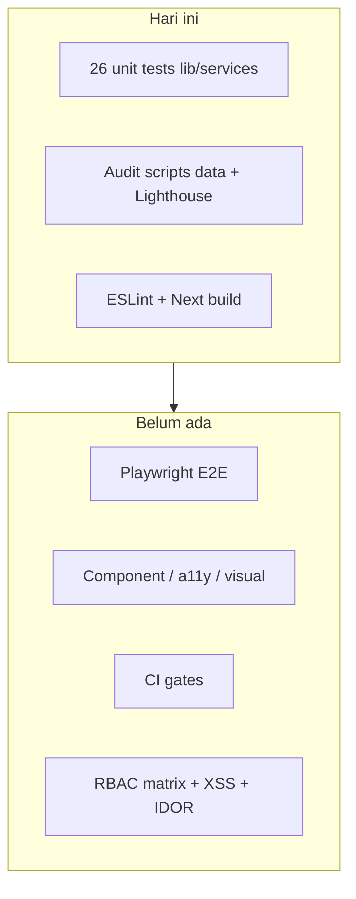
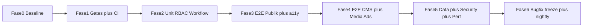

# Strategi Testing & Audit Arasvara

Tanggal: 2026-08-13  
Status: disetujui sebagai strategi; eksekusi mulai dari Fase 0  
Scope: situs publik + CMS `admin-xyz` + API — fitur, UI, data, keamanan, performa  
Dokumen terkait:

- `memory/audit_platform.md` — CMS Safari / iPad / WebKit
- `memory/issue_ipad.md` — upload gallery iPad
- `memory/admin-xyz-apple-interactivity-audit.md`
- `memory/analysis/admin-socmed-apple-audit.md`
- `memory/analysis/s3-problem.md`
- `memory/report-metrics.md`
- `memory/alurArticle.md` — oracle alur editorial
- `memory/role.md` / `memory/roleChange.md` — oracle RBAC
- `documentation/tech-docs.md`

---

## Ringkasan

Tujuan “bersih dari seluruh bug, fitur maupun UI” **tidak bisa dijamin secara literal** pada CMS berita sebesar ini (~45 halaman, ~102 API route, ~162 komponen, 10 role, 7 status artikel). Strategi yang tepat adalah **risk-based**: jalur yang merusak publikasi, keamanan, atau iklan harus selalu hijau; sisanya diaudit, diprioritaskan, dan ditutup secara bertahap.

Ini strategi, bukan sprint implementasi sekaligus. Eksekusi dimulai dari Fase 0.

Pembayaran/payment: **tidak ada** di project — skip PCI.

## Kondisi sekarang (baseline)

Yang sudah ada:

- Vitest unit test: **26 file**, environment `node`, hanya `src/**/*.test.ts` — lihat `vitest.config.ts`
- Skrip audit data: path/judul/tanggal/slug artikel & user (`npm run audit:*`)
- Skrip verifikasi: CDN, media URL, perf opts, Lighthouse mobile
- ESLint (`eslint-config-next`), TypeScript `strict: true`, `npm run build` / `analyze`

Yang belum ada (celah terbesar):

- Tidak ada GitHub Actions / CI untuk lint-test-build
- Tidak ada `tsc --noEmit` di scripts, tidak ada coverage, tidak ada Prettier
- Tidak ada Playwright/Cypress, Testing Library, Storybook, visual regression, axe/a11y
- Tidak ada tes komponen (`.test.tsx` tidak termasuk di Vitest)
- Tidak ada tes API route / RBAC matrix / transisi status artikel
- Zod terpusat hampir hanya di `src/lib/validations/auth.ts`
- Tidak ada `error.tsx` / `global-error.tsx` / Error Boundary — runtime crash jadi halaman putih
- `Dockerfile` hanya `npm run build` (tanpa lint/test)
- Rate limiting dan Sentry **belum ada**. Header sudah ada tetapi berbahaya: `X-Frame-Options: ALLOWALL` dan `CORS_ORIGINS` default `*` di `next.config.ts`
- Backlog bug **sudah tertulis** di `memory/` — belum masuk tes/CI (lihat dokumen terkait di atas)

## Prinsip strategi

1. **Piramida tes, bukan tes semuanya.** Unit cepat untuk aturan bisnis; E2E hanya golden path; UI audit untuk layout/a11y/responsive.
2. **Audit = 5 lensa**, bukan hanya “jalanin test”: kode, data, keamanan, performa/SEO, UX visual.
3. **Prod read-only.** Skrip audit data boleh ke prod; perbaikan hanya via backfill setelah laporan ditinjau.
4. **Satu sumber kebenaran bug.** Setiap temuan: severity, area (public/CMS/API/data/UI), repro, owner, status.
5. **Gate sebelum merge.** Tanpa CI, regresi akan kembali. Tes tanpa gate bukan strategi.

---

## Lensa 1 — Quality gates (statis, termurah)

Tambah skrip `typecheck` (`tsc --noEmit`), jalankan `lint` + `test` + `build` di CI.

Gate minimum per PR:

- `npm run lint`
- `npm run typecheck`
- `npm run test`
- `npm run build` (bisa nightly jika terlalu lambat di PR)

Ini menangkap bug tipe, import rusak, dan regresi unit sebelum manusia melihat UI.

## Lensa 2 — Unit & integrasi (Vitest)

Perluas `vitest.config.ts` agar mendukung `.test.tsx` + jsdom untuk komponen, tetap `node` untuk lib/services.

**Prioritas unit (ROI tertinggi) — urutan wajib:**

- **RBAC**: `hasPermission` + `ROLE_PERMISSIONS` di `src/lib/auth-client.ts` vs matrix di tech-docs. Setiap permission × 10 role.
- **State machine artikel**: transisi di `src/services/article/coreWriteArticleService.ts` (~baris 1030) + `STATUS_ROLE_MAP` di `src/types/article.ts`. Matriks: `from × to × role` — termasuk yang **harus gagal** (writer tidak boleh publish, contributor tidak boleh delete, AE tidak boleh editorial).
- **Akses publik vs preview**: `src/lib/articleViewAccess.ts` — draft/pending tidak bocor ke publik, view-count hanya `PUBLISHED`.
- **Public path & SEO**: `src/lib/article-public-path.test.ts` (sudah ada, perlu kasus legacy vs structured, 404, redirect).
- **Media URL / CDN / XSS HTML**: sanitasi output TipTap sebelum `html-react-parser` di `src/components/news/ArticleContent.tsx`.
- **Auth + edge proxy**: JWT issue/refresh/logout, cookie flags, dan `src/proxy.ts` — `x-api-secret`, matcher yang hardcode `/admin-xyz/:path*` vs `NEXT_PUBLIC_ADMIN_PANEL_PATH`, daftar `PUBLIC_API_PATHS` (login/refresh/media/publish-scheduled/sitemap) tidak boleh melebar.
- **KPI/analytics semantics**: tes yang sudah ada di `src/services/reports/` dijadikan kontrak — jangan pecah tanpa sadar.
- **Oracle bisnis yang sudah ada:** `memory/alurArticle.md` dan `memory/role.md` dipakai sebagai spesifikasi tes, bukan ditebak ulang.

**Tes API (integrasi, DB di-mock):**

- Golden API: login/refresh, CRUD artikel, approval, publish-scheduled, media upload/presign, ads homepage/single, search/indeks, sitemap.
- Setiap route sensitif: unauthenticated → 401, role salah → 403, IDOR (akses artikel/media/user orang lain).
- Endpoint scheduler (`/api/publish-scheduled`, `/api/media/cleanup-temp`): tanpa `SCHEDULER_SECRET` → 403.

Jangan kejar 100% coverage. Target awal: **lib + services editorial/auth/media > 70%**; UI komponen tidak dihitung dulu.

## Lensa 3 — UI, E2E, aksesibilitas, visual

Tambah Playwright (bukan Cypress: lebih cocok Next App Router + parallel + a11y).

**E2E publik (harus selalu hijau):**

- Home load: hero, carousel, nav, footer, tidak ada overlay pecah
- Buka artikel structured `/[category]/[yyyy]/[mm]/[dd]/[slug]` dan legacy `/news/[...segments]`
- Kategori, search, indeks, penulis, about/disclaimer
- Artikel `DRAFT` tidak terbuka tanpa auth
- Iklan tampil di slot homepage/artikel tanpa merusak layout
- Mobile 375px **dan Safari/WebKit**: menu, carousel swipe, gambar tidak overflow. Chrome desktop saja **tidak cukup** — backlog `memory/` sudah membuktikan bug Apple tidak kelihatan di Chrome Windows.

**E2E CMS (per role, bukan semua halaman × semua role):**

- Writer: buat draft → autosave → submit review; tidak bisa publish
- Editor: antrian approval → approve/reject → related/editor-choice
- Editor-in-chief/admin: publish, schedule, takedown, restore
- AE: hanya ads/sponsor; URL editorial ditolak
- Media: upload → crop → WebP → muncul di artikel
- Users/teams: create user dengan role, slug unik

**UI audit (manual + otomatis):**

- axe-core di halaman publik (Playwright)
- Breakpoint 375 / 768 / 1280 untuk home, artikel, CMS editor, dashboard
- Visual snapshot Playwright hanya untuk 5–8 layar kunci (home, artikel, nav mobile, login, editor, approval) — jangan snapshot semua shadcn
- TipTap: paste Word, embed YouTube/tweet, image caption, “baca juga”, highlight — ini sumber bug UI tersering di CMS
- **Perangkat wajib CMS (dari audit yang sudah ada):** Safari iPad + Safari macOS, bukan hanya Chrome. Repro backlog: ads `datetime-local` UTC vs WIB, HEIC di media/ads/sponsor (bukan hanya draft artikel), DnD gallery yang hover-only, crop modal vs keyboard Safari, chart tooltip hover-only. Lihat `memory/audit_platform.md`.

Komponen shadcn di `src/components/ui/` **tidak perlu** tes unit kecuali wrapper kustom yang mengubah perilaku.

## Lensa 4 — Audit data (sudah ada, perlu diperluas)

Pola yang sudah benar: skrip read-only di `scripts/` (`audit-article-paths`, `titles`, `publish-dates`, `user-slugs`).

Perluas dengan laporan JSON + severity:

- Artikel `PUBLISHED` tanpa `publicPath` / featured image / kategori
- Path duplikat, slug reserved (sudah ada `src/lib/category-reserved-slug.test.ts`)
- Denormalisasi drift (author/kategori di artikel vs collection sumber)
- Media orphan vs media yang di-referensikan tapi file S3 hilang
- Status `SCHEDULED` dengan tanggal lewat yang belum terbit
- Iklan aktif dengan tanggal/slot bertabrakan
- User tanpa slug / slug bentrok / `isActive: false` masih bisa login

Jalankan: local/staging dulu, lalu prod **read-only**. Jangan gabungkan audit dengan migrate.

## Lensa 5 — Audit keamanan

Checklist terfokus (bukan pentest generik):

- Matrix API × role (lensa 2) — ini 80% risiko CMS
- XSS: HTML artikel, caption, nama penulis, JSON-LD `dangerouslySetInnerHTML`
- Cookie JWT: httpOnly, secure, sameSite; refresh rotation di `src/lib/auth.ts`
- IDOR media/presigned URL, `api/media/view`, avatar
- Secret di repo / env default (`dev-only-jwt-secret-change-me` tidak boleh ke prod)
- Headers: `X-Frame-Options: ALLOWALL` dan CORS `*` di `next.config.ts` — clickjacking/embed bebas; ganti ke `DENY`/`SAMEORIGIN` + origin allowlist
- `NEXT_PUBLIC_API_SECRET` terekspos ke client by design — audit apakah ini masih gate yang bermakna, atau hanya obscurity
- Rate limit login & upload — saat ini tidak terpasang (dicatat di tech-docs)
- Path admin: folder `admin-xyz`, matcher proxy hardcode `/admin-xyz`, env `NEXT_PUBLIC_ADMIN_PANEL_PATH` — mismatch = CMS terbuka atau login loop

Temuan keamanan = P0, bukan backlog biasa.

## Lensa 6 — Performa & SEO

Manfaatkan yang sudah ada: `npm run lighthouse:mobile`, `analyze`, `verify:perf-opts`.

Tambah:

- Lighthouse desktop + 3 URL kunci (home, artikel, kategori) dengan budget (LCP, CLS, TBT)
- Sitemap news vs standar (`src/app/sitemap.xml/route.ts`, `sitemap-news.xml`)
- JSON-LD, canonical, OG, artikel taken-down/deleted tidak terindeks
- Bundle: editor TipTap/GSAP tidak ikut ke bundle halaman publik

## Lensa 7 — Bug bash manual (wajib, tidak tergantikan tes)

Otomasi tidak melihat “terasa salah”. Satu sesi terstruktur:

- 4 persona: pembaca, writer, editor, AE
- Checklist per halaman di `src/app/(public)`, `(inside)`, `admin-xyz`
- Catat: layout pecah, copy salah, loading tak berujung, toast error tidak jelas, keyboard trap, dark/light jika ada
- Editorial: paste panjang, 20+ gambar, gallery, socmed embed, autosave konflik tab

---

## Urutan eksekusi (jangan paralel semua)

### Fase 0 — Baseline (1–2 hari)

Inventaris halaman/API, jalankan tes + lint + build + audit scripts + Lighthouse. **Triase dulu** isu di `memory/` (iPad/HEIC, ads datetime, S3, analytics stub) menjadi backlog P0/P1 — jangan audit dari nol seolah belum ada temuan. Tidak menambah fitur.

### Fase 1 — Gates

`typecheck`, CI (lint + typecheck + test + build; Dockerfile/deploy ikut menjalankan tes, bukan hanya `next build`), coverage reporter. Tambah `error.tsx` / `global-error.tsx` agar crash tidak jadi halaman putih. Tanpa gate, tes baru tidak melindungi apa pun.

### Fase 2 — Otak bisnis

RBAC + state machine + view access + public path. Di sinilah bug “artikel bocor / writer bisa publish” tertangkap.

### Fase 3 — Wajah publik

Playwright publik + axe + 3 breakpoint + snapshot layar kunci.

### Fase 4 — CMS

E2E workflow + media + ads. Paling mahal, paling meredam bug editorial.

### Fase 5 — Audit dalam

Data prod read-only, security checklist, Lighthouse budget.

### Fase 6 — Perbaikan + freeze

Kerjakan P0/P1 dari backlog, freeze fitur baru sampai P0 habis, tes jadi nightly.

Perkiraan realistis: **3–5 minggu** jika dikerjakan berurutan, bukan “semua bug minggu ini”.

## Checklist fase

- [ ] Fase 0: baseline + triase `memory/`
- [ ] Fase 1: typecheck, coverage, CI, `error.tsx`
- [ ] Fase 2: unit/integrasi RBAC, state machine, view access, public path, API 401/403/IDOR
- [ ] Fase 3: Playwright publik, axe, breakpoint, snapshot layar kunci
- [ ] Fase 4: Playwright CMS (writer/editor/admin/AE) + media + ads
- [ ] Fase 5: audit data, security, Lighthouse budget, SEO
- [ ] Fase 6: P0/P1, fitur freeze, nightly

## Apa yang sengaja tidak dilakukan

- 100% coverage / tes setiap file shadcn
- E2E semua kombinasi 10 role × 45 halaman
- Visual regression seluruh app
- Menulis ulang tech-docs sebagai pengganti tes
- Migrate data sambil audit
- Mengabaikan temuan yang sudah ada di `memory/` lalu audit dari nol
- Scope payment/PCI — tidak ada pembayaran di Arasvara

## Definisi “optimal” yang bisa diukur

Arasvara dianggap cukup bersih untuk rilis/operasi jika:

- CI hijau: lint, typecheck, unit, build
- Semua E2E golden path publik + 4 persona CMS hijau
- Nol P0: kebocoran draft, IDOR, XSS, publish tanpa izin, clickjacking (`ALLOWALL`), data path rusak di prod
- P1 (UI pecah mobile/**Safari iPad**, iklan overlap/jadwal UTC, HEIC upload gagal, autosave gagal) punya owner dan SLA
- Audit data prod dijalankan berkala; issue baru tidak menumpuk diam-diam
- Lighthouse URL kunci tidak mundur dari baseline Fase 0

## Langkah berikutnya

**Fase 0** dulu: laporan baseline nyata (tes yang gagal, angka Lighthouse, hasil `audit:*`) plus triase backlog `memory/` menjadi P0/P1. Setelah itu Fase 1+2 (CI + tes RBAC/workflow). Fase 3–5 menyusul setelah gate itu hidup.
